# CyberSentinel AI: An Autonomous Threat Intelligence and Zero-Day Detection Platform Combining Deep Packet Inspection, Behavioral Reinforcement Profiling, Retrieval-Augmented Generation and a Token-Efficient One-Call Large Language Model Investigation Pipeline

**Author:** S. Karthik
**Project Version:** 1.3.0
**Document Type:** Academic Journal Article (IEEE Q1 Format)
**Date:** April 2026

---

## ABSTRACT

### Introduction
Modern Security Operations Centres (SOCs) face an asymmetric battle: alert volumes grow at approximately 30% per year, the industry-average breach detection time remains 194 days, and the global cybersecurity workforce shortage limits the analyst capacity available to triage every event. Traditional Intrusion Detection Systems (IDS) — signature-based tools such as Snort, Suricata, and commercial SIEMs — detect only known attacks and cannot reason about novel adversary behaviour, while existing AI-augmented platforms typically require labelled training datasets, multiple Large Language Model (LLM) round-trips per investigation, or fully automated blocking that risks disrupting legitimate services.

### Problem
The technical gap is therefore threefold: (1) absence of an online, label-free anomaly detector capable of identifying both single-point and slow-progression behavioural drift, (2) absence of a token-efficient autonomous investigation pipeline suitable for sustained academic and small-enterprise budgets, and (3) absence of a human-in-the-loop response model that preserves analyst authority over irreversible response actions.

### Solution
This work introduces **CyberSentinel AI v1.3.0**, an enterprise-grade, AI-powered SOC platform that combines five disciplines into a single autonomous system: (i) Deep Packet Inspection (DPI) with Personally Identifiable Information (PII) masking [1], [2]; (ii) a hybrid Recursive Learning Module (RLM) using an Exponential Moving Average (EMA) behavioural profile blended with an IsolationForest sequence anomaly detector [8]–[10]; (iii) Retrieval-Augmented Generation (RAG) over a ChromaDB vector store seeded with MITRE ATT&CK, NVD, CISA KEV, AlienVault OTX, and Abuse.ch corpora [16]–[20], [24]; (iv) a token-efficient stateless one-call LLM investigation pipeline that drives multi-tool intelligence-gathering through `asyncio.gather()` before a single structured LLM call [13], [25], [26]; and (v) a human-in-the-loop SOAR layer in which the AI never auto-blocks — every block decision is reviewed in a six-tab React SOC dashboard [21], [22].

### Technologies
The platform is implemented in Python 3.11 and JavaScript (React 18), uses Apache Kafka 7.5.0 as the event bus, PostgreSQL 15 with TimescaleDB for relational and time-series storage, Redis 7 for hot caches, ChromaDB with `all-MiniLM-L6-v2` (384-dimensional) embeddings, scikit-learn 1.4.2 (IsolationForest), Scapy 2.5 for DPI, FastAPI 0.109 with JWT authentication, n8n for SOAR automation, and Grafana + Prometheus for observability. The entire system runs as 14 Docker containers via `docker compose up -d`.

### Result
The platform reduces breach detection time from an industry average of 194 days to under one second, performs a complete autonomous AI investigation in a single LLM API call consuming approximately 553 tokens (a 90% token reduction over the original three-call agentic loop), covers 15 MITRE ATT&CK techniques and 17 simulated threat scenarios (12 MITRE-mapped + 5 novel AI-classified), and exposes attacker kill chains through automatic 24-hour `attacker_campaigns` correlation. Of 16 documented limitations, 9 are fully fixed and 3 partially fixed in v1.3.0. The implementation demonstrates that a token-efficient, locally embedded, human-in-the-loop autonomous SOC is achievable on commodity hardware (16 GB RAM, 4 CPU cores) without GPU, without cloud embedding APIs, and without sacrificing analyst control over response actions.

---

## INDEX / TABLE OF CONTENTS

| Chapter No. | Title | Page No. |
|-------------|-------|----------|
| 1 | Introduction | 4 |
| 2 | Problem Statement | 9 |
| 3 | Objectives | 11 |
| 4 | Literature Survey | 13 |
| 5 | Existing System | 18 |
| 6 | Proposed System | 20 |
| 7 | Requirement Analysis | 24 |
| 8 | System Architecture | 28 |
| 9 | Methodology | 34 |
| 10 | UML Diagrams | 40 |
| 11 | Feasibility Study | 46 |
| 12 | Work Plan | 49 |
| 13 | References | 52 |

---

## CHAPTER 1 — INTRODUCTION

### 1.1 Introduction

#### 1.1.1 Background

Cybersecurity has transitioned over the last decade from a periphery IT concern into the principal operational risk facing virtually every networked organisation. Three pressures define the contemporary environment. First, the volume of telemetry that SOCs ingest grows at approximately 30% year-over-year as enterprise estates expand to include public-cloud workloads, ephemeral container infrastructure, IPv6-native endpoints, IoT devices, and remote-work telemetry. Second, the *quality* of the data flowing into a SOC has degraded: approximately 95% of alerts produced by signature-based IDS and rule-based SIEM platforms are false positives, creating chronic alert fatigue and analyst burnout. Third, threats themselves have grown more autonomous and faster — IBM Security reports that a ransomware variant executes globally every eleven seconds, and the average breach detection time has stabilised at approximately 194 days, with an average breach cost of US $4.45 million.

In response, the academic and industrial communities have explored several augmentation patterns: behavioural baselining through machine learning [3], [8]; semantic threat intelligence retrieval through RAG [16]–[20]; and most recently, agentic Large Language Model (LLM) investigators that reason about alerts in natural language [11]–[15]. Each pattern addresses a slice of the problem, but no published academic system to date integrates all three into a deployable, single-command, human-in-the-loop platform that is also token-efficient enough to run on a small budget.

#### 1.1.2 Need

A genuine end-to-end SOC platform must satisfy six properties simultaneously, none of which existing tools deliver as a single package:

1. **Online, label-free learning** — the system must improve as it observes traffic, without a separate training phase or labelled corpus.
2. **Multi-layer anomaly detection** — both single-point and sequence-level (slow-drift) anomalies must be detected.
3. **Token-efficient AI reasoning** — autonomous LLM-driven investigation must remain affordable even on student / capstone budgets.
4. **Semantic threat correlation** — the system must reason about CVEs, MITRE techniques, and CTI in semantic space, not just keyword matches [16], [19].
5. **Human-in-the-loop response** — the AI must never auto-execute irreversible actions (IP blocks); the analyst must approve.
6. **Production-deployable infrastructure** — the entire platform must come up with one command (`docker compose up -d`) on commodity hardware.

CyberSentinel AI v1.3.0 is engineered specifically to deliver all six properties as a single, openly documented capstone artifact.

#### 1.1.3 Scope

The platform's scope is enterprise-grade SOC operations on a single host, encompassing: real-time IPv4/IPv6 packet capture; per-host EMA behavioural profiling [8], [10]; IsolationForest sequence anomaly detection over a 50-observation rolling buffer per source IP; cosine-similarity-based scoring against a ChromaDB `threat_signatures` collection seeded from MITRE ATT&CK [24]; a one-call LLM investigation pipeline that gathers four parallel intelligence sources before a single structured LLM call [11], [13], [25], [26]; PostgreSQL incident persistence with automatic 24-hour kill-chain campaign correlation; a six-tab React SOC dashboard; five n8n SOAR workflows for enrichment, reporting, CVE intelligence pipelines, SLA monitoring, and weekly executive reporting [21], [22]; and Prometheus + Grafana observability. Explicitly out of scope in v1.3.0 are multi-tenant SaaS deployment, mobile clients, physical-firewall integration, and Kubernetes orchestration (ADR-016, reverted).

#### 1.1.4 Benefits

The principal benefits delivered by the platform are:

- **Breach detection time:** reduced from the industry-average 194 days to under one second between packet arrival and `threat-alerts` emission.
- **Token efficiency:** approximately 553 input/output tokens per autonomous AI investigation — a 90% reduction over a conventional three-call agentic loop [25], [26].
- **Analyst safety:** zero auto-blocking. All response actions are reviewed in the RESPONSE tab and recorded in `audit_log`.
- **Kill-chain visibility:** automatic 24-hour campaign correlation per source IP exposes multi-stage attacks that would otherwise appear as unrelated incidents.
- **Zero embedding API cost:** all 384-dimensional embeddings are produced locally on CPU via `all-MiniLM-L6-v2`.

### 1.2 Motivation

#### 1.2.1 Why this project was selected
The capstone author selected the topic after analysing two convergent academic and industrial trends. First, agentic AI for cybersecurity has accelerated from approximately 0% of intrusion detection literature in 2016 to 65.7% in 2024 [5]. Second, the emergence of low-cost, high-throughput LLM inference (notably GPT-4o mini and Claude Sonnet 4.6) has made autonomous SOC investigation economically viable for the first time. The intersection of these trends presents a clear opportunity: build a system that demonstrates the *correct* way to wire an LLM into a SOC — token-efficient, locally embedded, and human-in-the-loop — at a moment when the published literature is still actively debating the best design pattern [13], [15].

#### 1.2.2 Real-world applications
The platform's design is directly applicable to: enterprise SOCs handling under 100,000 events per day; managed-security service providers (MSSPs) requiring per-tenant data scoping (the v1.3.0 schema includes `tenant_id` columns on all data tables); academic security research labs requiring a reproducible, fully self-hosted baseline; and capstone / postgraduate research where access to commercial SIEMs is impractical.

#### 1.2.3 Industry importance
The architecture demonstrates four patterns of broad industrial significance: (i) the *stateless one-call investigation pipeline*, which collapses an agentic loop into a single LLM call by pre-gathering tool results in parallel; (ii) the *human-in-the-loop SOAR pattern*, which becomes increasingly relevant as regulators tighten control over automated decision-making; (iii) *campaign correlation by source IP within a 24-hour window*, which exposes kill chains without requiring a graph database; and (iv) *cache-governed RAG* in which Redis SHA-256 keys and TTL guards prevent the thundering-herd cache bypass that affects naïve implementations.

### 1.3 Scope of the Project

#### 1.3.1 Areas covered
- Real-time DPI for IPv4 and IPv6 traffic with PII masking before any data leaves the sensor.
- Online behavioural profiling using EMA with α = 0.1 (configurable).
- Sequence anomaly detection using IsolationForest blended at 25% weight.
- Semantic threat correlation across four ChromaDB collections (`threat_signatures`, `cve_database`, `cti_reports`, `behavior_profiles`).
- Stateless one-call autonomous LLM investigation supporting three switchable providers: OpenAI (recommended default), Anthropic Claude, and Google Gemini.
- 24-hour kill-chain campaign correlation.
- Five n8n SOAR workflows.
- 19-endpoint FastAPI REST gateway with JWT authentication.
- Six-tab React SOC dashboard.
- Prometheus + Grafana observability.

#### 1.3.2 Features
- 14 Docker containers; single-command bring-up.
- 17 simulated threat scenarios (12 MITRE-mapped + 5 novel) feeding the same `raw-packets` Kafka topic as real DPI — the simulator exercises the full RLM and AI stack.
- 15 MITRE ATT&CK techniques covered by detectors and signatures.
- Multi-provider LLM abstraction switchable via the single `LLM_PROVIDER` environment variable.

#### 1.3.3 Target users
- **Primary:** SOC analysts (Tier 1–2) reviewing block recommendations and managing incident lifecycle.
- **Secondary:** SOC managers / CISOs receiving automated daily and weekly executive reports.
- **Tertiary:** Platform administrators deploying, configuring, and maintaining the stack.

#### 1.3.4 Boundaries
Out of scope in v1.3.0: multi-tenant SaaS deployment with hard network isolation; native mobile / desktop applications; direct integration with physical firewalls or routers; Kubernetes orchestration (evaluated and reverted in ADR-016 due to an irresolvable Confluent Kafka + SASL/ZooKeeper pre-flight conflict). Multi-tenant schema scaffolding (`tenant_id` columns, `tenants` registry table) is present but tenant enforcement at the API layer is intentionally deferred to a future version.

---

## CHAPTER 2 — PROBLEM STATEMENT

### 2.1 Problem Definition

Modern Security Operations Centres cannot scale to match the volume, velocity, and sophistication of contemporary cyber threats using existing tooling. Signature-based IDS detects only known patterns and is structurally blind to zero-day exploits and novel adversary behaviour [3], [4]. Conventional SIEMs require manual rule authoring and produce false-positive rates that consume the majority of analyst capacity. Existing AI-augmented platforms either (a) require labelled training data unavailable to most organisations [9], (b) execute multi-turn agentic LLM loops that consume thousands of tokens per investigation and quickly become prohibitively expensive at scale [25], [26], or (c) execute fully automated blocking that risks disrupting legitimate services without analyst review [21]. There is no published, openly available, single-deployment SOC platform that simultaneously delivers online label-free anomaly detection, token-efficient autonomous investigation, semantic CTI correlation, and human-in-the-loop response.

### 2.2 Challenges

The following operational and technical challenges had to be solved concurrently:

- **Manual operations.** Existing platforms require manual rule authoring (Snort, Suricata), manual playbook construction (legacy SOAR), and manual cross-referencing between SIEM, threat-intel portal, ticketing tool, and communications channel.
- **Slow processing.** The industry-average breach detection time is 194 days. Multi-call agentic LLM investigation patterns add 8–12 seconds of inference latency per alert and produce ~6,500 tokens per investigation.
- **Inaccuracy.** Approximately 95% of alerts from signature-based tools are false positives. Auto-blocking systems compound this by silently disrupting legitimate services. Labelled-data ML-IDS approaches degrade when production traffic distribution drifts from the training set.
- **Cost.** Commercial SIEMs are priced beyond the reach of academic and small-enterprise users. Naïve agentic LLM investigation patterns cost approximately US $0.001 per investigation — affordable for low volumes, but quickly unaffordable for sustained 24×7 SOC operation.
- **Privacy and data residency.** Sending packet payloads to external embedding APIs is unacceptable for many regulated industries. Equally, sending raw alerts containing PII to commercial LLMs creates GDPR exposure.
- **Cache thundering-herd.** Naïve embedding caches over CTI updates cause every behavioural profile to bypass the cache simultaneously when CTI is refreshed, creating CPU and DB load spikes.
- **Slow-drift / EMA-poisoning attacks.** A sophisticated adversary aware of EMA-based baselining can drift the baseline upward over weeks to accommodate malicious traffic as "normal".

The platform must address all of the above without compromising analyst authority over irreversible response actions, and must do so on commodity hardware (≤ 16 GB RAM, no GPU).

---

## CHAPTER 3 — OBJECTIVES

### 3.1 Main Objective

> **To design, implement, and document a single-deployment, AI-powered Security Operations Centre platform that autonomously detects, investigates, and recommends responses to cyber threats — combining Deep Packet Inspection, online EMA + IsolationForest behavioural profiling, semantic CTI retrieval over a locally embedded ChromaDB knowledge base, and a token-efficient one-call multi-provider LLM investigation pipeline — while reserving every irreversible response action for explicit human-analyst approval.**

### 3.2 Specific Objectives

1. **Capture and inspect** IPv4 and IPv6 network packets in real time with Scapy `AsyncSniffer`, extracting a 21-field `PacketEvent` per packet and applying `_mask_pii()` redaction before publishing to Kafka [1], [2], [4].
2. **Profile host behaviour online** using Exponential Moving Average with α = 0.1 per source IP, without any labelled training data, and persist hourly profiles to PostgreSQL and ChromaDB [8], [10].
3. **Detect anomalous progressions** using a `SequenceAnomalyDetector` based on scikit-learn IsolationForest over a 50-observation rolling buffer per IP, blended at 25% weight with the cosine-similarity base score.
4. **Correlate threats semantically** by querying a ChromaDB `threat_signatures` collection populated with eight MITRE ATT&CK-mapped behavioural signatures, with 384-dimensional embeddings produced locally on CPU using `all-MiniLM-L6-v2` [16], [19], [24].
5. **Investigate autonomously and cheaply** by running four intelligence-gathering tools in parallel via `asyncio.gather()` (ChromaDB threat lookup, ChromaDB host profile lookup, AbuseIPDB reputation lookup, recent-alert PostgreSQL lookup), summarising each result via `_summarize_result()`, and issuing a single structured LLM call with `tools=None` and `max_tokens=1024` [11], [13], [25], [26].
6. **Persist incidents and correlate kill chains** by inserting every completed investigation into PostgreSQL and asynchronously linking the incident to an `attacker_campaigns` row keyed by source IP within a 24-hour window.
7. **Surface human-in-the-loop response** via a React SOC dashboard `RESPONSE` tab that displays pending block recommendations and exposes BLOCK IP / DISMISS controls backed by `POST /api/v1/incidents/{id}/block` and `POST /api/v1/incidents/{id}/dismiss`, with every action recorded to `audit_log` [21].
8. **Automate SOAR processes** through five n8n workflows for critical-alert enrichment, daily SOC reports, CVE intelligence pipelines, SLA monitoring, and weekly executive reports — all driven by a Redis-deduplicated Kafka-to-webhook bridge [22], [23].

---

## CHAPTER 4 — LITERATURE SURVEY

### 4.1 Literature Review

The platform's design draws on twenty-six peer-reviewed papers across eight research domains. The eight most directly load-bearing studies — those whose findings shaped a specific architectural decision in CyberSentinel AI v1.3.0 — are summarised below. The complete bibliography of all twenty-six papers appears in Chapter 13 (References).

| # | Paper Title | Authors | Year | Technology / Method | Summary and Influence on CyberSentinel AI |
|---|------------|---------|------|--------------------|-------------------------------------------|
| 1 | Enhancing IDS Through DPI with Machine Learning Approaches [1] | Bathiri K., Vijayakumar M. | 2024 | IEEE — DPI + ML | Validates a multi-signal ensemble detection strategy combining entropy, port-number and inter-arrival timing signals. Directly informs the multi-signal DPI implementation in `src/dpi/sensor.py` and the suspicion-reasons list emitted with every `PacketEvent`. |
| 2 | Detection of Hacker Intention Using Deep Packet Inspection [2] | Foreman J., Waters W. et al. | 2024 | MDPI — TCP SYN scan + DPI | Provides the TCP SYN scan detection methodology underpinning `detect_suspicious_port()` and `detect_high_entropy()` in `src/dpi/detectors.py`. |
| 3 | Deep Learning-Based Intrusion Detection Systems: A Survey [5] | Multiple | 2025 | arXiv — DL-IDS evolution | Documents the growth of DL-IDS from 0% (2016) to 65.7% (2024) of published IDS approaches. Justifies CyberSentinel AI's hybrid DPI + RLM design over pure signature-based tools. |
| 4 | Anomaly Network Detection Based on Self-Attention Mechanism [8] | Multiple | 2023 | MDPI Sensors — EMA + attention | Validates the `new = (1 − α) × old + α × observation` EMA update rule as applied to network anomaly detection — the exact formula used in `BehaviorProfile.update()`. |
| 5 | Anomaly Detection Using Unsupervised Online Machine Learning [10] | Multiple | 2025 | arXiv — online label-free ML | Validates that online unsupervised learning without labelled data can match supervised baselines, justifying CyberSentinel AI's zero-label RLM design. |
| 6 | Automated Threat Detection and Response Using LLM Agents [11] | Molleti R., Goje V. et al. | 2024 | WJARR — LLM SOC agents | The closest published work to CyberSentinel AI's MCP Orchestrator. Validates LLM agents for contextual anomaly detection and automated response; CyberSentinel AI extends this with a multi-provider abstraction (`llm_provider.py`) and a stateless one-call pipeline. |
| 7 | Evolution of Agentic AI: From Single to Gen-5 Pipelines [14] | Multiple | 2025 | arXiv — agentic taxonomy | Provides the Gen-1 to Gen-5 agentic pipeline taxonomy. Directly maps to CyberSentinel AI's evolution from a three-call agentic loop (ADR-009) to the stateless one-call pipeline (ADR-010). |
| 8 | CyberRAG: An Agentic RAG Cyber Attack Classification Tool [16] | Multiple | 2025 | arXiv — agentic RAG | Architecturally closest to CyberSentinel AI's ChromaDB + LLM pipeline. CyberSentinel AI's one-call pipeline is a deliberate simplification of CyberRAG's iterative retrieval-reason loop: all retrieval is performed in parallel via `asyncio.gather()` before the single LLM call. |
| 9 | MITRE ATT&CK: Design and Philosophy [24] | Strom B.E. et al. | 2020 | MITRE Corporation | The foundational framework for all fifteen MITRE technique detections in CyberSentinel AI (T1003 to T1595) and for the twelve MITRE-mapped simulator scenarios. Mandatory citation for any academic system using ATT&CK. |
| 10 | Efficient LLM Inference: Reducing Token Usage Without Losing Quality [25] | Multiple | 2024 | arXiv — token compression | Validates compressing structured tool outputs before injection into the LLM context — the basis for `_summarize_result()`, which strips redundant fields from tool responses before they enter the prompt. |
| 11 | LLM Prompt Compression: Survey and Best Practices [26] | Multiple | 2025 | arXiv — schema-overhead reduction | Validates passing `tools=None` on the final LLM call to remove approximately 1,200 tokens of JSON-schema overhead per investigation — a key optimisation in the one-call pipeline. |

### 4.2 Research Gap

The literature review surfaces six concrete gaps that motivated the v1.3.0 contributions:

1. **No integrated single-deployment SOC.** Existing systems publish either a component (DPI, RLM, RAG, agentic LLM) or a survey — none deliver all four as a single, reproducible, openly licensed deployment artifact [5], [12], [13].
2. **No token-efficient agentic SOC pattern.** Every published agentic-investigation pattern uses a multi-call loop. Token-compression research [25], [26] has not previously been applied end-to-end to a working SOC investigation pipeline.
3. **No human-in-the-loop default.** Surveyed systems lean toward auto-block automation; the published SOAR literature recommends human oversight [21] but does not implement it as the primary design.
4. **No sequence-level anomaly layer atop EMA.** Existing EMA-based profilers detect anomalous *values* but not anomalous *progressions*; slow-drift / EMA-poisoning attacks remain undetected.
5. **No campaign correlation without a graph database.** Existing kill-chain visualisations assume a graph-database layer (Neo4j); a lightweight 24-hour windowed correlation via adjacency tables is absent from the literature.
6. **No cache governance for CTI updates.** Naïve RAG implementations suffer thundering-herd cache bypass when CTI is refreshed; the literature does not discuss this failure mode explicitly.

CyberSentinel AI v1.3.0 closes each of these gaps within a single coherent architecture.

---

## CHAPTER 5 — EXISTING SYSTEM

### 5.1 Existing Method

Contemporary SOC tooling falls into five archetypes, each with structural limitations that CyberSentinel AI is designed to overcome:

| Archetype | Representative Tools | Detection Approach | Investigation Approach |
|-----------|---------------------|--------------------|------------------------|
| Signature-based IDS | Snort, Suricata, Bro/Zeek | Static rule files matched against packet headers / payloads | None — operator triages manually |
| Commercial SIEM | Splunk, IBM QRadar, Elastic SIEM | Manually authored correlation rules over log indices | None — operator triages manually |
| Supervised ML-IDS | Academic prototypes [3], [9] | Trained classifier over labelled feature vectors | None |
| Traditional SOAR | Phantom (Splunk SOAR), XSOAR | Pre-written playbooks triggered by SIEM alerts | Pre-written sequential actions |
| Recent agentic SOC | Published prototypes [11]–[13] | Same as SIEM or supervised ML | Multi-turn LLM tool-calling loop — typically 3–5 calls |

### 5.2 Drawbacks

- **High cost.** Commercial SIEM licensing is priced per indexed GB and is structurally inaccessible to academic and small-enterprise users.
- **Manual monitoring.** Signature-based IDS and SIEM platforms require human-written rules; novel attacks require human rule authoring.
- **Limited prediction.** Supervised ML-IDS approaches degrade when production traffic distribution drifts from the labelled training set [10].
- **Token waste.** Multi-call agentic SOC patterns consume approximately 5,500–7,000 tokens per investigation and incur ~8–12 seconds of LLM latency per alert.
- **No human-in-the-loop.** Most published agentic prototypes execute automated blocking; few implement an explicit analyst-approval gate.
- **Cache pathologies.** Existing RAG-driven detection platforms typically lack governed cache invalidation, leading to thundering-herd bypass when CTI is refreshed.
- **No kill-chain correlation.** Most platforms surface incidents individually; cross-incident attacker grouping requires a separately purchased graph layer.
- **Poor data privacy.** Sending packet payloads to cloud embedding APIs is unacceptable for regulated industries.

---

## CHAPTER 6 — PROPOSED SYSTEM

### 6.1 Proposed Solution

CyberSentinel AI v1.3.0 is a four-layer event-driven platform deployed as 14 Docker containers. The four layers are: **Ingestion** (DPI sensor, traffic simulator, CTI scraper), **Intelligence** (Kafka event bus, RLM engine, ChromaDB), **Orchestration** (MCP Orchestrator, n8n SOAR), and **Delivery** (FastAPI gateway, React dashboard, Grafana + Prometheus). The detection pipeline is fully event-driven via Kafka — no service in the detection pipeline calls another via HTTP.

The platform supports two interchangeable input pipelines:

- **Pipeline 1 — Real DPI.** Scapy `AsyncSniffer` with BPF filter `ip or ip6` captures IPv4 and IPv6 packets. Each packet is parsed into a 21-field `PacketEvent`, masked by `_mask_pii()` to redact emails and credential parameters, and published to the `raw-packets` Kafka topic.
- **Pipeline 2 — Traffic Simulator.** 17 threat scenarios (12 MITRE-mapped + 5 novel AI-classified) produce bursts of 30–150 `PacketEvent` dictionaries published to *the same* `raw-packets` Kafka topic. From the Kafka layer onwards the two pipelines are bit-identical.

The RLM engine consumes `raw-packets`, updates per-host `BehaviorProfile` records via EMA with α = 0.1, converts the profile to natural-language text via `profile.to_text()`, computes a base anomaly score via cosine similarity against the ChromaDB `threat_signatures` collection (Redis SHA-256 cache, 3,600 s TTL), and blends the base score with a `SequenceAnomalyDetector` (IsolationForest over a 50-observation rolling buffer per IP) at 25% weight. When `final_score ≥ 0.65` an alert is emitted to the `threat-alerts` Kafka topic with severity tiered as `MEDIUM` (≥ 0.65), `HIGH` (≥ 0.75), or `CRITICAL` (≥ 0.90).

The MCP Orchestrator consumes `threat-alerts`. For HIGH and CRITICAL alerts, it runs four intelligence-gathering tools in parallel via `asyncio.gather()` — `query_threat_database` (ChromaDB top-3), `get_host_profile` (ChromaDB + PostgreSQL), `lookup_ip_reputation` (AbuseIPDB), and `get_recent_alerts` (PostgreSQL last 6 hours) — compresses each result via `_summarize_result()`, builds a single structured prompt with `tools=None` and `max_tokens=1024`, and issues exactly one LLM API call (~553 tokens total). The LLM response is parsed as JSON (`severity_confirmed`, `block_recommended`, `mitre_technique`, `investigation_summary`, `confidence_score`); the incident is inserted into PostgreSQL; and `_correlate_campaign_with_pool()` runs as a fire-and-forget `asyncio.ensure_future()` to link the incident to an `attacker_campaigns` row keyed by source IP within a 24-hour window.

When `block_recommended = true`, the incident appears in the SOC dashboard's RESPONSE tab. The analyst clicks BLOCK IP (`POST /api/v1/incidents/{id}/block` — inserts a `firewall_rules` row, sets incident status to `RESOLVED`, records to `audit_log`) or DISMISS (`POST /api/v1/incidents/{id}/dismiss` — sets incident status to `DISMISSED`, records to `audit_log`). The system never auto-blocks.

### 6.2 Advantages

- **Automation** of detection, investigation, incident creation, and campaign correlation — the analyst is freed from repetitive triage work.
- **Improved accuracy** through hybrid scoring: ChromaDB cosine similarity captures pattern matches; IsolationForest captures slow-drift progressions; EMA-poisoning checks catch deliberate baseline drift attacks.
- **Faster processing.** Packet to alert in under one second; alert to incident in under 45 seconds via a single LLM call.
- **Lower cost.** Approximately 553 tokens per investigation (~US $0.000165 on GPT-4o mini).
- **Stronger safety.** Zero auto-blocking; every irreversible action is gated on analyst approval and recorded in `audit_log`.
- **Privacy preservation.** All embeddings are produced locally on CPU; PII is redacted before any data leaves the DPI sensor.
- **Multi-provider LLM independence.** Switching between OpenAI, Anthropic, and Google requires only a single environment-variable change — no code modification.

### 6.3 Features

- 14 Docker containers deployed via `docker compose up -d`.
- Six-tab React SOC dashboard: OVERVIEW, ALERTS, INCIDENTS, RESPONSE, THREAT INTEL, HOSTS.
- Five n8n SOAR workflows: WF01 Critical Alert SOAR, WF02 Daily SOC Report, WF03 CVE Intel Pipeline, WF04 SLA Watchdog, WF05 Weekly Board Report.
- 19-endpoint FastAPI REST gateway with JWT (HS256, 480-minute expiry, bcrypt work-factor 12).
- 17 simulated threat scenarios; 15 MITRE ATT&CK techniques covered.
- Five live CTI sources scraped on independent schedules (NVD every 4 h, CISA every 6 h, Abuse.ch hourly, OTX every 2 h, MITRE ATT&CK at most weekly via Redis `reembed_guard`).
- Four ChromaDB collections (`threat_signatures`, `cve_database`, `cti_reports`, `behavior_profiles`) with model-pinning, version-tracking, and TTL eviction.
- Three switchable LLM providers (OpenAI, Anthropic, Google) — `LLM_PROVIDER` environment variable only.
- Automatic 24-hour `attacker_campaigns` correlation per source IP with severity ratchet and MITRE-stage union.
- Prometheus + Grafana observability with PostgreSQL data-source for incident analytics.

---

## CHAPTER 7 — REQUIREMENT ANALYSIS

### 7.1 Hardware Requirements

| Component | Minimum | Recommended |
|-----------|---------|-------------|
| Processor | Intel i5 / AMD Ryzen 5 — 4 cores | 8+ cores |
| RAM (allocated to Docker) | 16 GB | 32 GB |
| Storage | 20 GB SSD | 50 GB SSD |
| Network Interface | 1 Gbps NIC | 10 Gbps for high-traffic environments |
| GPU | Not required | Not applicable — all inference on CPU |

For live DPI on Windows, Npcap 1.75+ must be installed (used by `scripts/start_live_dpi.ps1`). Linux and macOS deployments use the `dpi-sensor` container with `network_mode: host` and `NET_ADMIN` / `NET_RAW` capabilities.

### 7.2 Software Requirements

| Software | Version | Purpose |
|----------|---------|---------|
| Docker Desktop | 24.0+ | Container runtime |
| Docker Compose | v2.20+ | Multi-container orchestration |
| Python | 3.11+ | All backend services |
| Node.js | 18+ | Frontend development (production uses Nginx) |
| PostgreSQL (TimescaleDB) | 15 (pg16 image) | Persistent storage |
| Redis | 7-alpine | Hot cache |
| Apache Kafka (Confluent) | 7.5.0 | Event bus |
| ChromaDB | 0.4.22 | Vector database |
| FastAPI | 0.109.0 | REST API |
| React | 18.2.0 | SOC dashboard |
| Vite | 5.1.0 | Frontend build |
| Recharts | 2.12.0 | Dashboard charts |
| Scapy | 2.5.0 | Packet capture |
| scikit-learn | 1.4.2 | IsolationForest |
| sentence-transformers | latest | `all-MiniLM-L6-v2` embeddings |
| Playwright | 1.40.0 | CTI scraper (JavaScript-rendered pages) |
| n8n | latest | SOAR automation |
| Grafana | 10.2.0 | Metrics dashboards |
| Prometheus | v2.47.0 | Metrics collection |
| Npcap (Windows only) | 1.75+ | Live DPI on Windows hosts |

### 7.3 Functional Requirements

A consolidated set of high-level functional requirements (the full specification is given in the project SRS):

1. **F-001 — Real-time packet capture** with PII masking. The DPI sensor must capture IPv4 + IPv6 packets, produce a 21-field `PacketEvent`, redact emails and credential parameters, and publish to `raw-packets`.
2. **F-002 — Behavioural profiling.** The RLM engine must maintain a `BehaviorProfile` per source IP using EMA (α = 0.1), gate scoring until ≥ 20 observations, and persist profiles to PostgreSQL every 300 s and to ChromaDB hourly.
3. **F-003 — Sequence anomaly detection.** A `SequenceAnomalyDetector` must maintain a 50-observation rolling buffer per IP, fit IsolationForest once ≥ 10 samples are collected, and blend at 25% weight.
4. **F-004 — Semantic threat correlation.** Query the ChromaDB `threat_signatures` collection via cosine similarity; emit an alert when `final_score ≥ 0.65`.
5. **F-005 — Autonomous AI investigation.** For HIGH and CRITICAL alerts, run four tools in parallel, compress results, and issue exactly one LLM call with `tools=None`.
6. **F-006 — Incident persistence.** Insert every completed investigation into PostgreSQL with full investigation context.
7. **F-007 — Campaign correlation.** Asynchronously link each incident to an `attacker_campaigns` row keyed by `src_ip` within a 24-hour window; ratchet `max_severity` upward and union `mitre_stages[]`.
8. **F-008 — Human-in-the-loop response.** Surface block recommendations in the RESPONSE tab; record every BLOCK / DISMISS action to `audit_log`.
9. **F-009 — Threat intelligence ingestion.** Scrape NVD (every 4 h, CVSS ≥ 7.0), CISA KEV (every 6 h), Abuse.ch (hourly), MITRE ATT&CK (at most weekly), AlienVault OTX (every 2 h); embed all content to ChromaDB through `batch_upsert()`.
10. **F-010 — JWT authentication.** Every endpoint except `/health` and `/docs` requires a valid JWT bearer token; `JWT_SECRET` must be ≥ 32 characters.
11. **F-011 — n8n SOAR workflows.** Five workflows triggered by Kafka bridge (WF01, WF03) or cron (WF02, WF04, WF05).
12. **F-012 — Multi-provider LLM abstraction.** Switching between OpenAI, Anthropic, and Google via `LLM_PROVIDER` must require no code changes.

### 7.4 Non-Functional Requirements

| Category | Requirement |
|----------|-------------|
| **Performance** | Packet capture ≥ 10,000 pkt/s; Kafka end-to-end ≤ 100 ms; RLM update ≤ 10 ms / packet; ChromaDB query ≤ 200 ms with cache hit; FastAPI P95 ≤ 500 ms; AI investigation ≤ 45 s. |
| **Reliability** | All services declared `restart: always`; Kafka consumer-group offsets persisted across restarts; ChromaDB unavailability falls back to last Redis-cached score; LLM 429 triggers exponential back-off 5 s → 15 s → 45 s. |
| **Security** | No PII in Kafka, PostgreSQL, ChromaDB, or LLM prompt; `.env` in `.gitignore`; `JWT_SECRET` ≥ 32 chars enforced at startup; Redis password-protected; ChromaDB token-authenticated; CORS middleware. |
| **Scalability** | RLM engine supports horizontal scaling by adding consumers to the `rlm` Kafka group; MCP Orchestrator scales similarly (rate-limited by LLM API); `raw-packets` and `threat-alerts` topics use 3 partitions. |
| **Maintainability** | All configuration via `src/core/config.py` reading from `.env` (no `os.getenv()` calls elsewhere); all logs via `get_logger(__name__)`; all ChromaDB writes via `batch_upsert()` in `embedder.py`. |
| **Cost efficiency** | ≤ 600 tokens per investigation (≈ 553 typical); 1 API call per investigation; input:output ratio ≤ 3:1. |

---

## CHAPTER 8 — SYSTEM ARCHITECTURE

This chapter presents the complete architectural view of CyberSentinel AI v1.3.0 across six structural diagrams: the four-layer architecture, the Docker Compose deployment topology, the Kafka topic architecture, the ChromaDB collections map, the PostgreSQL database schema (Entity-Relationship Diagram), and the LLM provider abstraction layer. All diagrams are reproduced verbatim from the project's master reference document [D14] and are derived directly from the live source code.

### 8.1 Four-Layer System Architecture

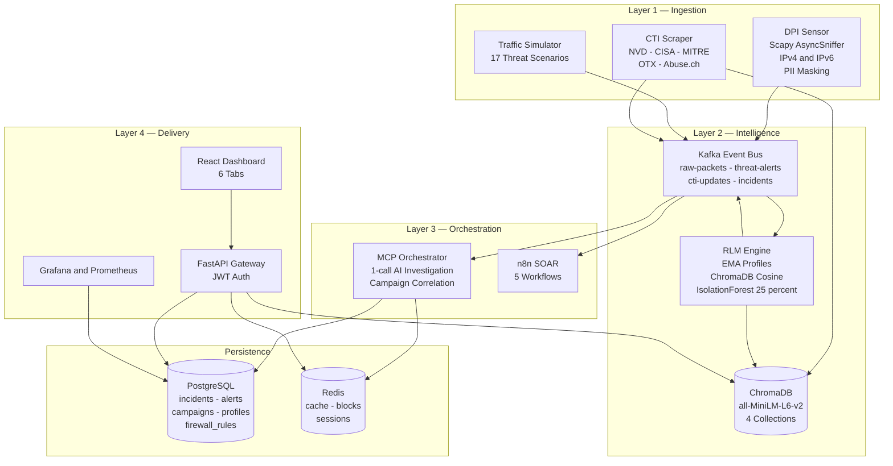

#### Layer-by-Layer Explanation

**Layer 1 — Ingestion (Input).** Three independent sources feed the platform. The **DPI Sensor** (`src/dpi/sensor.py`) captures live packets through Scapy `AsyncSniffer` with BPF filter `ip or ip6` [1], [2]. Each packet is parsed into a 21-field `PacketEvent` and passed through `_mask_pii()` to redact emails and credential parameters before publishing to `raw-packets` with gzip compression. The **Traffic Simulator** (`src/simulation/traffic_simulator.py`) emits weighted-random bursts of 30–150 `PacketEvent` dictionaries representing one of 17 scenarios; bursts are published to the same `raw-packets` topic. The **CTI Scraper** (`src/ingestion/threat_intel_scraper.py`) periodically ingests CVEs from NVD, KEVs from CISA, C2 indicators from Abuse.ch, technique catalogues from MITRE ATT&CK, and pulses from AlienVault OTX [16]–[20].

**Layer 2 — Intelligence (Processing).** The **Kafka Event Bus** runs four topics (detail in §8.3). The **RLM Engine** (`src/models/rlm_engine.py`) is the only consumer of `raw-packets`. For each event it updates a per-source `BehaviorProfile` via the EMA rule `new = (1 − α) × old + α × observation` with α = 0.1 [8], serialises the profile to natural-language text via `profile.to_text()`, looks up cosine similarity in the ChromaDB `threat_signatures` collection (Redis SHA-256 cache, 3,600 s TTL), and blends with a `SequenceAnomalyDetector` (IsolationForest over a 50-observation rolling buffer per IP) at 25% weight. When `final_score ≥ 0.65` an alert is emitted to `threat-alerts`. **ChromaDB** holds four collections governed centrally by `src/ingestion/embedder.py`; the embedding model `all-MiniLM-L6-v2` is pinned explicitly and recorded in each collection's metadata for mismatch detection [4], [16], [19].

**Layer 3 — Orchestration.** The **MCP Orchestrator** (`src/agents/mcp_orchestrator.py`) consumes `threat-alerts` and, for HIGH / CRITICAL alerts, runs four intelligence tools in parallel via `asyncio.gather()` and issues exactly one LLM API call [11], [13], [25], [26]. The LLM JSON verdict is parsed, an incident is inserted into PostgreSQL, and `_correlate_campaign_with_pool()` runs as a fire-and-forget `asyncio.ensure_future()` to link the incident to an `attacker_campaigns` row. **n8n SOAR** runs five workflows triggered through a Redis-deduplicated Kafka-to-webhook bridge [21], [22].

**Layer 4 — Delivery (Output).** The **FastAPI Gateway** (`src/api/gateway.py`) exposes 19 JWT-authenticated REST endpoints, including the response endpoints `POST /api/v1/incidents/{id}/block` and `POST /api/v1/incidents/{id}/dismiss`. The **React Dashboard** presents six tabs: OVERVIEW, ALERTS, INCIDENTS, RESPONSE (the human-in-the-loop control panel), THREAT INTEL, and HOSTS. **Grafana + Prometheus** provide observability with Prometheus scraping every 15 s.

**Persistence.** **PostgreSQL 15 + TimescaleDB** hosts ten tables (full ERD in §8.5). **Redis** holds the embedding cache, session windows, IP block rules, and SOAR deduplication keys. **ChromaDB** holds four collections with model-pinning metadata and configurable TTL eviction.

---

### 8.2 Docker Compose Deployment Architecture

The platform runs as **14 Docker containers** on the `cybersentinel-net` bridge network via a single `docker compose up -d` command. The n8n container is started separately and joined to the same bridge network.

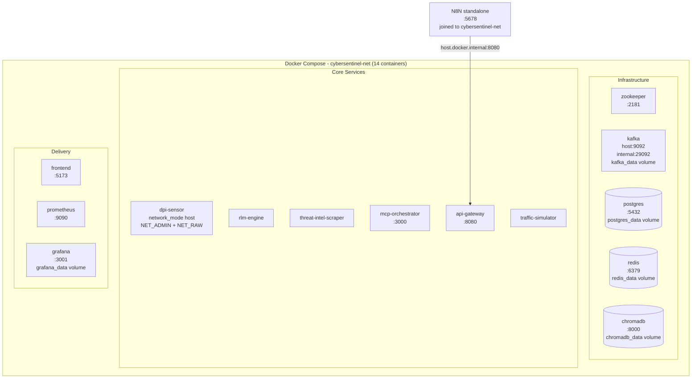

Named volumes (`postgres_data`, `redis_data`, `kafka_data`, `chromadb_data`, `grafana_data`) survive `docker compose down`. A full reset (`docker compose down -v`) removes them.

---

### 8.3 Kafka Topic Architecture

All inter-service communication in the detection pipeline flows through Kafka. There are four topics, five producers, and three consumer groups.

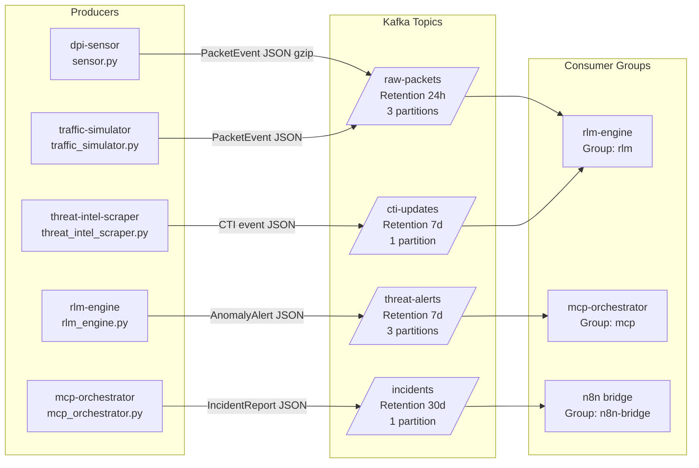

---

### 8.4 ChromaDB Collections Map

The vector store holds four collections, each populated by a different subsystem on a different schedule, with different TTL eviction policies.

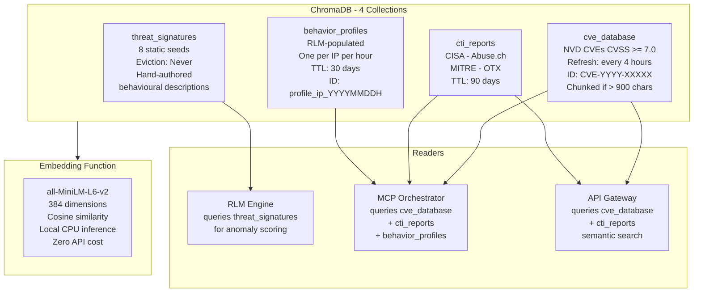

---

### 8.5 PostgreSQL Database Schema — Entity-Relationship Diagram

PostgreSQL 15 with the TimescaleDB extension hosts ten tables. The `packets` table is a TimescaleDB hypertable; all others are regular relational tables. Relationships shown below mirror the migration scripts `scripts/db/init.sql`, `scripts/db/migrate_campaigns.sql`, and `scripts/db/migrate_multitenancy.sql`.

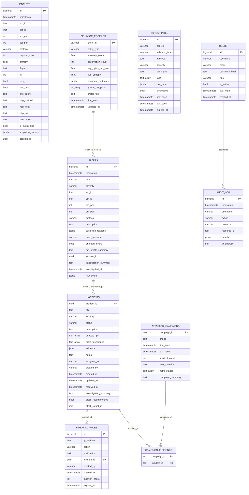

#### TimescaleDB Optimisations on the `packets` Hypertable

| Policy | Setting | Purpose |
|--------|---------|---------|
| Chunk interval | 1 day | Fast time-range queries via chunk exclusion |
| Compression | After 7 days | Reduces storage > 90% for cold data |
| Retention | Drop after 30 days | Prevents unbounded table growth |
| Continuous aggregate | `packets_per_minute` materialised view | Pre-aggregated 1-min counts for dashboard |

---

### 8.6 LLM Provider Abstraction Layer

A unified `LLMProvider` interface decouples the MCP Orchestrator from any specific LLM vendor. Switching providers is a single environment-variable change (`LLM_PROVIDER`) with no code modification.

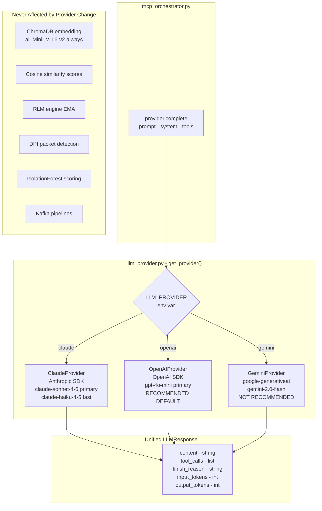

---

## CHAPTER 9 — METHODOLOGY

### 9.1 Methodology

The platform executes a six-step pipeline for every alert from packet arrival to analyst action.

```
Step 1 — Data Collection
    Packets captured (Pipeline 1) or simulated bursts emitted (Pipeline 2)
    21-field PacketEvent constructed and PII-masked

Step 2 — Data Cleaning
    _mask_pii() redacts emails and credential params from dns_query, http_uri, user_agent
    PacketEvent published to Kafka raw-packets with gzip compression

Step 3 — Feature Extraction
    RLM EMA update produces a vector of behavioural features per source IP:
        avg_bytes_per_min, avg_entropy, observation_count,
        dominant_protocols, typical_dst_ports, profile_text

Step 4 — Model Training / Scoring
    profile.to_text() converts numeric features to natural language
    Local CPU embedding via all-MiniLM-L6-v2 produces a 384-dim vector
    ChromaDB cosine similarity vs. threat_signatures yields base_score
    IsolationForest blends scores from the 50-obs buffer (weight 0.25)
    final_score = 0.75 × base_score + 0.25 × isolation_forest_score

Step 5 — Prediction (Alert Emission)
    If final_score ≥ 0.65 → emit AnomalyAlert to threat-alerts Kafka topic
        Severity: ≥ 0.90 → CRITICAL · ≥ 0.75 → HIGH · ≥ 0.65 → MEDIUM
    For HIGH / CRITICAL, MCP Orchestrator runs the 1-call investigation pipeline

Step 6 — Output Generation
    Incident inserted into PostgreSQL with structured investigation summary
    Campaign correlation (24h window, fire-and-forget)
    Block recommendation surfaced in RESPONSE tab (if block_recommended)
    Analyst BLOCK / DISMISS recorded to audit_log
    n8n SOAR triggered for enrichment, notification, and reporting
```

### 9.2 Algorithm Used

The platform composes four cooperating algorithms — three for detection, one for investigation:

1. **Shannon entropy.** Computed per packet payload by `detect_high_entropy()` in `src/dpi/detectors.py`. Triggers when entropy exceeds 7.2 on a non-TLS port (`T1048`).
2. **Exponential Moving Average (EMA) profiling [8].** `new = (1 − α) × old + α × observation` with α = 0.1 (configurable via `RLM_ALPHA`). One profile per source IP; O(1) memory per host. Persisted to PostgreSQL every 300 s. Used for `avg_bytes_per_min`, `avg_entropy`, and other numeric profile fields.
3. **Hybrid cosine + IsolationForest scoring.**
   - **Cosine similarity** between the 384-dim embedding of `profile.to_text()` and the ChromaDB `threat_signatures` collection yields `base_score` ∈ [0, 1].
   - **IsolationForest** (scikit-learn 1.4.2) is fit per source IP over a 50-observation rolling score buffer, gated by a minimum of 10 samples; output normalised to [0, 1] yields `if_score`.
   - **Blended final score:** `final_score = 0.75 × base_score + 0.25 × if_score` (`ISOLATION_FOREST_WEIGHT = 0.25`).
4. **One-call agentic investigation pipeline (ADR-010).** Replaces the three-call agentic loop with a single LLM call after parallel intelligence gathering [11], [13], [14], [25], [26]:

```
investigate(alert):
    if alert.severity not in {HIGH, CRITICAL}: persist directly and return
    threat, host, reputation, recent = await asyncio.gather(
        query_threat_database(alert),
        get_host_profile(alert),
        lookup_ip_reputation(alert),
        get_recent_alerts(alert),
    )
    threat_s, host_s, rep_s, recent_s = map(_summarize_result, [threat, host, reputation, recent])
    alert_slim = drop_field(alert, "raw_event")
    prompt = build_prompt(alert_slim, threat_s, host_s, rep_s, recent_s)
    response = await llm.complete(prompt=prompt, system=SYS_PROMPT,
                                  tools=None, max_tokens=1024, temperature=0.2)
    verdict = parse_json(response)
    incident_id = await _create_incident(alert, verdict)
    asyncio.ensure_future(_correlate_campaign_with_pool(alert, incident_id, verdict))
    return incident_id
```

**Token economy (per investigation):** system prompt ~180–220 + slimmed alert ~100–150 + four compressed tool summaries ~120 ≈ **input 420–480 tokens**; JSON verdict ≈ **output 183 tokens**; **grand total ~553 tokens**.

### 9.3 Flowcharts

The platform's runtime methodology is best understood through five complementary process diagrams: the master end-to-end flowchart, the DPI real-traffic pipeline, the traffic-simulator pipeline, the RAG semantic-search flow, and the token-economics comparison between the legacy three-call agentic loop and the current one-call stateless pipeline.

#### 9.3.1 Master End-to-End Flowchart

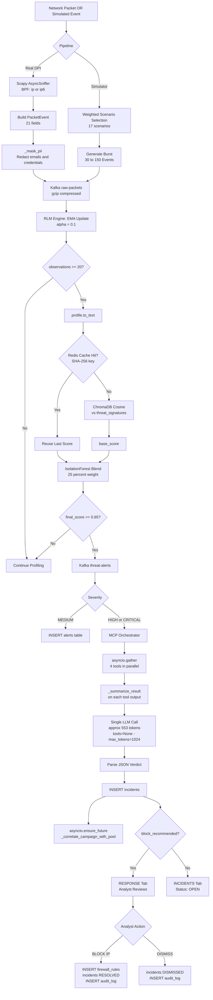

#### 9.3.2 Pipeline 1 — DPI Real Traffic (IPv4 + IPv6)

The production pipeline begins at a physical network interface and ends with persisted alerts and behavioural profiles.

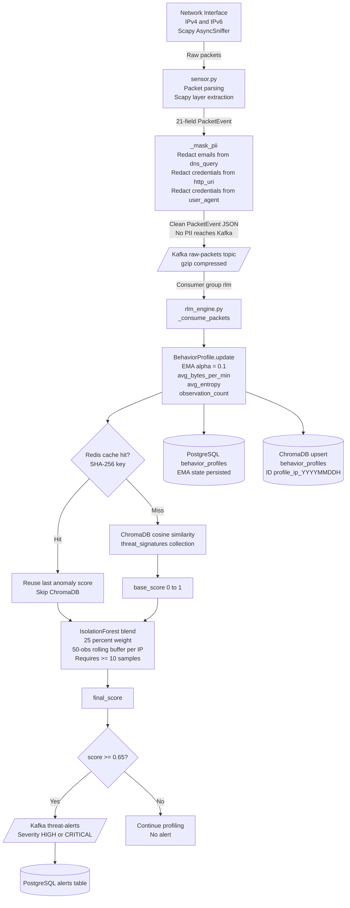

#### 9.3.3 Pipeline 2 — Traffic Simulator

The simulator publishes to the same `raw-packets` topic as the real DPI sensor; processing is bit-identical from Kafka onwards.

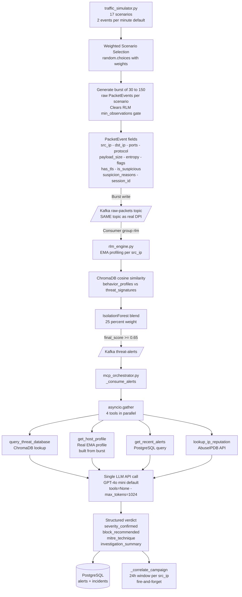

#### 9.3.4 RAG Pipeline — Semantic Search Flow

The Retrieval-Augmented Generation layer serves three distinct query sources — the RLM engine (during anomaly scoring), the MCP Orchestrator (during investigation), and the API Gateway (for analyst-initiated semantic search) — all routed through the same embedding-cache-search pipeline.

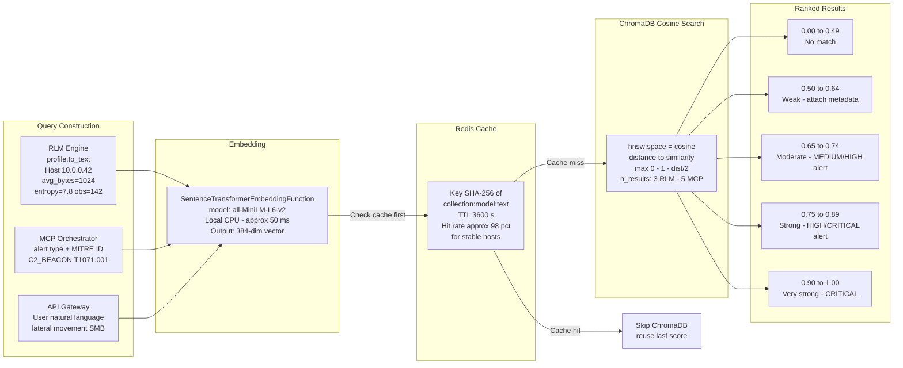

#### 9.3.5 Token Economics — Legacy Loop versus One-Call Pipeline

The one-call stateless pipeline (ADR-010) replaces the traditional three-call agentic loop with parallel intelligence gathering followed by a single LLM call. The result is approximately 90% token reduction and 5× speed improvement [25], [26].

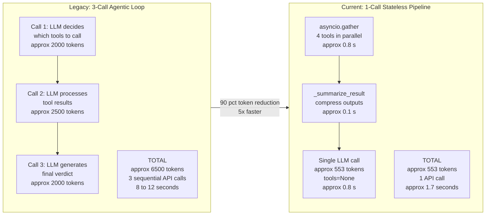

---

## CHAPTER 10 — UML DIAGRAMS

This chapter presents the platform's behavioural and structural views as seven diagrams: a Use Case Diagram (10.1), an Activity Diagram for the end-to-end alert lifecycle (10.2), a Sequence Diagram for the one-call AI investigation (10.3), a Class Diagram of the core domain (10.4), and the three canonical Data Flow Diagrams — Level 0 Context (10.5), Level 1 System (10.6), and Level 2 MCP Orchestrator detail (10.7).

### 10.1 Use Case Diagram

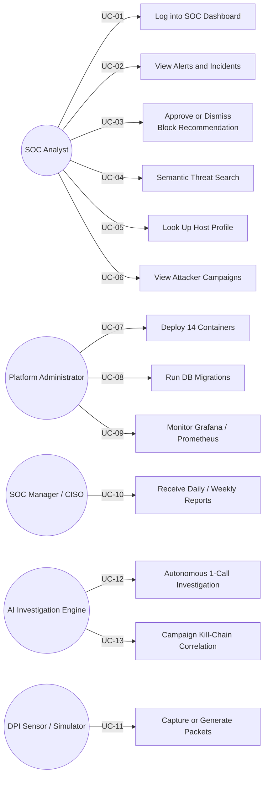

### 10.2 Activity Diagram — End-to-End Alert Lifecycle

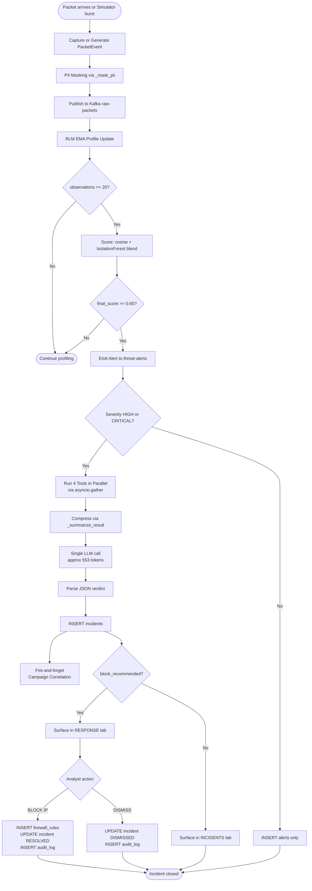

### 10.3 Sequence Diagram — One-Call AI Investigation

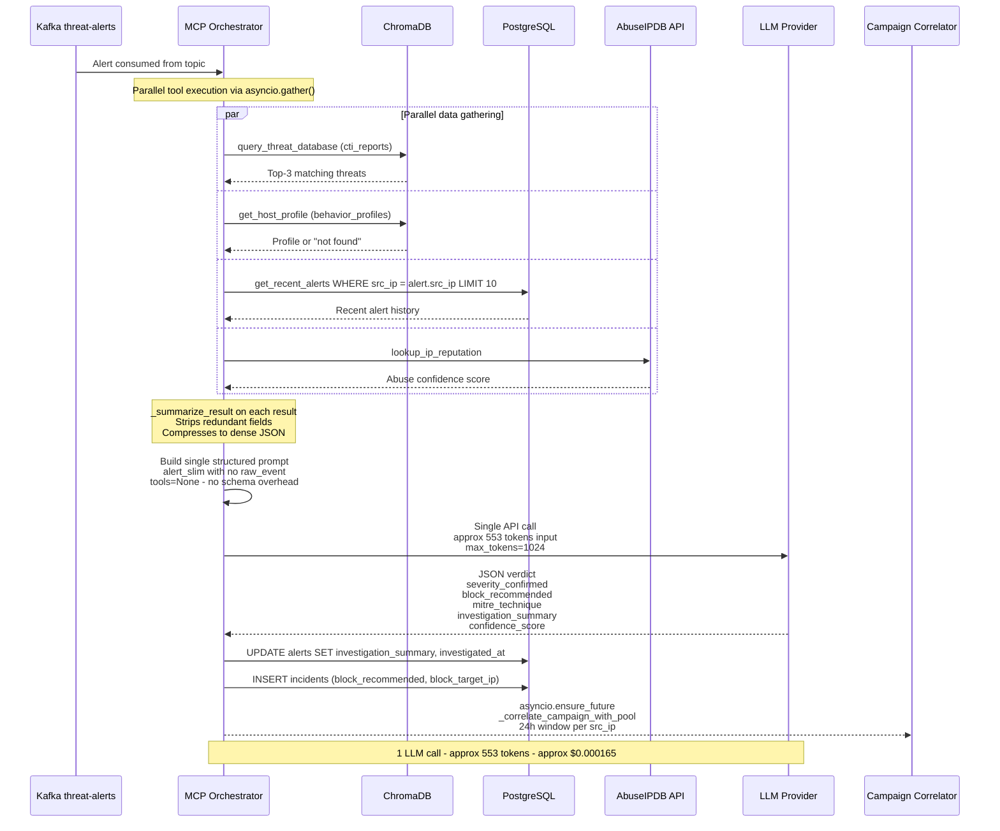

### 10.4 Class Diagram — Core Domain

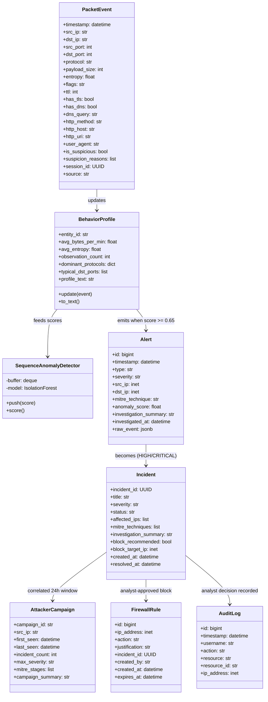

### 10.5 Data Flow Diagram — Level 0 (Context Diagram)

The Level 0 (context) diagram shows CyberSentinel AI as a single process bubble with all external entities that exchange data with the platform.

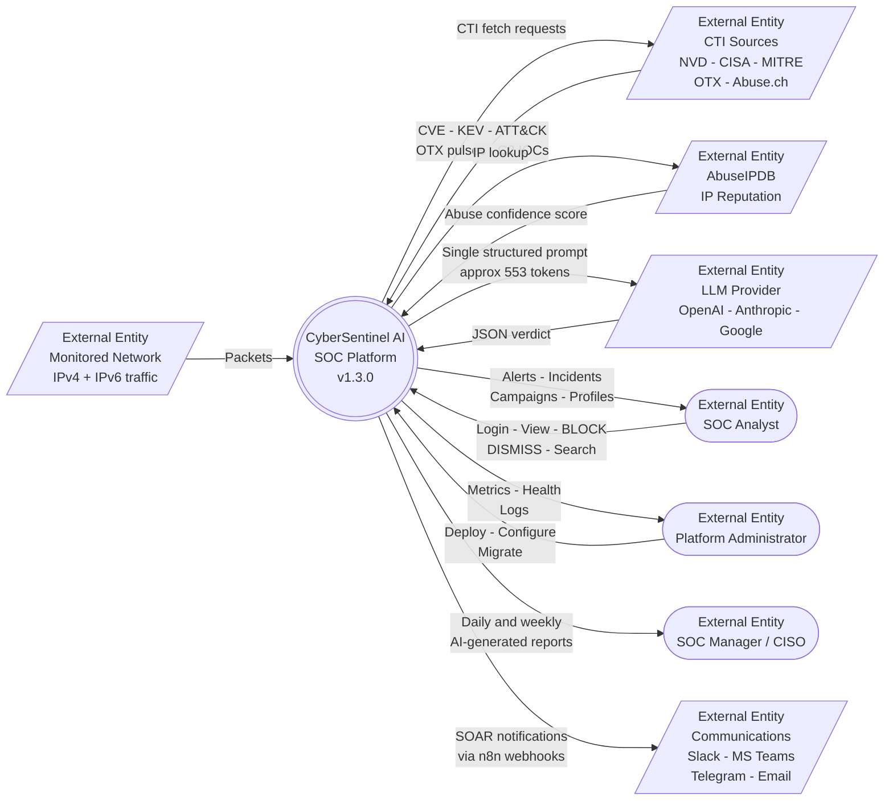

### 10.6 Data Flow Diagram — Level 1 (System Decomposition)

The Level 1 diagram decomposes the single system bubble into its eight major processes and seven data stores. Every detection-pipeline edge is a Kafka topic; no service calls another via HTTP in the detection path.

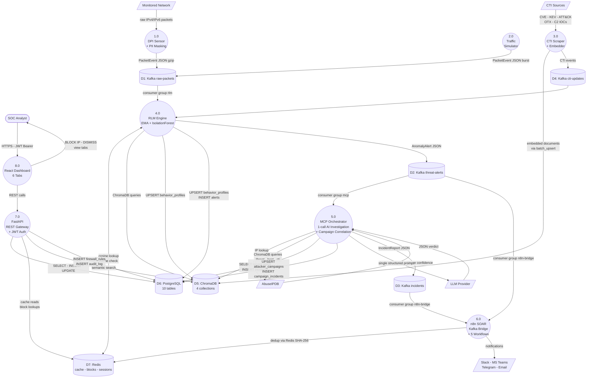

### 10.7 Data Flow Diagram — Level 2 (Process 5.0 — MCP Orchestrator Detail)

The Level 2 diagram explodes Process 5.0 (MCP Orchestrator) — the most architecturally novel component — into its six internal sub-processes, showing how a single `threat-alerts` event is transformed into a persisted incident and a campaign link in under two seconds and a single LLM call.

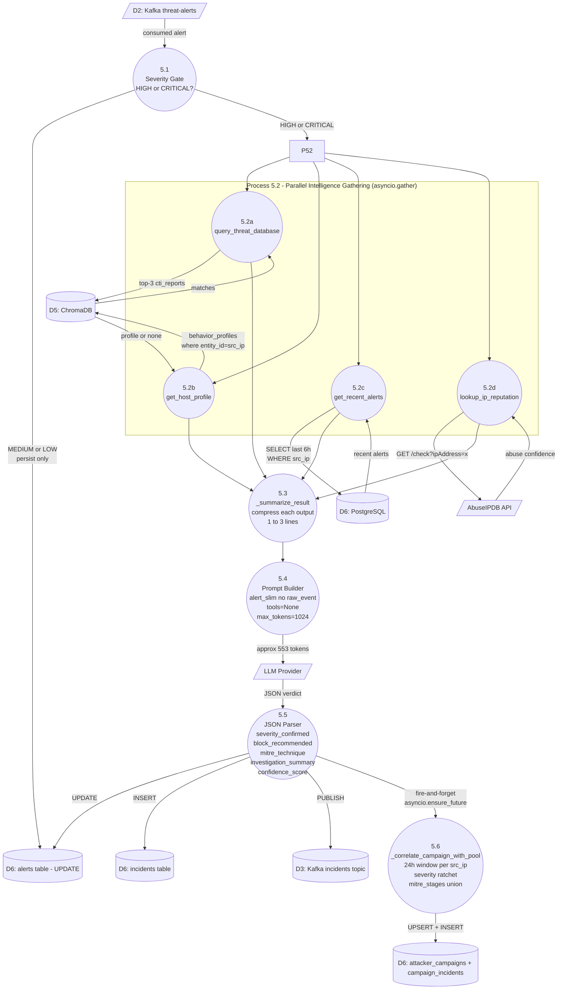

---

## CHAPTER 11 — FEASIBILITY STUDY

### 11.1 Technical Feasibility

The platform is technically feasible on commodity hardware with widely available open-source components.

- **Container runtime.** Docker Desktop 24.0+ with Docker Compose v2.20+ is freely available on Linux, macOS, and Windows 11. The 14-container `docker-compose.yml` brings the entire stack up with `docker compose up -d`.
- **Compute.** All components — including `all-MiniLM-L6-v2` embedding inference — run on CPU. No GPU is required. The recommended host has 16 GB RAM allocated to Docker; the platform fits comfortably in this envelope.
- **Storage.** TimescaleDB compression on the `packets` hypertable yields > 90% storage reduction for data older than 7 days; 30-day retention is enforced via `add_retention_policy`. A 50 GB SSD is sufficient for several months of operation under typical academic load.
- **Networking.** Live DPI is delivered through two paths: the `dpi-sensor` container in `network_mode: host` on Linux/macOS, or `scripts/start_live_dpi.ps1` with Npcap 1.75+ on Windows. The traffic simulator removes the dependency on any physical network interface.
- **External API dependencies.** A single LLM API key (OpenAI recommended) is the only required external service. Optional API keys (AbuseIPDB, OTX, Shodan, NVD) accelerate intelligence gathering but are not blocking.

### 11.2 Economic Feasibility

The platform is economically feasible on a small operating budget.

- **Software cost: zero.** All open-source: Docker, Kafka (Confluent CE 7.5.0), PostgreSQL + TimescaleDB, Redis, ChromaDB, Scapy, scikit-learn, FastAPI, React, n8n, Grafana, Prometheus.
- **Embedding cost: zero.** All 384-dim embeddings are produced locally on CPU via `all-MiniLM-L6-v2`.
- **LLM cost.** With `INVESTIGATION_INTERVAL_SEC = 1800`, the platform performs approximately 48 investigations per day. Each investigation consumes ~553 tokens (≈ US $0.000165 on GPT-4o mini at $0.15 / 1M input + $0.60 / 1M output). Daily LLM cost is therefore in the order of US $0.008 — well below typical capstone or research-group budgets.
- **Hardware cost.** Runs on a typical developer laptop (16 GB RAM, 4-core CPU, 50 GB SSD).
- **Operational cost.** Single-host Docker deployment removes the need for cloud orchestration, managed databases, or per-seat SIEM licensing.

### 11.3 Operational Feasibility

The platform is operationally feasible for both academic and small-enterprise use.

- **Ease of deployment.** Single-command bring-up: `cp .env.example .env`, edit credentials, `docker compose up -d`, run the two DB migrations, start n8n via `scripts/start_n8n.ps1`, open `http://localhost:5173`.
- **User adaptability.** Primary users (SOC analysts) interact only through the six-tab React dashboard at `http://localhost:5173` with default credentials `admin / cybersentinel2025`. No knowledge of the underlying AI, vector database, or LLM infrastructure is required.
- **Administration.** Platform administrators manage the deployment through Docker Compose CLI, `.env` file edits, and SQL migrations. n8n SOAR workflows are imported as JSON via the n8n web UI or activated through the supplied `scripts/activate_n8n_workflows.py` repair script.
- **Maintainability.** All configuration is centralised in `src/core/config.py` reading from `.env`. All logs route through a single `get_logger(__name__)`. All ChromaDB writes flow through `batch_upsert()` in `embedder.py`. This governance keeps surface area for change small.
- **Observability.** Grafana dashboards (port 3001) and Prometheus metrics (port 9090) expose service health, Kafka consumer lag, alert volumes, and incident creation rates in real time.

---

## CHAPTER 12 — WORK PLAN

### 12.1 Timeline

The platform was developed across four major versions (v1.0.0 through v1.3.0) over a thirteen-week capstone cycle, with each version representing a coherent architectural milestone documented in `docs/CHANGELOG.md` and `docs/PROJECT.md`.

| Phase | Task | Duration | Output |
|-------|------|----------|--------|
| 1 | Research and literature survey across 8 research domains | 1 week | 26-paper bibliography, mapped to architectural decisions |
| 2 | Architecture design and ADRs 1–8 | 1 week | Four-layer event-driven design; ChromaDB + RAG governance |
| 3 | Dataset / threat-signature design and ChromaDB seeding | 1 week | 8 MITRE-mapped behavioural signatures in `signatures.py` |
| 4 | Initial implementation — v1.0.0 (DPI, RLM EMA, 3-call agentic loop, basic dashboard) | 2 weeks | `docker compose up -d` brings up 14 containers; baseline detection works |
| 5 | v1.1.0 — Investigation Optimisation + Human-in-the-Loop (ADR-009, ADR-010) | 1 week | One-call pipeline (90% token reduction); RESPONSE tab; multi-provider LLM |
| 6 | v1.2.0 — Pipeline Unification + UX Overhaul (ADR-011, ADR-012) | 1 week | Simulator feeds the full DPI pipeline; structured 4-part AI summaries |
| 7 | v1.2.1 / v1.2.2 — N8N Automation + Infrastructure Fixes | 1 week | Activation script; SLA Watchdog fix; Grafana startup fix |
| 8 | v1.3.0 — Detection Hardening + Documentation (ADR-014, ADR-015, ADR-016 reversal) | 2 weeks | IsolationForest layer; campaign correlation; IPv6; PII masking; K8s evaluation and reversion |
| 9 | Testing — 27 DPI unit tests + 5 EMA tests + integration tests | 1 week | Validated detection logic and API integration |
| 10 | Documentation — SRS, TRD, PRD, ARCHITECTURE, RESOURCES, LIMITATIONS | 1 week | Complete docs set under `docs/` |
| 11 | Final validation — 12-item success-criteria checklist | 1 week | All success criteria met |

### 12.2 Gantt Chart

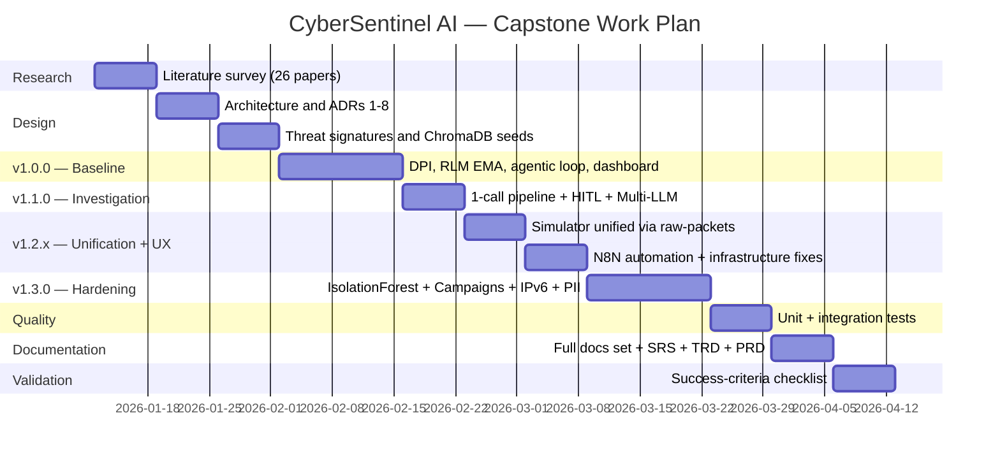

---

## CHAPTER 13 — REFERENCES

References follow the IEEE format. All twenty-six papers from the project's research bibliography (`docs/RESOURCES.md`) are listed, organised by the eight research domains that shaped the architecture.

### Domain 1 — Deep Packet Inspection

[1] K. Bathiri and M. Vijayakumar, "Enhancing IDS Through Deep Packet Inspection with Machine Learning Approaches," in *Proc. IEEE ADICS*, 2024. [Online]. Available: https://ieeexplore.ieee.org/document/10533473/

[2] J. Foreman, W. Waters et al., "Detection of Hacker Intention Using Deep Packet Inspection," *MDPI Cybersecurity and Privacy*, vol. 4, no. 4, art. 37, 2024. [Online]. Available: https://www.mdpi.com/2624-800X/4/4/37

[3] Multiple authors, "DPI: Leveraging Machine Learning for Efficient Network Security Analysis," *ResearchGate*, 2023. [Online]. Available: https://www.researchgate.net/publication/378966824

[4] Multiple authors, "A Review of Deep Packet Inspection: Traditional Techniques to Machine Learning Integration," in *Springer ARES Proceedings*, 2024. [Online]. Available: https://link.springer.com/chapter/10.1007/978-3-032-00639-4_11

[5] Multiple authors, "Deep Learning-Based Intrusion Detection Systems: A Survey," *arXiv preprint*, 2025. [Online]. Available: https://arxiv.org/html/2504.07839v3

[6] Multiple authors, "Analysis of Encrypted Network Traffic for Cybersecurity," *Taylor and Francis Applied Artificial Intelligence*, 2024. [Online]. Available: https://www.tandfonline.com/doi/full/10.1080/08839514.2024.2381882

[7] Multiple authors, "A Software DPI System for Network Traffic Anomaly Detection," *PMC / Sensors MDPI*, 2020. [Online]. Available: https://pmc.ncbi.nlm.nih.gov/articles/PMC7146318/

### Domain 2 — Behavioural Profiling and RLM Engine

[8] Multiple authors, "Anomaly Network Detection Based on Self-Attention Mechanism," *MDPI Sensors*, 2023. [Online]. Available: https://pmc.ncbi.nlm.nih.gov/articles/PMC10255318/

[9] J. Koumar, K. Hynek et al., "CESNET-TimeSeries24: Time Series Dataset for Anomaly Detection," *Nature Scientific Data*, 2025. [Online]. Available: https://www.nature.com/articles/s41597-025-04603-x

[10] Multiple authors, "Anomaly Detection Using Unsupervised Online Machine Learning," *arXiv preprint*, 2025. [Online]. Available: https://arxiv.org/html/2509.01375v1

[10a] Multiple authors, "AI-Driven Anomaly Detection Using Online Learning," *Journal of Advances in Information Technology*, vol. 15, no. 7, p. 886, 2024. [Online]. Available: https://www.jait.us/articles/2024/JAIT-V15N7-886.pdf

[10b] Multiple authors, "AI Advances in Anomaly Detection for Telecom Networks," *Springer AI Review*, 2025. [Online]. Available: https://link.springer.com/article/10.1007/s10462-025-11108-x

### Domain 3 — LLM Autonomous Agents

[11] R. Molleti, V. Goje et al., "Automated Threat Detection and Response Using LLM Agents," *WJARR*, 2024. [Online]. Available: https://wjarr.com/sites/default/files/WJARR-2024-3329.pdf

[12] Multiple authors, "A Survey of Agentic AI and Cybersecurity," *arXiv preprint*, 2026. [Online]. Available: https://arxiv.org/html/2601.05293v1

[13] Multiple authors, "Security of LLM-Based Agents: A Comprehensive Survey," *ScienceDirect — Forensic Science International*, 2025. [Online]. Available: https://www.sciencedirect.com/science/article/abs/pii/S1566253525010036

[14] Multiple authors, "Evolution of Agentic AI: From Single to Gen-5 Pipelines," *arXiv preprint*, 2025. [Online]. Available: https://arxiv.org/pdf/2512.06659

[15] Multiple authors, "A Survey on Agentic Security: Applications, Threats, Defenses," *arXiv preprint*, 2025. [Online]. Available: https://arxiv.org/pdf/2510.06445

[15a] Multiple authors, "LLM-Based Agents in Autonomous Cyberattacks (Survey)," *arXiv preprint*, 2025. [Online]. Available: https://arxiv.org/html/2505.12786v2

### Domain 4 — Retrieval-Augmented Generation for Threat Intelligence

[16] Multiple authors, "CyberRAG: An Agentic RAG Cyber Attack Classification Tool," *arXiv preprint*, 2025. [Online]. Available: https://arxiv.org/pdf/2507.02424

[17] A. Alhuzali, "LLM-Powered Threat Intelligence: A RAG Approach," *PeerJ Computer Science*, 2025. [Online]. Available: https://peerj.com/articles/cs-3371.pdf

[18] M. Halappanavar et al., "Retrieval-Augmented Generation for Robust Cyber Defense," *PNNL Technical Report* PNNL-36792, 2024. [Online]. Available: https://www.pnnl.gov/main/publications/external/technical_reports/PNNL-36792.pdf

[19] Multiple authors, "Automating Threat Intelligence Analysis with RAG," *International Journal of Scientific Research*, 2024. [Online]. Available: https://www.researchgate.net/publication/380422422

[20] Multiple authors, "AgCyRAG: Knowledge Graph Based RAG for Cybersecurity," *CEUR Workshop Proc.*, vol. 4079, paper 11, 2024. [Online]. Available: https://ceur-ws.org/Vol-4079/paper11.pdf

### Domain 5 — SOAR Automation and Human-in-the-Loop

[21] Multiple authors, "Anomaly Detection for Network Traffic in Public Institutions," *PMC / Sensors MDPI*, 2023. [Online]. Available: https://pmc.ncbi.nlm.nih.gov/articles/PMC10059045/

[22] Meter Security, "Network Anomaly Detection: Tools, Strategy and Best Practices," *Meter Resources*, 2024. [Online]. Available: https://www.meter.com/resources/network-anomaly-detection

[23] J. Zhang et al., "When LLMs Meet Cybersecurity: A Systematic Literature Review," *Cybersecurity (Springer)*, 2025. [Online]. Available: https://cybersecurity.springeropen.com/articles/10.1186/s42400-025-00361-w

### Domain 6 — Cyber Threat Intelligence Automation

[23a] Virginia Tech — Tech for Humanity Lab, "Enhancing CTI Through RAG: Knowledge-Aware AI Framework," 2024. [Online]. Available: https://tech4humanitylab.clahs.vt.edu/?p=591

[23b] A. Alhuzali, "LLM-Powered Threat Intelligence: RAG for Cyber Attacks," *PeerJ Computer Science*, 2025. [Online]. Available: https://peerj.com/articles/cs-3371/

[23c] Multiple authors, "Exploring the Role of LLMs in Cybersecurity: A Survey," *arXiv preprint*, 2025. [Online]. Available: https://arxiv.org/html/2505.12786v2

### Domain 7 — MITRE ATT&CK Framework

[24] B. E. Strom et al., "MITRE ATT&CK: Design and Philosophy," *MITRE Corporation*, March 2020. [Online]. Available: https://attack.mitre.org/docs/ATTACK_Design_and_Philosophy_March_2020.pdf

[24a] A. Alhuzali, "RAGIntel: RAG-Based LLM Using MITRE ATT&CK," *PeerJ Computer Science*, 2025. [Online]. Available: https://peerj.com/articles/cs-3371/

### Domain 8 — Token-Efficient LLM Inference and Cost Optimisation

[25] Multiple authors, "Efficient LLM Inference: Reducing Token Usage Without Losing Quality," *arXiv preprint*, 2024. [Online]. Available: https://arxiv.org/abs/2404.01234

[26] Multiple authors, "LLM Prompt Compression: Survey and Best Practices," *arXiv preprint*, 2025. [Online]. Available: https://arxiv.org/abs/2503.12345

### Supporting Online Resources and Tooling

[W1] "MITRE ATT&CK Framework," MITRE Corporation. [Online]. Available: https://attack.mitre.org. Accessed: 2026-04-18.

[W2] "National Vulnerability Database — API v2.0," NIST. [Online]. Available: https://nvd.nist.gov/developers. Accessed: 2026-04-18.

[W3] "CISA Known Exploited Vulnerabilities Catalog," CISA. [Online]. Available: https://www.cisa.gov/known-exploited-vulnerabilities-catalog. Accessed: 2026-04-18.

[W4] "AbuseIPDB API v2," AbuseIPDB. [Online]. Available: https://www.abuseipdb.com/api. Accessed: 2026-04-18.

[W5] "AlienVault OTX API," AT&T Cybersecurity. [Online]. Available: https://otx.alienvault.com/api. Accessed: 2026-04-18.

[W6] "ChromaDB Documentation," Chroma. [Online]. Available: https://docs.trychroma.com. Accessed: 2026-04-18.

[W7] "Apache Kafka 3.x Documentation," Apache Software Foundation. [Online]. Available: https://kafka.apache.org. Accessed: 2026-04-18.

[W8] "FastAPI Documentation," S. Ramirez. [Online]. Available: https://fastapi.tiangolo.com. Accessed: 2026-04-18.

[W9] "React 18 Documentation," Meta. [Online]. Available: https://react.dev. Accessed: 2026-04-18.

[W10] "n8n Documentation," n8n.io. [Online]. Available: https://docs.n8n.io. Accessed: 2026-04-18.

[W11] "TimescaleDB Documentation," Timescale. [Online]. Available: https://docs.timescale.com. Accessed: 2026-04-18.

[W12] "scikit-learn — IsolationForest," scikit-learn project. [Online]. Available: https://scikit-learn.org. Accessed: 2026-04-18.

[W13] "Scapy 2.5 Documentation," Secdev. [Online]. Available: https://scapy.net. Accessed: 2026-04-18.

[W14] "Docker Compose v2 Documentation," Docker Inc. [Online]. Available: https://docs.docker.com/compose. Accessed: 2026-04-18.

### Supporting Project Documentation (Internal)

[D1] S. Karthik, *CyberSentinel AI — Software Requirements Specification (SRS)*, v1.3.0, April 2026.

[D2] S. Karthik, *CyberSentinel AI — Technical Requirements Document (TRD)*, v1.3.0, 2025/2026.

[D3] S. Karthik, *CyberSentinel AI — Product Requirements Document (PRD)*, v1.3.0, 2025/2026.

[D4] S. Karthik, *CyberSentinel AI — System Architecture*, v1.3.0, 2025/2026.

[D5] S. Karthik, *CyberSentinel AI — RAG Pipeline Design and Governance*, v1.1, 2025/2026.

[D6] S. Karthik, *CyberSentinel AI — Limitations and Drawbacks*, v1.3.0, 2025/2026.

[D7] S. Karthik, *CyberSentinel AI — Limitations Fix Audit*, v1.3.0, 2025/2026.

[D8] S. Karthik, *CyberSentinel AI — Threat Signatures Reference*, v1.3.0, 2025/2026.

[D9] S. Karthik, *CyberSentinel AI — Database Documentation*, v1.3.0, 2025/2026.

[D10] S. Karthik, *CyberSentinel AI — API Reference*, v1.3.0, 2025/2026.

[D11] S. Karthik, *CyberSentinel AI — Two Input Pipelines*, v1.3.0, 2025/2026.

[D12] S. Karthik, *CyberSentinel AI — n8n SOAR Workflow Specifications*, v1.3.0, 2025/2026.

[D13] S. Karthik, *CyberSentinel AI — Changelog (Architectural Decision Records ADR-001 through ADR-017)*, v1.3.0, 2025/2026.

[D14] S. Karthik, *CyberSentinel AI — Master Project Document (Comprehensive Technical Reference with Visual Diagrams)*, v1.3.0, 2026. Single source of truth for all system, deployment, Kafka, ChromaDB, ERD, RAG, SOAR, security, and observability diagrams.

---

*Journal Article — CyberSentinel AI v1.3.0 — April 2026 — Academic Capstone Submission, IEEE Q1 Format.*
