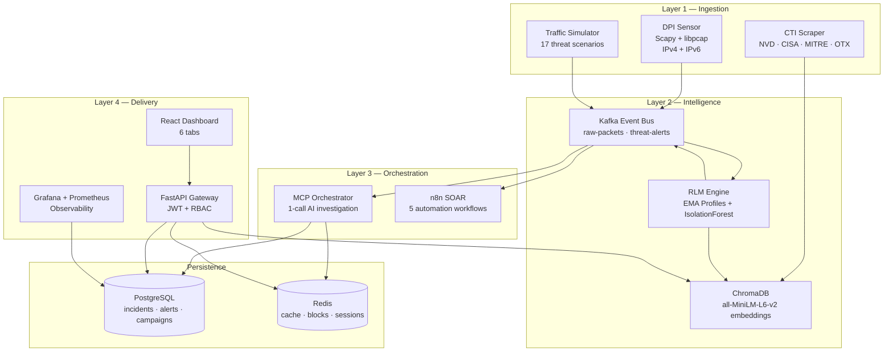
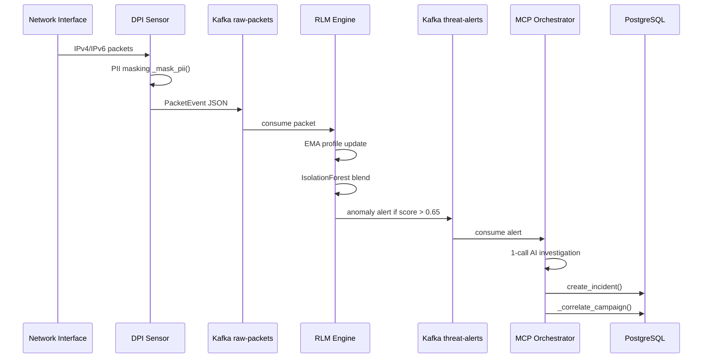
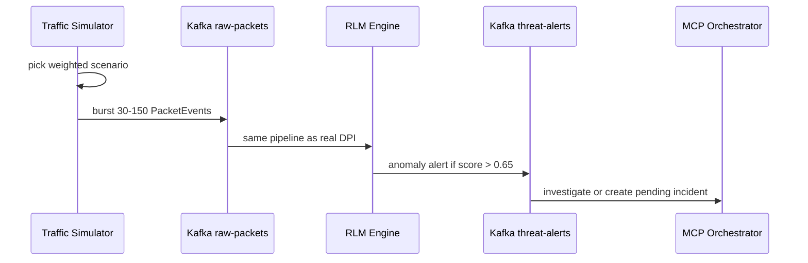
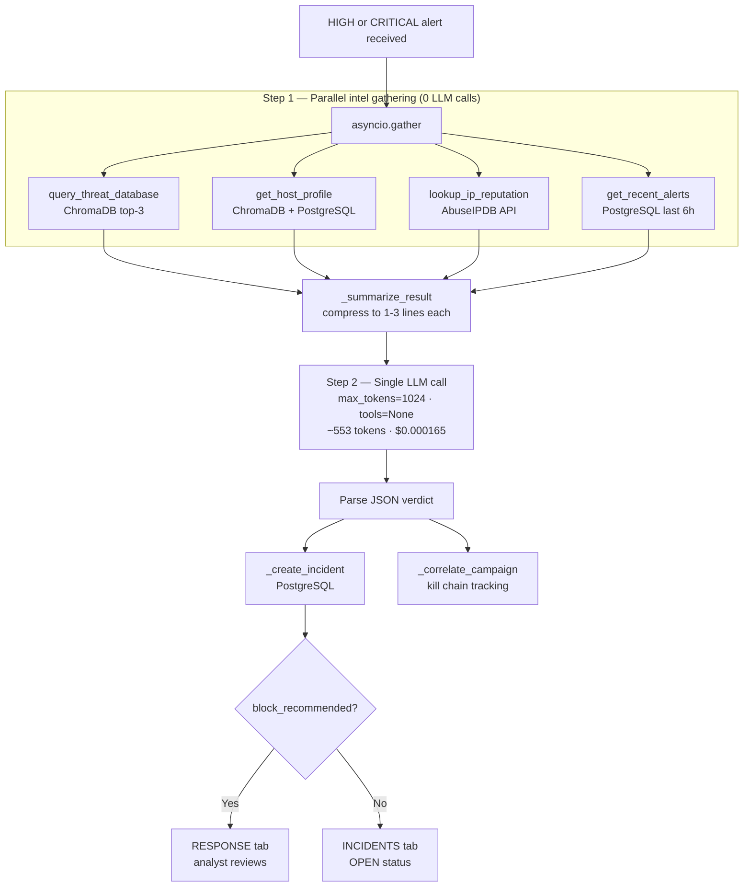
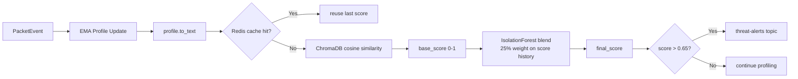
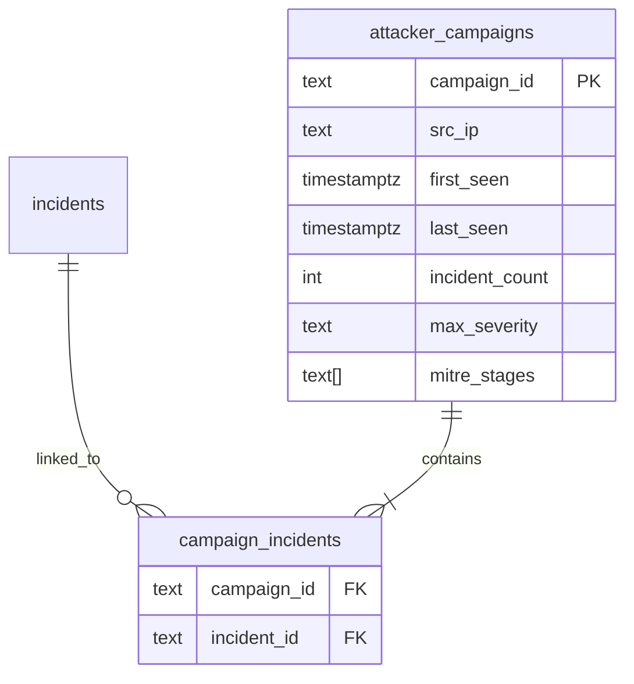
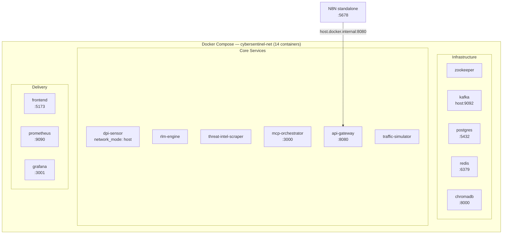

# CyberSentinel AI

**Autonomous Threat Intelligence & Zero-Day Detection Platform**

Enterprise-grade, AI-powered SOC platform combining Deep Packet Inspection, Recursive Language Model (RLM) behavioral profiling, IsolationForest sequence anomaly detection, and AI-driven autonomous investigation with a human-in-the-loop response workflow. Deployed as **14 Docker containers** with a single command.

---

## What It Does


| Problem | Industry Average | CyberSentinel AI |
|---------|-----------------|-----------------|
| Breach detection time | 194 days | < 1 second |
| Alert triage | Manual | Autonomous AI |
| Incident creation | Hours to days | 15–45 seconds, 1 LLM call |
| CVE awareness | Manual monitoring | Automated every 4 hours |
| Block decisions | Ad-hoc | Human-in-the-loop review |

---

## System Architecture



---

## Two Input Modes

### Mode 1 — Real DPI (Production)



### Mode 2 — Traffic Simulator (Testing & Demo)



Both modes are **identical from the Kafka layer onwards** — the simulator is not a shortcut, it exercises the full RLM + AI stack.

---

## Quick Start

### Prerequisites

- Docker Desktop 24.0+ with 16 GB RAM allocated
- One LLM API key: `OPENAI_API_KEY` (recommended) or `ANTHROPIC_API_KEY` or `GOOGLE_API_KEY`

### 1. Configure

```bash
cp .env.example .env
# Edit .env — set LLM_PROVIDER=openai and your OPENAI_API_KEY
```

### 2. Start all 14 services

```bash
docker compose up -d

# Wait for Kafka to be healthy (~2-3 minutes)
docker compose ps
```

### 3. Run DB migrations (first time only)

```bash
docker exec -i cybersentinel-postgres psql -U sentinel -d cybersentinel < scripts/db/migrate_campaigns.sql
docker exec -i cybersentinel-postgres psql -U sentinel -d cybersentinel < scripts/db/migrate_multitenancy.sql
```

### 4. Start n8n SOAR

```powershell
.\scripts\start_n8n.ps1
```

### 5. Open the dashboard

| Service | URL | Credentials |
|---------|-----|-------------|
| SOC Dashboard | http://localhost:5173 | admin / cybersentinel2025 |
| API Swagger | http://localhost:8080/docs | admin / cybersentinel2025 |
| n8n SOAR | http://localhost:5678 | admin / see `.env` |
| Grafana | http://localhost:3001 | admin / admin2025 |
| Prometheus | http://localhost:9090 | none |

> See `docs/RUNNING.md` for the full start/stop guide and troubleshooting.

---

## SOC Dashboard — 6 Tabs

| Tab | Purpose |
|-----|---------|
| OVERVIEW | Risk gauge, metric cards, 24h alert timeline, platform health |
| ALERTS | Alert table — severity badges, anomaly score bars, MITRE tags |
| INCIDENTS | Incident lifecycle — OPEN / INVESTIGATING / RESOLVED / CLOSED |
| RESPONSE | Human-in-the-loop: Block Recommendations, Active Incidents, Firewall Rules |
| THREAT INTEL | ChromaDB semantic search + MITRE coverage map + CTI source status |
| HOSTS | RLM behavioral profile lookup — anomaly score, entropy, kill chain |

---

## AI Investigation Pipeline



| Metric | Old Agentic Loop | Optimized 1-Call |
|--------|-----------------|-----------------|
| LLM calls / investigation | 3 | **1** |
| Tokens / investigation | ~5,500–7,000 | **~553** |
| Cost (GPT-4o mini) | ~$0.001 | **~$0.000165** |
| Budget runway ($5) | ~5,000 | **~30,000 investigations** |

---

## Anomaly Detection Stack



The **IsolationForest** layer sits on a 50-observation rolling buffer per IP and detects anomalous *progressions* — a slow ramp like `[0.30, 0.33, 0.37, 0.41, 0.46]` is flagged even though no single value crosses the threshold.

---

## Kill Chain / Campaign Tracking



Every incident is automatically correlated with a campaign via `_correlate_campaign_with_pool()`. Incidents from the same source IP within 24 hours are grouped into the same campaign. The `GET /api/v1/campaigns` endpoint exposes all campaigns ordered by last activity.

---

## Docker Compose Deployment



Data survives container restarts because all state lives in named Docker volumes: `postgres_data`, `redis_data`, `kafka_data`, `chromadb_data`, `grafana_data`.

---

## MITRE ATT&CK Coverage

| Technique | ID | Detection Layer |
|---|---|---|
| C2 Application Layer Protocol | T1071.001 | DPI timing + RLM |
| Network Service Discovery | T1046 | DPI SYN flood |
| Exfiltration over Non-C2 Channel | T1048.003 | RLM volume + entropy |
| Dynamic DNS Resolution (DGA) | T1568.002 | DPI DNS analysis |
| SMB Lateral Movement | T1021.002 | RLM internal patterns |
| RDP Lateral Movement | T1021.001 | DPI + RLM |
| Obfuscated/Packed Payload | T1027 | DPI entropy |
| Protocol Tunneling | T1572 | DPI oversized ICMP/DNS |
| Brute Force — Password Guessing | T1110.001 | DPI rapid auth failure |
| Password Spraying | T1110.003 | DPI low-and-slow |
| Exploit Public-Facing App | T1190 | DPI payload matching |
| Unix Reverse Shell | T1059.004 | DPI suspicious port |
| Proxy / Tor Usage | T1090.003 | CTI exit node IPs |
| Ransomware Staging | T1486 | RLM SMB enumeration |
| Credential Dumping | T1003 | RLM auth spike |

---

## LLM Provider Configuration

Switch providers with one env var — no code changes:

```bash
# .env
LLM_PROVIDER=openai          # claude | openai | gemini
OPENAI_API_KEY=sk-...

LLM_MODEL_PRIMARY=gpt-4o-mini
LLM_TEMPERATURE=0.2
INVESTIGATION_INTERVAL_SEC=1800
```

| Provider | Model | Cost/investigation | Recommendation |
|----------|-------|-------------------|----------------|
| openai | gpt-4o-mini | $0.000165 | Best value |
| claude | claude-sonnet-4-6 | ~$0.0004 | Best quality |
| gemini | gemini-2.5-flash | free tier | Not recommended (content filter) |

---

## Common Commands

```bash
# Check all containers
docker compose ps

# View service logs
docker compose logs -f mcp-orchestrator
docker compose logs -f rlm-engine

# Rebuild and redeploy a service after code change
docker compose up -d --build mcp-orchestrator

# Restart a service
docker compose restart api-gateway

# Full reset (WARNING: deletes all data volumes)
docker compose down -v
docker compose up -d
```

---

## Project Structure

```
cybersentinel-ai/
├── src/
│   ├── core/               # Config, logger, constants
│   ├── dpi/                # DPI sensor — packet capture + PII masking
│   ├── models/             # RLM engine — EMA + IsolationForest
│   ├── agents/             # MCP orchestrator + LLM provider + tools
│   ├── ingestion/          # CTI scraper + RAG embedder
│   ├── simulation/         # Traffic simulator (17 scenarios)
│   └── api/                # FastAPI REST gateway
├── docker/                 # Dockerfiles (one per service)
├── docker-compose.yml      # All 14 services
├── scripts/
│   ├── start_n8n.ps1       # Starts N8N container with correct env vars
│   ├── start_live_dpi.ps1  # Windows DPI with Npcap
│   └── db/                 # SQL migrations (migrate_campaigns.sql, migrate_multitenancy.sql)
├── configs/                # Prometheus + Grafana configs
├── frontend/               # React SOC Dashboard
├── n8n/                    # SOAR workflow JSONs
├── docs/                   # Full documentation
└── .env                    # All secrets and config (gitignored)
```

---

## Key Metrics

- **14** Docker containers (`docker compose up -d`)
- **6** SOC Dashboard tabs
- **5** SOAR workflows (n8n)
- **17** simulated threat scenarios (12 MITRE-mapped + 5 novel)
- **15** MITRE ATT&CK techniques covered
- **5** live CTI sources (NVD, CISA, Abuse.ch, MITRE, OTX)
- **3** LLM providers switchable via single env var
- **1** LLM call per investigation (~553 tokens, ~$0.000165)
- **0** external embedding API calls (fully local, CPU-only)
- **11/16** documented limitations fully fixed

---

## Documentation

| Document | Purpose |
|----------|---------|
| [`docs/RUNNING.md`](docs/RUNNING.md) | Start/stop guide, everyday workflow, troubleshooting |
| [`docs/ARCHITECTURE.md`](docs/ARCHITECTURE.md) | Deep-dive system design with Mermaid diagrams |
| [`docs/PIPELINES.md`](docs/PIPELINES.md) | DPI vs Simulator pipeline comparison |
| [`docs/DEPLOYMENT_PLAN.md`](docs/DEPLOYMENT_PLAN.md) | Kubernetes deployment guide |
| [`docs/DATABASE.md`](docs/DATABASE.md) | Full schema — all tables, indexes, migrations |
| [`docs/API_REFERENCE.md`](docs/API_REFERENCE.md) | All REST API endpoints |
| [`docs/CHANGELOG.md`](docs/CHANGELOG.md) | Version history + architectural decisions |
| [`docs/LIMITATIONS.md`](docs/LIMITATIONS.md) | Known limitations + severity |
| [`docs/LIMITATIONS_FIXES.md`](docs/LIMITATIONS_FIXES.md) | Fix audit — what was addressed and how |
| [`docs/TRD.md`](docs/TRD.md) | Technical Requirements Document |
| [`docs/RAG_DESIGN.md`](docs/RAG_DESIGN.md) | RAG pipeline design + governance |
| [`docs/WORKFLOWS.md`](docs/WORKFLOWS.md) | n8n SOAR workflow specifications |

---

*CyberSentinel AI v1.3.0 — Academic Capstone Project 2025/2026*
