# Software Requirements Specification

**CyberSentinel AI — Autonomous Threat Intelligence and Zero-Day Detection Platform**

| Field | Value |
|-------|-------|
| Stream | Application |
| Version | 1.3.0 |
| Date | April 2026 |
| Status | Final |
| Authors | S Karthik |

---

## Table of Contents

1. [Introduction](#1-introduction)
   - 1.1 [Scope of SRS Document](#11-scope-of-srs-document)
   - 1.2 [Definitions, Acronyms and Abbreviations](#12-definitions-acronyms-and-abbreviations)
   - 1.3 [References](#13-references)
   - 1.4 [Overview](#14-overview)
2. [Overall Description](#2-overall-description)
   - 2.1 [Product Perspective](#21-product-perspective)
   - 2.2 [Product Functions](#22-product-functions)
   - 2.3 [User Characteristics](#23-user-characteristics)
   - 2.4 [General Constraints](#24-general-constraints)
   - 2.5 [Assumptions and Dependencies](#25-assumptions-and-dependencies)
3. [Specific Requirements](#3-specific-requirements)
   - 3.1 [External Requirements](#31-external-requirements)
   - 3.2 [Functional Requirements](#32-functional-requirements)
   - 3.3 [Non-Functional Requirements](#33-non-functional-requirements)
   - 3.4 [Other Requirements](#34-other-requirements)
4. [Architectural Overview](#4-architectural-overview)
5. [Data Flow Diagrams](#5-data-flow-diagrams)
6. [Design Constraints](#6-design-constraints)

---

## 1. Introduction

CyberSentinel AI is an enterprise-grade, AI-powered Security Operations Centre (SOC) platform designed to autonomously detect, investigate, and recommend responses to cyber threats in real time. The system integrates deep packet inspection, machine learning-based behavioural profiling, semantic threat intelligence retrieval via RAG (Retrieval-Augmented Generation), large language model (LLM) driven investigation, and human-in-the-loop response automation into a unified platform deployable as 14 Docker containers with a single command.

The platform addresses the critical gap between the volume of modern cyber threats and the capacity of human security analysts — reducing breach detection time from an industry average of 194 days to under one second, while ensuring all blocking decisions remain under human control.

| Metric | Industry Average | CyberSentinel AI |
|--------|-----------------|-----------------|
| Breach detection time | 194 days | Under 1 second |
| Alert triage | Manual by analyst | Autonomous AI (~553 tokens, ~$0.000165) |
| Incident creation | Hours to days | Under 60 seconds |
| False-positive blocking | Common with auto-block systems | Eliminated — analyst approves every block |
| CVE awareness | Manual monitoring | Automated, every 4 hours |
| Attack campaign tracking | Manual correlation | Automatic 24-hour kill chain grouping |

### 1.1 Scope of SRS Document

This Software Requirements Specification covers the complete CyberSentinel AI platform version 1.3.0. It defines:

- All functional capabilities across four architectural layers: Ingestion, Intelligence, Orchestration, and Delivery
- Non-functional requirements including performance, security, scalability, and reliability
- External interface requirements for hardware, software, and user interaction
- Architectural constraints and design decisions governing the implementation

This document applies to the full platform stack: the DPI sensor (`src/dpi/sensor.py`), RLM engine (`src/models/rlm_engine.py`), MCP orchestrator (`src/agents/mcp_orchestrator.py`), CTI scraper (`src/ingestion/threat_intel_scraper.py`), traffic simulator (`src/simulation/traffic_simulator.py`), API gateway (`src/api/gateway.py`), React SOC dashboard (`frontend/src/CyberSentinel_Dashboard.jsx`), n8n SOAR workflows, and all supporting infrastructure (Kafka, PostgreSQL, Redis, ChromaDB).

This document does **not** cover:

- Multi-tenant deployment — schema is prepared (`migrate_multitenancy.sql`) but not enforced in v1.3.0
- Mobile or native desktop client applications
- Physical firewall or router API integration — block rules are managed within the platform only
- Cloud-hosted SaaS deployment — the platform is fully self-hosted

### 1.2 Definitions, Acronyms and Abbreviations

| Term | Definition |
|------|-----------|
| **AI** | Artificial Intelligence |
| **API** | Application Programming Interface |
| **ATT&CK** | Adversarial Tactics, Techniques, and Common Knowledge — MITRE threat framework |
| **BPF** | Berkeley Packet Filter — expression language for network packet filtering |
| **C2** | Command and Control — attacker-to-compromised-host communication channel |
| **CISA** | Cybersecurity and Infrastructure Security Agency (US) |
| **CTI** | Cyber Threat Intelligence |
| **CVE** | Common Vulnerabilities and Exposures |
| **CVSS** | Common Vulnerability Scoring System |
| **DGA** | Domain Generation Algorithm — malware technique to generate C2 domains dynamically |
| **DPI** | Deep Packet Inspection — analysis of network packet content beyond headers |
| **EMA** | Exponential Moving Average — online statistical smoothing technique |
| **ERD** | Entity-Relationship Diagram |
| **HNSW** | Hierarchical Navigable Small World — approximate nearest-neighbour algorithm used by ChromaDB |
| **HTTP/HTTPS** | Hypertext Transfer Protocol / Secure |
| **IP / IPv4 / IPv6** | Internet Protocol version 4 and version 6 |
| **JWT** | JSON Web Token — compact bearer token for stateless authentication |
| **KEV** | Known Exploited Vulnerabilities — CISA catalogue of actively exploited CVEs |
| **LLM** | Large Language Model |
| **MCP** | Model Context Protocol — the orchestration pattern used for AI investigation |
| **MITRE** | MITRE Corporation — publisher of the ATT&CK adversary behaviour framework |
| **NIC** | Network Interface Card |
| **NVD** | National Vulnerability Database |
| **OTX** | AlienVault Open Threat Exchange — community threat intelligence sharing platform |
| **PII** | Personally Identifiable Information |
| **RBAC** | Role-Based Access Control |
| **RAG** | Retrieval-Augmented Generation — LLM pattern combining vector search with generation |
| **RDP** | Remote Desktop Protocol |
| **REST** | Representational State Transfer |
| **RLM** | Reinforcement Learning Module — the behavioural profiling engine in CyberSentinel AI |
| **SMB** | Server Message Block — Windows file-sharing protocol |
| **SOAR** | Security Orchestration, Automation and Response |
| **SOC** | Security Operations Centre |
| **SSH** | Secure Shell |
| **TCP / UDP** | Transmission Control Protocol / User Datagram Protocol |
| **TLS** | Transport Layer Security |
| **TTL** | Time To Live |
| **UPSERT** | Database operation combining INSERT and UPDATE |

### 1.3 References

| Reference | Description |
|-----------|-------------|
| MITRE ATT&CK Framework v14 | Adversary tactics and techniques taxonomy — https://attack.mitre.org |
| NVD API v2.0 | National Vulnerability Database — https://nvd.nist.gov/developers |
| CISA KEV Catalogue | Known Exploited Vulnerabilities — https://www.cisa.gov/known-exploited-vulnerabilities-catalog |
| AbuseIPDB API v2 | IP reputation scoring — https://www.abuseipdb.com/api |
| AlienVault OTX API | Community threat intelligence pulses — https://otx.alienvault.com/api |
| Shodan API | Internet-connected device intelligence — https://developer.shodan.io |
| ChromaDB Documentation | Vector database — https://docs.trychroma.com |
| all-MiniLM-L6-v2 | Sentence Transformers embedding model, 384 dimensions — HuggingFace |
| Apache Kafka 3.x | Distributed event streaming — https://kafka.apache.org |
| FastAPI | Python REST API framework — https://fastapi.tiangolo.com |
| React 18 | Frontend framework — https://react.dev |
| n8n | Workflow automation / SOAR engine — https://docs.n8n.io |
| TimescaleDB | Time-series PostgreSQL extension — https://docs.timescale.com |
| IsolationForest (scikit-learn) | Anomaly detection — https://scikit-learn.org |
| OpenAI GPT-4o mini API | Default LLM provider — https://platform.openai.com |
| Anthropic Claude API | Alternative LLM provider — https://docs.anthropic.com |
| Docker Compose v2 | Container orchestration — https://docs.docker.com/compose |
| Scapy 2.5+ | Python packet manipulation library — https://scapy.net |
| docs/MASTER.md | CyberSentinel AI full technical reference |
| docs/ARCHITECTURE.md | Design principles, failure modes, scalability |
| docs/DATABASE.md | PostgreSQL schema reference and migrations |
| docs/PIPELINES.md | DPI vs simulator pipeline deep comparison |
| docs/API_REFERENCE.md | All REST endpoints with request/response schemas |

### 1.4 Overview

The remainder of this document is structured as follows:

- **Section 2** provides a high-level view of the product, its functions, intended users, constraints, and dependencies
- **Section 3** details all functional, non-functional, and external interface requirements
- **Section 4** describes the four-layer system architecture and component responsibilities
- **Section 5** traces data through the system via Mermaid data flow diagrams — from packet capture to incident resolution
- **Section 6** documents the design constraints that shaped the implementation

---

## 2. Overall Description

### 2.1 Product Perspective

CyberSentinel AI is a standalone, self-hosted cybersecurity platform built as an academic capstone project. It is not a component of a larger system — it is a complete, production-deployable SOC platform that runs as **14 Docker containers** on a single host via `docker compose up -d`.

The platform sits passively between the monitored network and human security analysts. It observes network traffic via a DPI sensor, builds behavioural profiles of hosts, scores anomalies using a hybrid EMA + IsolationForest model, investigates high-severity alerts autonomously using an LLM, and surfaces actionable recommendations through a React SOC dashboard. No traffic is modified and no IP is blocked without explicit analyst approval.

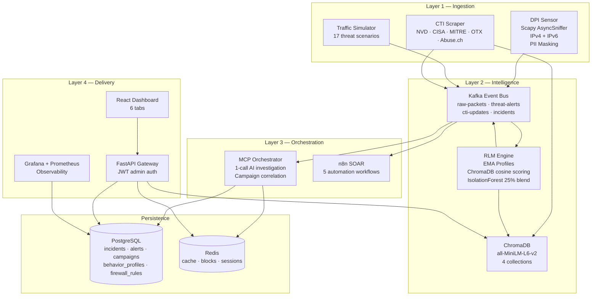

The platform integrates with five external threat intelligence feeds (NVD, CISA, Abuse.ch, MITRE ATT&CK, OTX), one or more LLM providers (OpenAI, Anthropic, Google), AbuseIPDB for real-time IP reputation, and n8n for SOAR workflow execution (Slack, Jira, PagerDuty, ServiceNow).

### 2.2 Product Functions

| # | Function | Key Component |
|---|----------|--------------|
| F1 | Real-time packet capture and DPI (IPv4 + IPv6) with PII masking | `src/dpi/sensor.py` |
| F2 | EMA-based behavioural host profiling per source IP | `src/models/rlm_engine.py` |
| F3 | IsolationForest sequence anomaly detection (50-obs rolling buffer, 25% blend) | `SequenceAnomalyDetector` class |
| F4 | Semantic threat correlation via ChromaDB cosine similarity (RAG) | `src/ingestion/embedder.py` |
| F5 | Autonomous 1-call LLM investigation — asyncio.gather + single LLM call | `src/agents/mcp_orchestrator.py` |
| F6 | Attacker campaign correlation — 24-hour kill chain grouping per src_ip | `attacker_campaigns` + `campaign_incidents` tables |
| F7 | Human-in-the-loop SOAR — analyst approves or dismisses block via RESPONSE tab | FastAPI + React |
| F8 | Threat intelligence ingestion from 5 sources every 4 hours | `src/ingestion/threat_intel_scraper.py` |
| F9 | 5 automated n8n SOAR workflows (alerts, daily report, CVE pipeline, SLA, weekly) | `n8n/workflows/` |
| F10 | 17-scenario traffic simulator publishing to the same Kafka topic as real DPI | `src/simulation/traffic_simulator.py` |
| F11 | 6-tab React SOC dashboard with live API-backed data | `frontend/src/CyberSentinel_Dashboard.jsx` |
| F12 | Prometheus + Grafana observability stack | `configs/prometheus/`, `configs/grafana/` |

### 2.3 User Characteristics

**Primary User — Security Analyst**

The primary user operates within a SOC environment. Characteristics:
- Familiar with network security concepts: IP addresses, ports, protocols, common attack patterns
- Understands MITRE ATT&CK framework and severity classifications (CRITICAL / HIGH / MEDIUM / LOW)
- Requires **no knowledge** of the underlying AI, vector database, or LLM infrastructure
- Accesses the platform exclusively through the React SOC Dashboard at `http://localhost:5173`
- Makes block/dismiss decisions on AI-flagged IPs via the RESPONSE tab

**Secondary User — Platform Administrator**

Manages deployment, configuration, and maintenance. Characteristics:
- Proficient with Docker and Docker Compose
- Configures `.env` file with API keys and secrets
- Runs database migrations (`migrate_campaigns.sql`, `migrate_multitenancy.sql`)
- Diagnoses issues using `docker compose logs` and PostgreSQL / Redis CLI tools
- Starts n8n SOAR via `scripts/start_n8n.ps1`

**Tertiary User — SOC Manager / Executive**

Receives automated reports from n8n SOAR workflows (daily SOC summary, weekly board report) delivered to Slack. Requires no direct interaction with the platform.

### 2.4 General Constraints

| ID | Constraint |
|----|-----------|
| GC-01 | **No auto-blocking.** The system must never automatically execute an IP block. All block decisions require explicit analyst approval via the RESPONSE tab. This is an architectural constraint, not a configuration option. |
| GC-02 | **LLM API required for investigation.** AI investigation of HIGH and CRITICAL alerts requires an active LLM API connection. The detection pipeline (DPI → RLM → Kafka) operates independently. |
| GC-03 | **Local embeddings only.** All vector embeddings must use the local `all-MiniLM-L6-v2` model. No external embedding API may be used. Zero embedding cost, zero data exfiltration. |
| GC-04 | **Single admin account in v1.3.0.** The platform supports one `admin` account. Multi-user RBAC is defined in the DB schema but not enforced in the API code in this version. |
| GC-05 | **PII must not reach Kafka.** `_mask_pii()` must be called on every PacketEvent before publishing. Emails and credential parameters must be redacted. |
| GC-06 | **No direct ChromaDB access.** All upsert operations must go through `batch_upsert()` in `src/ingestion/embedder.py`. No service may call ChromaDB collection methods directly. |
| GC-07 | **DPI container requires Linux/macOS.** The DPI sensor uses `network_mode: host` + `NET_ADMIN` / `NET_RAW` caps. On Windows, DPI runs natively via `scripts/start_live_dpi.ps1` with Npcap installed. The simulator provides equivalent functionality without a physical interface. |
| GC-08 | **No Kubernetes.** Docker Compose is the authoritative deployment. A Kubernetes migration was evaluated and reverted (ADR-016). |

### 2.5 Assumptions and Dependencies

**Assumptions:**

- Docker Desktop 24.0+ is installed with at least 16 GB RAM allocated to Docker
- A valid LLM API key (OpenAI recommended) is available before first deployment
- `.env` is populated from `.env.example` before running `docker compose up -d`
- Database migrations are run on first deployment
- n8n is started separately via `scripts/start_n8n.ps1` after the main stack is up

**External Dependencies:**

| Dependency | Version | Role | Behaviour if Unavailable |
|-----------|---------|------|--------------------------|
| Docker Desktop | 24.0+ | Container runtime | Platform cannot start |
| Docker Compose | v2.20+ | Orchestration | Platform cannot start |
| OpenAI API | GPT-4o mini | Default LLM for investigation | Investigations fail; detection pipeline continues |
| AbuseIPDB API | v2 | IP reputation lookup | Investigation proceeds without reputation score |
| NVD API | v2.0 | CVE ingestion | Rate-limited anonymous fallback |
| Kafka (Confluent) | 7.5.0 | Event streaming | Alert pipeline pauses; offsets saved, no data loss on restart |
| PostgreSQL (TimescaleDB) | pg16 | Persistent storage | API returns 503 |
| Redis | 7-alpine | Caching + sessions | Blocking decisions fall back to PostgreSQL |
| ChromaDB | latest | Vector similarity store | RLM scoring pauses; last cached score used |
| n8n | latest | SOAR workflows | Alerts still created; no Slack/Jira/PagerDuty notifications |
| Scapy | 2.5+ | Packet capture | Simulator pipeline unaffected |

---

## 3. Specific Requirements

### 3.1 External Requirements

#### 3.1.1 User Interface Requirements

**UI-01 — Web-Based SOC Dashboard**
Accessible at `http://localhost:5173` via any modern browser (Chrome, Firefox, Edge, Safari). No plugins required. Dashboard automatically loads realistic demo data if the API is unreachable.

**UI-02 — Login Screen**
A login form is presented before any data is shown. Authenticates against `POST /auth/token` (OAuth2 password flow). JWT token is stored in browser session state and sent as a Bearer token on all subsequent requests. Default credentials: `admin` / `cybersentinel2025`.

**UI-03 — Six Dashboard Tabs**

| Tab | Content |
|-----|---------|
| OVERVIEW | Animated risk score gauge (0–100), 6 KPI metric cards, 24-hour alert timeline bar chart, top MITRE techniques |
| ALERTS | Filterable table with severity badges, anomaly score bars, MITRE tags, investigation summaries |
| INCIDENTS | Incident cards with status (OPEN / INVESTIGATING / RESOLVED / DISMISSED), `block_recommended` badges, campaign links |
| HOSTS | IP lookup — full EMA behavioural profile, anomaly score, block status, recent alerts (all under nested `.profile` key) |
| THREAT INTEL | Semantic search via `POST /api/v1/threat-search` — queries ChromaDB `cve_database` + `cti_reports` |
| RESPONSE | Human-in-the-loop: pending block recommendations with BLOCK IP and DISMISS buttons. No auto-blocking. |

**UI-04 — Service URLs**

| Service | URL | Credentials |
|---------|-----|-------------|
| SOC Dashboard | http://localhost:5173 | admin / cybersentinel2025 |
| API Swagger UI | http://localhost:8080/docs | admin / cybersentinel2025 |
| n8n SOAR | http://localhost:5678 | admin / see `.env` |
| Grafana | http://localhost:3001 | admin / admin2025 |
| Prometheus | http://localhost:9090 | none |

#### 3.1.2 Hardware Requirements

| Resource | Minimum | Recommended |
|----------|---------|-------------|
| CPU | 4 cores | 8+ cores |
| RAM (Docker) | 16 GB | 32 GB |
| Storage | 20 GB SSD | 50 GB SSD |
| Network | 1 Gbps NIC | 10 Gbps for high-traffic environments |
| OS | Linux (Ubuntu 22.04+), macOS 13+, or Windows 11 Pro | Linux preferred for DPI sensor |
| GPU | Not required | Not applicable — all inference on CPU |

For live DPI (not simulation): a network interface accessible to the container in `network_mode: host`. On Windows, Npcap 1.75+ must be installed.

#### 3.1.3 Software Requirements

| Requirement | Detail |
|-------------|--------|
| SW-01 Container runtime | Docker Desktop 24.0+ with Docker Compose v2.20+ |
| SW-02 OS | Linux / macOS / Windows 11 Pro with Docker Desktop for full stack; Linux/macOS required for DPI container |
| SW-03 Frontend dev | Node.js 18+ and npm (only needed for `npm run dev`; production uses Nginx container) |
| SW-04 Python | 3.11+ for running tests outside Docker (`pytest tests/`) |
| SW-05 Windows DPI | Npcap 1.75+ with WinPcap compatibility mode enabled |
| SW-06 LLM provider | Active internet + API key for OpenAI (recommended), Anthropic, or Google. Gemini is not recommended — 20 req/day free tier + safety filters block security content |

### 3.2 Functional Requirements

#### FR-01 — Packet Capture and PII Masking

| ID | Requirement |
|----|-------------|
| FR-01.1 | The DPI sensor must capture packets from `CAPTURE_INTERFACE` using Scapy `AsyncSniffer` |
| FR-01.2 | BPF filter must be `ip or ip6` — both IPv4 and IPv6 must be captured |
| FR-01.3 | Each packet must be parsed into a `PacketEvent` with exactly 21 fields: `timestamp`, `src_ip`, `dst_ip`, `src_port`, `dst_port`, `protocol`, `payload_size`, `entropy`, `flags`, `ttl`, `has_tls`, `has_dns`, `dns_query`, `http_method`, `http_host`, `http_uri`, `user_agent`, `is_suspicious`, `suspicion_reasons`, `session_id`, `source` |
| FR-01.4 | `_mask_pii()` must be called on every `PacketEvent` before Kafka publication — emails redacted from `dns_query`/`http_uri`/`user_agent`; credential params (`password=`, `token=`, `api_key=`) redacted from HTTP fields |
| FR-01.5 | `PacketEvent` JSON must be published to Kafka topic `raw-packets` with gzip compression |
| FR-01.6 | A `session_id` UUID must be assigned to group packets belonging to the same flow |

#### FR-02 — Traffic Simulation

| ID | Requirement |
|----|-------------|
| FR-02.1 | The simulator must implement exactly 17 threat scenarios: 12 MITRE ATT&CK-mapped + 5 novel AI-classified |
| FR-02.2 | Each scenario invocation must generate a burst of 30–150 `PacketEvent` dicts |
| FR-02.3 | All simulator events must publish to `raw-packets` — the same topic as the real DPI sensor |
| FR-02.4 | The simulator must **never** publish directly to `threat-alerts` — the full RLM pipeline must process all events |
| FR-02.5 | Scenario selection must use weighted `random.choices` — higher-severity scenarios have higher weights |

#### FR-03 — Behavioural Profiling (RLM Engine)

| ID | Requirement |
|----|-------------|
| FR-03.1 | The RLM engine must maintain a `BehaviorProfile` per unique source IP |
| FR-03.2 | Profiles must update per packet using EMA with `alpha = RLM_ALPHA` (default 0.1) |
| FR-03.3 | Profile fields: `avg_bytes_per_min`, `avg_entropy`, `observation_count`, `dominant_protocols`, `typical_dst_ports`, `profile_text` |
| FR-03.4 | Scoring must not begin until `observation_count ≥ RLM_MIN_OBSERVATIONS` (default 20) |
| FR-03.5 | Profiles must be persisted to PostgreSQL `behavior_profiles` via UPSERT (one record per IP per hour) |
| FR-03.6 | Profiles must be embedded and upserted to ChromaDB `behavior_profiles` collection via `batch_upsert()` |

#### FR-04 — Anomaly Scoring

| ID | Requirement |
|----|-------------|
| FR-04.1 | Base score = cosine similarity between profile embedding and `threat_signatures` ChromaDB collection |
| FR-04.2 | Redis must be checked for a cached embedding before calling ChromaDB (cache key: SHA-256 of `collection:model:text`) |
| FR-04.3 | `SequenceAnomalyDetector` must maintain a 50-observation rolling score buffer per IP |
| FR-04.4 | IsolationForest blending must not begin until ≥10 observations are in the buffer |
| FR-04.5 | IsolationForest contributes 25% of the final score (`ISOLATION_FOREST_WEIGHT=0.25`) |
| FR-04.6 | A `threat-alerts` Kafka event must be emitted when `final_score ≥ RLM_ANOMALY_THRESHOLD` (default 0.65) |
| FR-04.7 | Severity mapping: score ≥ 0.90 → CRITICAL; score ≥ 0.75 → HIGH; score ≥ 0.65 → MEDIUM |

#### FR-05 — AI Investigation (1-Call LLM Pipeline)

| ID | Requirement |
|----|-------------|
| FR-05.1 | MCP orchestrator must consume alerts from the `threat-alerts` Kafka topic (consumer group: `mcp`) |
| FR-05.2 | Only HIGH and CRITICAL alerts trigger LLM investigation |
| FR-05.3 | Four tools must execute in parallel via `asyncio.gather()`: `query_threat_database` (ChromaDB), `get_host_profile` (ChromaDB + PostgreSQL), `get_recent_alerts` (PostgreSQL), `lookup_ip_reputation` (AbuseIPDB) |
| FR-05.4 | Each tool result must be compressed by `_summarize_result()` before the LLM prompt is built |
| FR-05.5 | Exactly one LLM API call must be made per investigation with `tools=None` and `max_tokens=1024` |
| FR-05.6 | The `raw_event` field must be excluded from the LLM prompt |
| FR-05.7 | Total input tokens must not exceed ~600 under normal conditions (~553 typical) |
| FR-05.8 | LLM response must be parsed as JSON: `severity_confirmed`, `block_recommended`, `mitre_technique`, `investigation_summary`, `confidence_score` |
| FR-05.9 | On HTTP 429 (rate limit), apply exponential backoff: 5s → 15s → 45s |
| FR-05.10 | Minimum interval between investigations: `INVESTIGATION_INTERVAL_SEC` (default 1800s) |

#### FR-06 — Incident Management

| ID | Requirement |
|----|-------------|
| FR-06.1 | A new incident must be created in PostgreSQL for every completed investigation |
| FR-06.2 | Incident fields: `title`, `severity`, `status` (default OPEN), `affected_ips`, `mitre_techniques`, `investigation_summary`, `block_recommended`, `block_target_ip` |
| FR-06.3 | The `alerts` record must be updated with `investigation_summary` and `investigated_at` on completion |
| FR-06.4 | Analysts must be able to update status to OPEN / INVESTIGATING / RESOLVED / DISMISSED via `PUT /api/v1/incidents/{id}` |

#### FR-07 — Attacker Campaign Correlation

| ID | Requirement |
|----|-------------|
| FR-07.1 | After each incident is created, `_correlate_campaign_with_pool()` must run via `asyncio.ensure_future()` (fire-and-forget — must not block the investigation pipeline) |
| FR-07.2 | Incidents from the same `src_ip` within 24 hours must link to the same `attacker_campaigns` record |
| FR-07.3 | `incident_count` must increment per linked incident |
| FR-07.4 | `max_severity` must ratchet upward — never decrease |
| FR-07.5 | `mitre_stages` must be the union of all MITRE technique IDs across all linked incidents |

#### FR-08 — Human-in-the-Loop SOAR Response

| ID | Requirement |
|----|-------------|
| FR-08.1 | The system must **never** automatically execute an IP block |
| FR-08.2 | `POST /api/v1/incidents/{id}/block`: inserts into `firewall_rules`, sets incident status to RESOLVED, writes to `audit_log` |
| FR-08.3 | `POST /api/v1/incidents/{id}/dismiss`: sets incident status to DISMISSED, writes to `audit_log` |
| FR-08.4 | `audit_log` entry must include: `username`, `action`, `resource`, `resource_id`, `timestamp`, client `ip_address` |
| FR-08.5 | `GET /api/v1/block-recommendations` must return all incidents where `block_recommended = true` AND `status = OPEN` |

#### FR-09 — Threat Intelligence Ingestion

| ID | Requirement |
|----|-------------|
| FR-09.1 | CTI scraper must ingest from: NVD (CVEs with CVSS ≥ 7.0), CISA KEV, MITRE ATT&CK techniques, AlienVault OTX pulses, Abuse.ch C2 indicators |
| FR-09.2 | All content must be embedded and upserted to ChromaDB via `batch_upsert()` — never directly |
| FR-09.3 | Scraping cycle: every `SCRAPE_INTERVAL_HOURS` hours (default 4) |
| FR-09.4 | Content must be chunked at `MAX_CHUNK_CHARS` characters with `CHUNK_OVERLAP_CHARS` overlap before embedding |
| FR-09.5 | Redis guard key (`reembed_guard:mitre_attack`) must prevent MITRE re-embedding more than once per `MITRE_REEMBED_INTERVAL_DAYS` (default 7) |

#### FR-10 — Authentication and Security

| ID | Requirement |
|----|-------------|
| FR-10.1 | All API endpoints except `/health` and `/docs` must require a valid JWT bearer token |
| FR-10.2 | JWT tokens issued via `POST /auth/token` using OAuth2 password flow |
| FR-10.3 | Passwords hashed with bcrypt, work factor 12 |
| FR-10.4 | JWT tokens expire after 480 minutes; algorithm HS256 |
| FR-10.5 | API must raise `RuntimeError` at startup if `JWT_SECRET` is empty or missing |
| FR-10.6 | All secrets via `.env` file only — no hardcoded secrets anywhere in source code |

#### FR-11 — n8n SOAR Workflows

| ID | Workflow | Trigger | Actions |
|----|----------|---------|---------|
| FR-11.1 | WF01 Critical Alert SOAR | Kafka bridge — CRITICAL + HIGH alerts | Slack Block Kit, Jira ticket, PagerDuty (CRITICAL only), MS Teams |
| FR-11.2 | WF02 Daily SOC Report | Cron 7AM Mon–Fri | Fetch 24h stats, LLM narrative, post to Slack |
| FR-11.3 | WF03 CVE Intel Pipeline | Kafka bridge — CVE events | LLM impact summary, Jira vulnerability ticket, Slack + Telegram |
| FR-11.4 | WF04 SLA Watchdog | Cron every 15 min | Check open incident SLA; breach → PagerDuty + ServiceNow P1 |
| FR-11.5 | WF05 Weekly Board Report | Cron Monday 8AM | 7-day metrics, LLM executive summary, post to Slack |
| FR-11.6 | All workflows | — | Redis deduplication (`n8n_dedup:{sha256}`) prevents duplicate triggers |

### 3.3 Non-Functional Requirements

#### Performance

| ID | Requirement |
|----|-------------|
| NFR-P-01 | Alert generation (packet → Kafka `threat-alerts`) must complete within 1 second under normal load |
| NFR-P-02 | AI investigation (alert consumed → incident created) must complete within 10 seconds under normal LLM API latency |
| NFR-P-03 | RLM engine must process ≥1,000 PacketEvents per minute on minimum hardware |
| NFR-P-04 | ChromaDB queries: ≤200ms with Redis cache hit; ≤1 second without cache |
| NFR-P-05 | Dashboard API calls must respond within 2 seconds under normal load |
| NFR-P-06 | Total LLM tokens per investigation must not exceed 1,000 (input + output); typical is ~833 |

#### Reliability

| ID | Requirement |
|----|-------------|
| NFR-R-01 | Kafka consumer group offsets must persist across service restarts — no alert lost |
| NFR-R-02 | All services must have `restart: always` policy in `docker-compose.yml` |
| NFR-R-03 | All state must reside in named Docker volumes (`postgres_data`, `redis_data`, `kafka_data`, `chromadb_data`, `grafana_data`) — survive `docker compose down` |
| NFR-R-04 | If Redis is unavailable, blocking decisions must fall back to PostgreSQL |
| NFR-R-05 | If ChromaDB is unavailable, the last Redis-cached anomaly score must be used for continuity |
| NFR-R-06 | LLM API failures must trigger exponential backoff: 5s → 15s → 45s |

#### Security

| ID | Requirement |
|----|-------------|
| NFR-S-01 | No PII (emails, passwords, tokens, API keys) may appear in Kafka, PostgreSQL, ChromaDB, or LLM prompts |
| NFR-S-02 | `.env` must be in `.gitignore`; must never be committed to version control |
| NFR-S-03 | Internal services (Kafka, PostgreSQL, Redis, ChromaDB) must be accessible only on `cybersentinel-net` bridge network |
| NFR-S-04 | Only six ports exposed to host: 5173, 8080, 3001, 9090, 5678, 9092 |
| NFR-S-05 | API must include CORS middleware limiting allowed origins |
| NFR-S-06 | `JWT_SECRET` must be ≥32 characters; API raises `RuntimeError` if this is not met |
| NFR-S-07 | Redis requires password auth via `REDIS_PASSWORD` |
| NFR-S-08 | ChromaDB requires token auth via `CHROMA_TOKEN` |

#### Scalability

| ID | Requirement |
|----|-------------|
| NFR-SC-01 | RLM engine must support horizontal scaling by adding Kafka consumers to the `rlm` consumer group |
| NFR-SC-02 | MCP orchestrator supports horizontal scaling; throughput is rate-limited by LLM API |
| NFR-SC-03 | FastAPI gateway supports multiple replicas behind a load balancer |
| NFR-SC-04 | `raw-packets` and `threat-alerts` Kafka topics must use 3 partitions |

#### Maintainability

| ID | Requirement |
|----|-------------|
| NFR-M-01 | All configurable values must live in `src/core/config.py` read from `.env` — no `os.getenv()` calls elsewhere |
| NFR-M-02 | All log output must use `get_logger(__name__)` from `src/core/logger.py` |
| NFR-M-03 | All Python public functions must have type hints and docstrings |
| NFR-M-04 | No direct `ChromaDB.upsert()` calls — all through `batch_upsert()` in `embedder.py` |

### 3.4 Other Requirements

**Data Retention Policy**

| Data | Retention | Mechanism |
|------|-----------|-----------|
| Raw packets | 30 days | TimescaleDB `add_retention_policy` drops chunks |
| Packet compression | After 7 days | TimescaleDB compression — >90% storage reduction |
| Alerts | Indefinite | Manual archival |
| Incidents | Indefinite | Manual archival |
| Campaigns | Indefinite | Manual archival |
| ChromaDB `behavior_profiles` | 30 days | `evict_stale_profiles()` in RLM persist cycle (`PROFILE_TTL_DAYS`) |
| ChromaDB `cti_reports` | 90 days | `evict_stale_profiles()` in scraper cycle (`CTI_TTL_DAYS`) |
| Redis embedding cache | 1 hour | `SETEX` with `EMBED_CACHE_TTL_SEC` |
| Redis IP block rules | 24 hours | `SETEX blocked:{ip} 86400` |
| Redis session windows | 1 hour | `EXPIRE` on each `LPUSH` |
| Audit log | Indefinite | Compliance requirement |

**Compliance**
All block and dismiss decisions must be recorded in `audit_log` with full attribution (username, action, resource, timestamp, client IP) to support forensic investigation.

**Cost Management**
`INVESTIGATION_INTERVAL_SEC` controls LLM API expenditure. Default 1800s = ~48 investigations/day = ~$0.008/day on GPT-4o mini. A $5 API budget supports ~30,000 investigations.

---

## 4. Architectural Overview

CyberSentinel AI is structured as a four-layer, event-driven architecture. **No service calls another service directly via HTTP in the detection pipeline** — all inter-service communication flows through Kafka.

### Docker Compose Deployment (14 Containers)

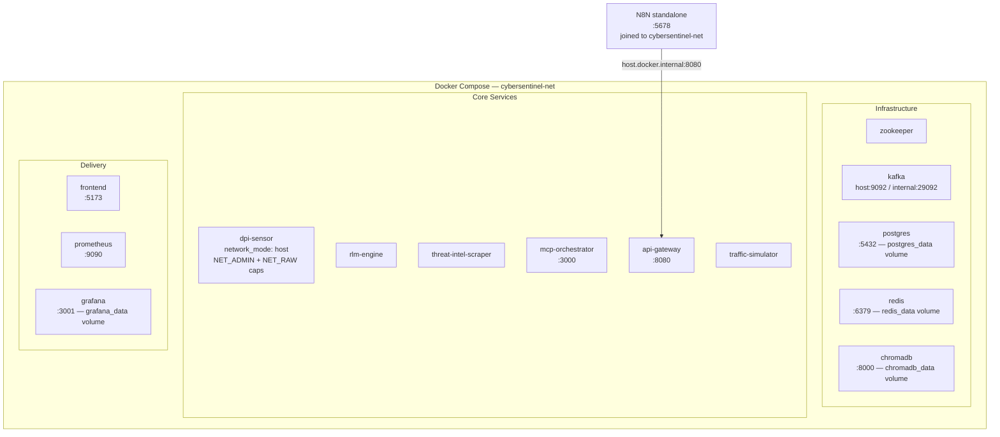

Named volumes (`postgres_data`, `redis_data`, `kafka_data`, `chromadb_data`, `grafana_data`) survive `docker compose down` but are removed by `docker compose down -v`.

### Component Responsibilities

| Component | File | Responsibility |
|-----------|------|---------------|
| DPI Sensor | `src/dpi/sensor.py` | Packet capture, 21-field extraction, PII masking, Kafka publish |
| RLM Engine | `src/models/rlm_engine.py` | EMA profiling, ChromaDB cosine scoring, IsolationForest blend, alert emission |
| MCP Orchestrator | `src/agents/mcp_orchestrator.py` | Parallel tool execution, 1-call LLM investigation, incident creation, campaign correlation |
| LLM Provider | `src/agents/llm_provider.py` | Multi-provider abstraction (Claude / OpenAI / Gemini) with unified response schema |
| CTI Scraper | `src/ingestion/threat_intel_scraper.py` | NVD, CISA, Abuse.ch, MITRE ATT&CK, OTX ingestion and embedding |
| Embedder | `src/ingestion/embedder.py` | ChromaDB governance — all upserts routed through here |
| Traffic Simulator | `src/simulation/traffic_simulator.py` | 17-scenario burst generation to `raw-packets` |
| API Gateway | `src/api/gateway.py` | 19 REST endpoints, JWT auth, PostgreSQL / Redis / ChromaDB queries |
| Kafka Bridge | `n8n/bridge/kafka_bridge.py` | Routes Kafka topics to n8n webhooks |
| React Dashboard | `frontend/src/CyberSentinel_Dashboard.jsx` | 6-tab SOC HUD, live API polling, demo mode fallback |

### LLM Provider Abstraction

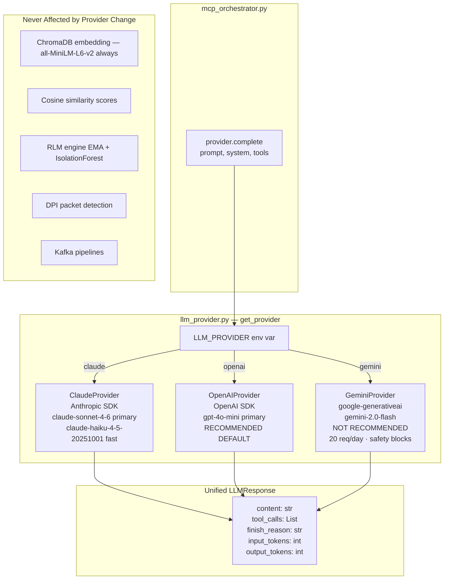

### Kafka Topic Architecture

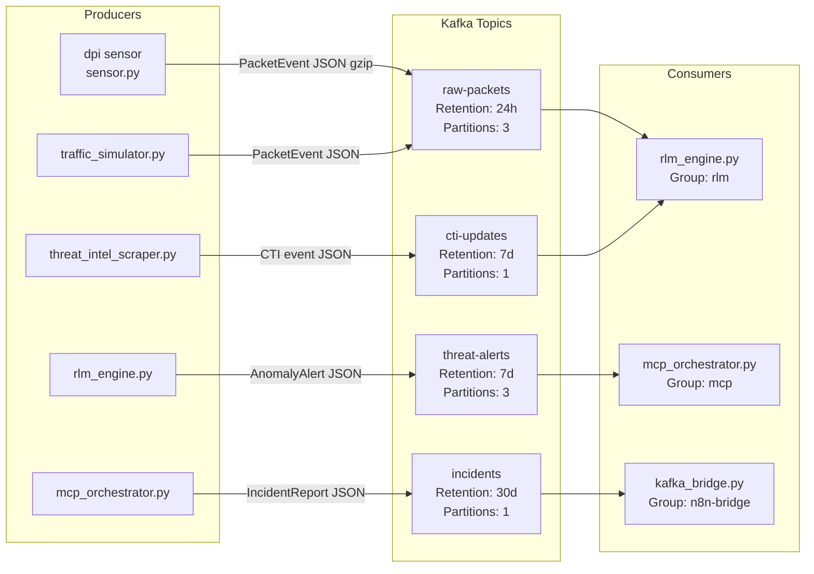

### PostgreSQL Schema (ERD)

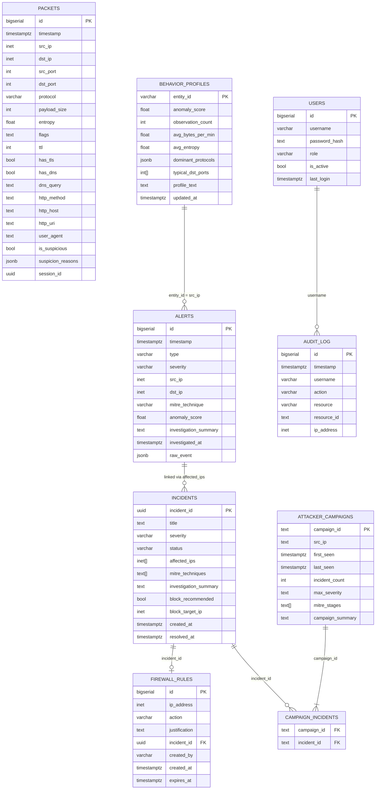

---

## 5. Data Flow Diagrams

### DFD 1 — Pipeline 1: Real DPI Traffic (IPv4 + IPv6)

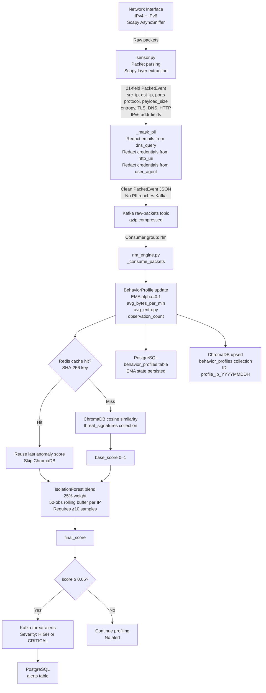

### DFD 2 — Pipeline 2: Traffic Simulator

Both pipelines publish to the **same** `raw-packets` Kafka topic. Processing is **identical** from Kafka onwards.

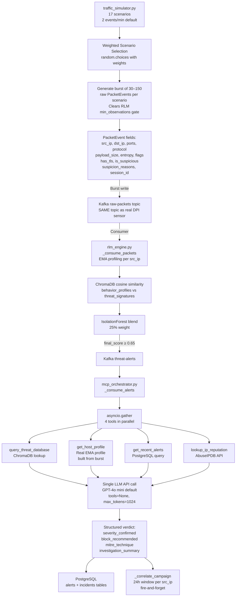

### DFD 3 — AI Investigation Pipeline (1-Call LLM)

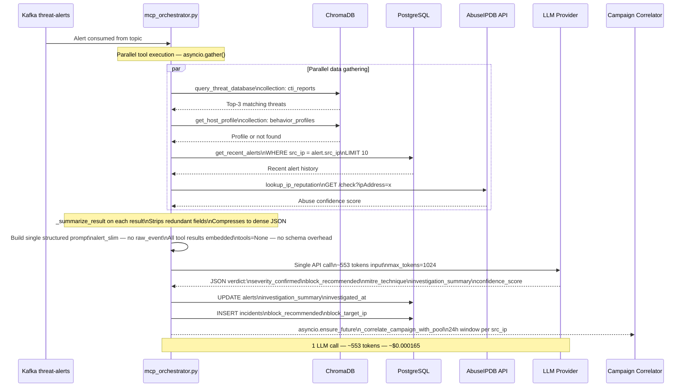

### DFD 4 — Human-in-the-Loop Response Flow

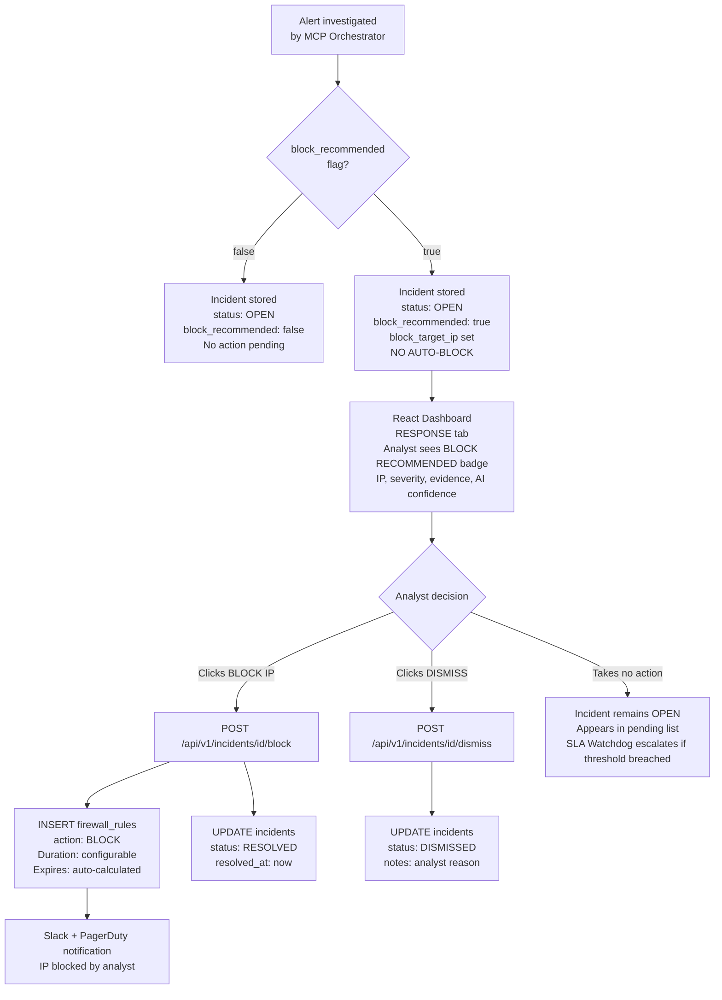

### DFD 5 — Campaign Correlation and Kill Chain Tracking

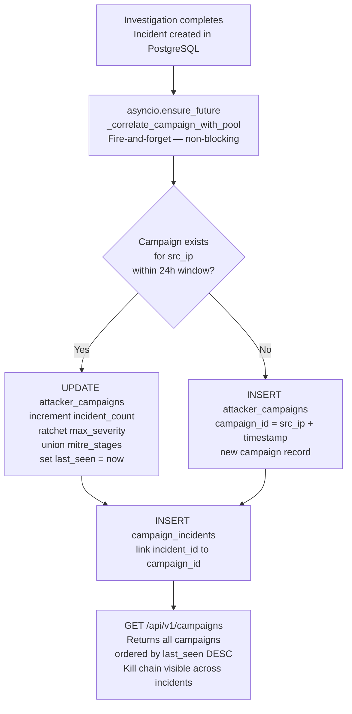

### DFD 6 — Full Data Lifecycle (Alert to Resolution)

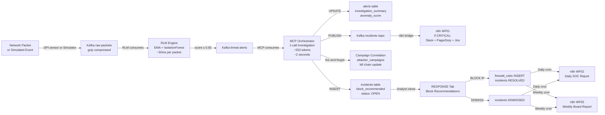

### DFD 7 — n8n SOAR Workflow Map

```mermaid
graph TB
    subgraph TRIGGERS["Triggers"]
        T1[Kafka Bridge\nCRITICAL + HIGH alerts\nvia webhook]
        T2[Cron: 7AM Mon–Fri\nDaily SOC Report]
        T3[Kafka Bridge\ncritical-cve events\nfrom CTI scraper]
        T4[Cron: Every 15 minutes\nSLA enforcement]
        T5[Cron: Monday 8AM\nWeekly Board Report]
    end

    subgraph WF01["WF01 — Critical Alert SOAR"]
        W1A[Enrich alert\nCorrelate RLM + AbuseIPDB] --> W1B[POST /api/v1/incidents]
        W1B --> W1C[Jira security ticket]
        W1C --> W1D[Slack Block Kit]
        W1C --> W1E[PagerDuty — CRITICAL only]
        W1C --> W1F[MS Teams MessageCard]
    end

    subgraph WF02["WF02 — Daily SOC Report"]
        W2A[Fetch 24h stats] --> W2B[OpenAI GPT-4o mini\nHTTP Request node]
        W2B --> W2C[Slack Block Kit report]
    end

    subgraph WF03["WF03 — CVE Intel Pipeline"]
        W3A[CVE event from CTI scraper] --> W3B[OpenAI: 3-sentence impact]
        W3B --> W3C[Jira vulnerability ticket]
        W3B --> W3D[Slack + Telegram alert]
    end

    subgraph WF04["WF04 — SLA Watchdog"]
        W4A[Fetch open incidents] --> W4B[Check SLA thresholds]
        W4B -->|Breached| W4C[PagerDuty + ServiceNow P1]
        W4B -->|Warning| W4D[Slack warning]
    end

    subgraph WF05["WF05 — Weekly Board Report"]
        W5A[Fetch 7-day metrics] --> W5B[OpenAI GPT-4o mini\nHTTP Request node]
        W5B --> W5C[Slack executive report]
    end

    T1 --> WF01
    T2 --> WF02
    T3 --> WF03
    T4 --> WF04
    T5 --> WF05
```

### DFD 8 — RAG Pipeline and Semantic Search

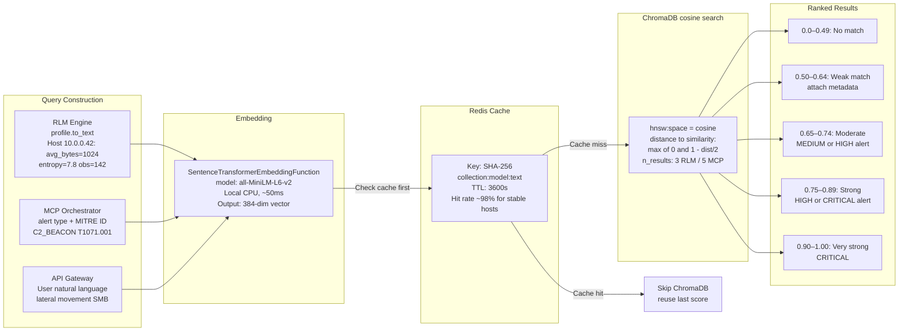

---

## 6. Design Constraints

**DC-01 — Event-Driven Architecture is Mandatory**
No service in the detection pipeline may call another service directly via HTTP. All inter-service communication flows through Kafka. This ensures any service can restart, scale, or be replaced without affecting others.

**DC-02 — Local Embeddings Only**
All vector embeddings must use the local `all-MiniLM-L6-v2` model running inside Docker containers on CPU. No cloud embedding API may be used. This is a privacy and cost constraint — all network traffic data remains local with zero embedding cost.

**DC-03 — Single LLM Call Per Investigation**
The investigation pipeline must issue exactly one LLM API call per alert. The agentic loop pattern (where the LLM calls tools iteratively) is explicitly prohibited. All four tools (`query_threat_database`, `get_host_profile`, `get_recent_alerts`, `lookup_ip_reputation`) must execute via `asyncio.gather()` before the single LLM call. This achieves 90% token reduction and 5× speed improvement over the old 3-call pattern.

| | Old Agentic Loop | New 1-Call Pipeline |
|-|-----------------|---------------------|
| LLM calls / investigation | 3 | **1** |
| Tokens / investigation | ~6,500 | **~553** |
| Cost (GPT-4o mini) | ~$0.001 | **~$0.000165** |
| Speed | ~8–12 seconds | **~1.7 seconds** |

**DC-04 — No Auto-Blocking**
The system must never automatically execute an IP block without explicit analyst approval. The LLM sets a `block_recommended` flag only. The analyst approves or dismisses via the RESPONSE tab. This is a safety constraint to prevent false-positive disruption of legitimate services.

**DC-05 — Simulator Must Use the DPI Pipeline**
The traffic simulator must publish to `raw-packets` and its events must be processed by the full RLM pipeline. It must never publish directly to `threat-alerts`. This ensures simulator events build genuine `BehaviorProfile` records with real anomaly scores — not bypassed shortcuts.

**DC-06 — Proportional AI Usage**
LLM API calls are reserved for HIGH and CRITICAL alerts only. MEDIUM and LOW alerts are handled deterministically. The LLM is the only recurring external cost in the platform — every unnecessary call wastes budget.

**DC-07 — No Kubernetes**
Docker Compose is the authoritative production deployment. A Kubernetes migration was evaluated (ADR-016) and reverted due to an irreconcilable incompatibility: Confluent's `ClusterStatus` pre-flight check cannot coexist with SASL on a non-SASL ZooKeeper instance. The Docker Compose path is the only supported deployment.

**DC-08 — ChromaDB Access Governance**
No service may call ChromaDB's collection methods (`add()`, `upsert()`, `delete()`) directly. All reads and writes must go through the governed interfaces in `src/ingestion/embedder.py` (`batch_upsert()`, `get_embedding_function()`). This enforces consistent embedding model use and correct cache invalidation.

**DC-09 — Configuration Centralisation**
All environment-variable access must go through `src/core/config.py`. No `os.getenv()` calls permitted in any other source file. Every configurable threshold (anomaly score, EMA alpha, LLM interval, TTLs) is a single-location change.

**DC-10 — React Frontend Constraints**
Functional components only. No UI component libraries except Recharts for charts. Inline CSS. No Redux. All state is local component state with API polling. Host profile data must be accessed as `hostProfile.profile?.{metric}` — the behavioral profile is nested under the `profile` key in the `/api/v1/hosts/{ip}` response.

---

*CyberSentinel AI — Software Requirements Specification — v1.3.0 — April 2026*
*Capstone Project — Academic Submission*
*All Mermaid diagrams render natively on GitHub, VS Code (Mermaid Preview), Notion, Obsidian, and GitBook.*
