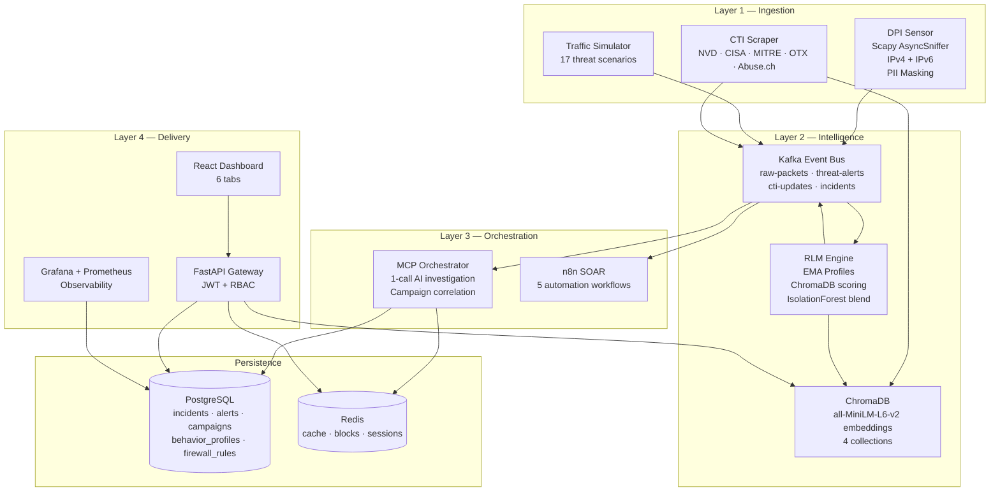
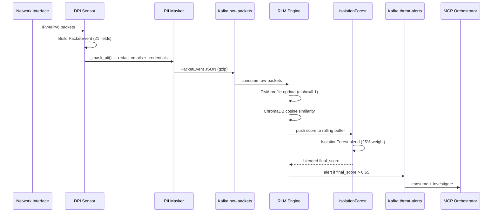
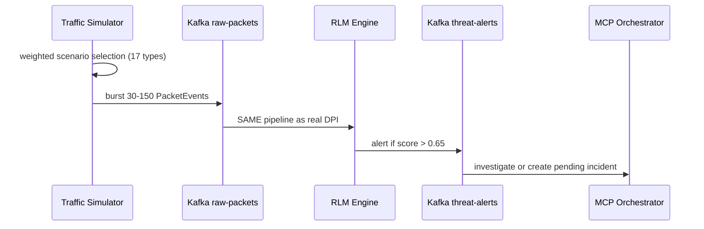
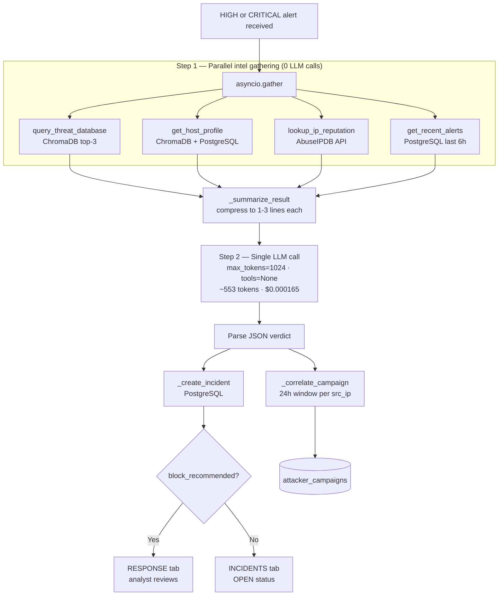
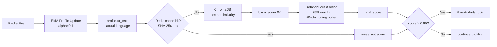
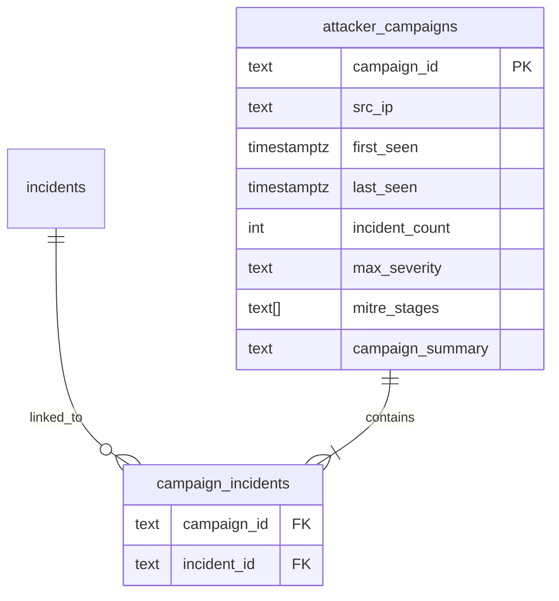
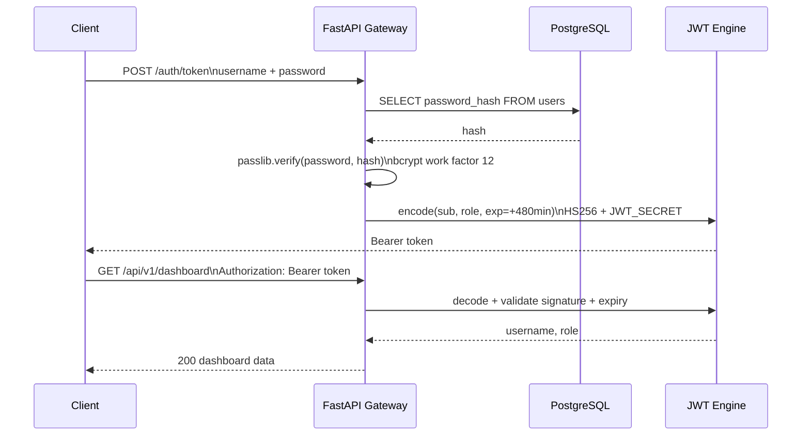
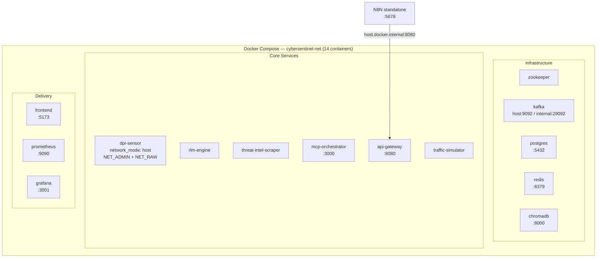
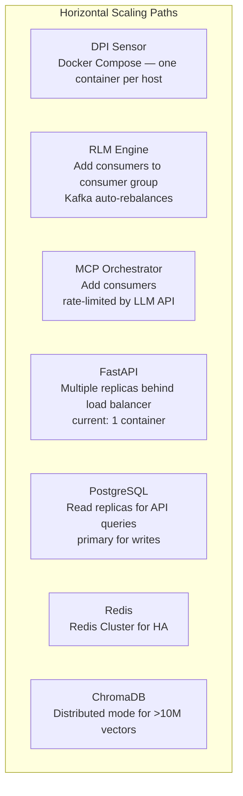

# System Architecture

**CyberSentinel AI v1.3.0 — Deep Dive Design Document**

---

## 1. Design Principles

Five principles shape every architectural decision:

**1. Event-driven over request-driven.** No service calls another service directly via HTTP in the detection pipeline. All communication flows through Kafka. Any service can restart, scale, or be replaced without affecting others.

**2. Online over offline.** The RLM engine learns from live traffic continuously. There is no training phase, no offline batch job, no labelled dataset dependency. The system improves as it observes more traffic.

**3. Local over cloud for embeddings.** All vector embeddings run on CPU using `all-MiniLM-L6-v2` locally inside Docker containers. Zero embedding API cost, zero latency from external calls, zero data leaving the deployment.

**4. Proportional AI usage.** LLM APIs are expensive. They are called only for HIGH and CRITICAL alerts — the minority that genuinely warrant reasoning. Everything else is handled deterministically by code.

**5. Human-in-the-loop for response actions.** The AI investigates and recommends — but a human analyst approves IP blocks via the RESPONSE tab. This prevents automated false-positive blocking and follows SOAR best practice.

---

## 2. Full System Architecture

---

## 3. The Two Input Pipelines

CyberSentinel AI has two completely separate data input paths. Both are **identical from the Kafka layer onwards**.

### Pipeline 1 — Real DPI (Production)

### Pipeline 2 — Traffic Simulator (Testing & Demo)

Both pipelines produce identical alert and incident records from the Kafka layer onwards.

---

## 4. AI Investigation Pipeline

### Token Efficiency

| Metric | Old Agentic Loop | Optimized 1-Call |
|--------|-----------------|-----------------|
| LLM calls / investigation | 3 | **1** |
| Tokens / investigation | ~5,500–7,000 | **~553** |
| Cost (GPT-4o mini) | ~$0.001 | **~$0.000165** |
| Budget runway ($5) | ~5,000 | **~30,000 investigations** |

---

## 5. Anomaly Detection Stack

**IsolationForest layer:** sits on a 50-observation rolling buffer per IP and detects anomalous *progressions* — a slow ramp like `[0.30, 0.33, 0.37, 0.41, 0.46]` is flagged even though no single value crosses the threshold. Requires at least 10 observations before blending begins.

---

## 6. Kill Chain / Campaign Tracking

Every incident is automatically correlated with a campaign via `_correlate_campaign_with_pool()`. Incidents from the same source IP within 24 hours are grouped into the same campaign. The `GET /api/v1/campaigns` endpoint exposes all campaigns ordered by last activity.

---

## 7. Authentication and Authorization

### Access Control

The current deployment uses a single `admin` account. All authenticated endpoints are accessible with the admin JWT token. The `users` table schema includes a `role` column (`admin`, `analyst`, `responder`, `viewer`) for future multi-user expansion, but role-based access differentiation is not enforced in the current API implementation.

---

## 8. State Management

| State Type | Store | Rationale |
|-----------|-------|-----------|
| Raw packets (time-series) | TimescaleDB hypertable | O(1) time-range queries via chunk exclusion |
| Alerts + incidents | PostgreSQL | Relational queries, status joins |
| Campaign tracking | PostgreSQL `attacker_campaigns` | 24h correlation window, kill chain grouping |
| Block recommendations | PostgreSQL `incidents` | Persisted until analyst acts |
| Behavioral profiles (persistent) | PostgreSQL `behavior_profiles` | UPSERT by entity_id |
| Behavioral profiles (live) | Python dict in RLM process | Microsecond access for per-packet EMA |
| Firewall block rules | Redis `blocked:{ip}` + PostgreSQL `firewall_rules` | Redis: hot-path lookup; PostgreSQL: persistence |
| Session timing windows | Redis list `session:{id}` | Sliding window for C2 beacon detection |
| Embedding cache | Redis `embed_cache:{sha256}` | Prevent redundant ChromaDB queries |
| MITRE re-embed guard | Redis `reembed_guard:mitre_attack` | Rate-limit static source re-embedding |
| n8n dedup | Redis `n8n_dedup:{sha256}` | Prevent duplicate workflow triggers |
| Threat signatures | ChromaDB `threat_signatures` | Semantic similarity lookup — never evicted |
| CTI reports | ChromaDB `cti_reports` | 90-day TTL |
| CVE database | ChromaDB `cve_database` | Upsert by CVE-ID, no eviction |
| Behavioral profile vectors | ChromaDB `behavior_profiles` | 30-day TTL |
| User accounts | PostgreSQL `users` | RBAC, bcrypt-hashed passwords |
| Audit log | PostgreSQL `audit_log` | Compliance, forensics |

---

## 9. Docker Compose Deployment Architecture

Data survives container restarts because all state lives in named Docker volumes: `postgres_data`, `redis_data`, `kafka_data`, `chromadb_data`, `grafana_data`.

**Kafka permanent restart fix:** When ZooKeeper regenerates a new cluster ID, Kafka's stored `meta.properties` can contain the old ID causing `InconsistentClusterIdException`. Fix: `docker compose stop kafka zookeeper && docker volume rm cybersentinel-ai_kafka_data && docker compose up -d`. The `docker-compose.yml` kafka service also runs a ZooKeeper broker registration cleanup before starting to prevent stale registrations.

---

## 10. Security Architecture

### Secret Management

All secrets are injected via the `.env` file at the repo root. Docker Compose passes them as environment variables to each container. No secret is hardcoded in any source file or Docker image. The API gateway raises `RuntimeError` at startup if `JWT_SECRET` is empty — the service refuses to run without it.

### PII Masking

The DPI sensor calls `_mask_pii()` on every `PacketEvent` before publishing to Kafka. This redacts:
- Email addresses in `dns_query`, `http_uri`, `user_agent` → `[email-redacted]`
- Credential parameters (`password=`, `token=`, `api_key=`, etc.) → `param=[redacted]`

No PII reaches Kafka, PostgreSQL, or the LLM prompt.

### Network Isolation

All services communicate on the `cybersentinel-net` Docker bridge network. Only these ports are exposed to the host:

| Service | External Port | Notes |
|---------|--------------|-------|
| Frontend | 5173 | React SOC Dashboard |
| API Gateway | 8080 | FastAPI + Swagger |
| Grafana | 3001 | Metrics dashboards |
| Prometheus | 9090 | Metrics scraping |
| n8n | 5678 | Standalone container |
| Kafka | 9092 | External client access |

---

## 11. Failure Modes and Mitigations

| Failure | Impact | Mitigation |
|---------|--------|-----------|
| Kafka restart — cluster ID mismatch | Broker crashes | `docker volume rm cybersentinel-ai_kafka_data` + restart removes stale meta.properties |
| Kafka broker down | Alert pipeline pauses | Consumer group offsets saved — no data loss on restart |
| ChromaDB unavailable | RLM scoring pauses | Embedding cache means last known anomaly score continues to gate alerts |
| LLM API rate limit (429) | Investigation delayed | Exponential backoff: 5s → 15s → 45s |
| PostgreSQL down | API returns 503 | asyncpg pool with timeout; health endpoint reports degraded |
| Redis down | Blocking decisions fall back to DB | All critical state also in PostgreSQL |
| n8n unavailable | SOAR workflows don't trigger | Bridge retries 3 times; events still in Kafka for replay |
| DPI sensor exits | No new packet capture | Docker Compose `restart: always` policy; simulator can continue test events |
| IsolationForest cold start | No blend for first 10 obs | `SequenceAnomalyDetector` returns raw ChromaDB score until 10 samples collected |

---

## 12. Scalability Design

---

## 13. Data Retention Policy

| Data | Retention | Mechanism |
|------|-----------|-----------|
| Raw packets | 30 days | TimescaleDB `add_retention_policy` drops partitions |
| Packet compression | After 7 days | `add_compression_policy` — 90%+ storage reduction |
| Alerts | Indefinite | Manual cleanup via API |
| Incidents | Indefinite | Manual archival |
| Campaigns | Indefinite | Grouped by src_ip + 24h window |
| ChromaDB behavior_profiles | 30 days | `evict_stale_profiles()` in RLM persist cycle |
| ChromaDB cti_reports | 90 days | `evict_stale_profiles()` in scraper cycle |
| Redis session windows | 1 hour | `EXPIRE` on each LPUSH |
| Redis embedding cache | 1 hour | `SETEX EMBED_CACHE_TTL_SEC` |
| Redis block rules | 24 hours default | `SETEX blocked:{ip} 86400` |
| Audit log | Indefinite | Manual archival |

---

*Architecture Document — CyberSentinel AI v1.3.0 — 2025/2026*
