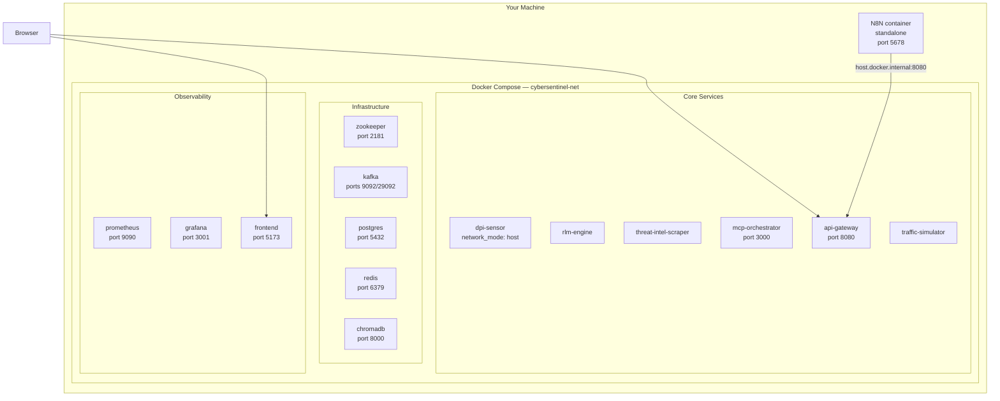
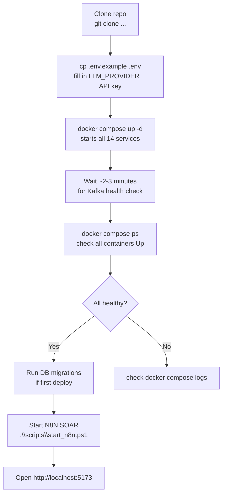
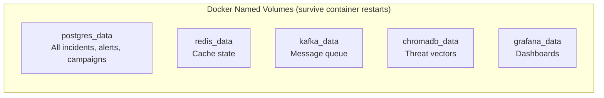

# Deployment Plan

**CyberSentinel AI v1.3.0 — Docker Compose**

---

## Architecture Overview



---

## Prerequisites (One-Time Setup)

| Requirement | Check |
|------------|-------|
| Docker Desktop 24.0+ | `docker --version` |
| Docker Compose V2 | `docker compose version` |
| At least **16 GB RAM** on host | Task Manager → Performance |
| `.env` file at repo root with API keys | `ls .env` |

---

## First Deploy (Fresh Install)



### Step-by-Step Commands

```powershell
# 1. Configure environment
cp .env.example .env
# Edit .env — set LLM_PROVIDER=openai and OPENAI_API_KEY=sk-...

# 2. Start all 14 services
docker compose up -d

# 3. Wait for services to be healthy (~2-3 minutes)
docker compose ps

# 4. Run DB migrations (first deploy only)
docker exec -i cybersentinel-postgres psql -U sentinel -d cybersentinel `
  < scripts/db/migrate_campaigns.sql
docker exec -i cybersentinel-postgres psql -U sentinel -d cybersentinel `
  < scripts/db/migrate_multitenancy.sql

# 5. Start N8N SOAR automation
.\scripts\start_n8n.ps1

# 6. Start frontend (development mode, optional if using Docker frontend)
cd frontend && npm install && npm run dev
```

---

## Everyday Start/Stop

### Starting the Project

```powershell
# Start all 14 services
docker compose up -d

# Start N8N (if not already running)
docker start N8N

# Verify API is healthy
curl http://localhost:8080/health

# Open dashboard
# http://localhost:5173
```

### Stopping the Project

```powershell
# Option A — Stop just the core stack (keep N8N running)
docker compose down

# Option B — Stop everything including N8N
docker compose down
docker stop N8N

# Option C — Stop and remove all containers (data preserved in volumes)
docker compose down
docker stop N8N
```

---

## Service URLs

| Service | URL | Credentials |
|---------|-----|-------------|
| SOC Dashboard | http://localhost:5173 | — |
| API Swagger | http://localhost:8080/docs | admin / cybersentinel2025 |
| n8n SOAR | http://localhost:5678 | admin (set on first run) |
| Grafana | http://localhost:3001 | admin / admin2025 |
| Prometheus | http://localhost:9090 | none |
| ChromaDB | http://localhost:8000 | token from `.env` |

**API authentication:** `POST /auth/token` with form body `username=admin&password=cybersentinel2025` → returns JWT Bearer token.

---

## Data Persistence



**Containers are not data.** They are just processes. When Docker restarts they reconnect to the same named volumes. All incidents, alerts, threat intel, and behavioral profiles are preserved.

```powershell
# View all volumes
docker volume ls | findstr cybersentinel

# Inspect a volume location
docker volume inspect cybersentinel-ai_postgres_data
```

---

## Updating the Deployment

### Rebuild and Redeploy a Single Service

```powershell
# Example: rebuild the RLM engine after code changes
docker compose up -d --build rlm-engine

# Or rebuild everything
docker compose up -d --build
```

### Apply .env Changes

```powershell
# After editing .env, restart affected services
docker compose up -d mcp-orchestrator api-gateway
```

### Full Reset (Deletes All Data)

```powershell
# WARNING: This deletes all incidents, alerts, and behavioral profiles
docker compose down -v   # -v removes named volumes
docker compose up -d
```

---

## Common Issues and Fixes

### Kafka in Restart Loop

**Cause:** Stale `meta.properties` with a mismatched cluster ID (from ZooKeeper restart or volume wipe).

**Fix:**

```powershell
# Stop Kafka and Zookeeper
docker compose stop kafka zookeeper

# Remove the Kafka data volume (cluster ID stored here)
docker volume rm cybersentinel-ai_kafka_data

# Restart everything
docker compose up -d
```

### Container Using Old Code After Rebuild

```powershell
# Force a full rebuild
docker compose up -d --build --force-recreate mcp-orchestrator
```

### localhost:5173 or localhost:8080 Not Reachable

```powershell
# Check if containers are running
docker compose ps

# Check specific service logs
docker compose logs -f api-gateway

# Restart the affected service
docker compose restart api-gateway
```

### API Returns `{"detail":"Not Found"}` at Root

Expected. The root `/` path has no route. Use:
- `/health` — service health check
- `/docs` — Swagger UI
- `/api/v1/dashboard` — dashboard data

### Out of Memory

```powershell
# Check resource usage
docker stats --format 'table {{.Name}}\t{{.CPUPerc}}\t{{.MemUsage}}'

# Scale down the traffic simulator to free RAM
docker compose stop traffic-simulator
```

---

## Common Docker Commands

```powershell
# Check all container status
docker compose ps

# View logs for a service
docker compose logs -f mcp-orchestrator
docker compose logs -f rlm-engine
docker compose logs -f kafka

# Open a PostgreSQL shell
docker exec -it cybersentinel-postgres psql -U sentinel -d cybersentinel

# Open a Redis CLI
docker exec -it cybersentinel-redis redis-cli -a $REDIS_PASSWORD

# Check resource usage
docker stats --no-stream

# Restart a single service
docker compose restart api-gateway

# Stop a single service
docker compose stop traffic-simulator
```

---

## Container Map (14 Services)

```
cybersentinel-ai (docker-compose.yml)
├── cybersentinel-zookeeper     — Kafka coordination (port 2181)
├── cybersentinel-kafka         — Message broker (host:9092, internal:29092)
├── cybersentinel-postgres      — TimescaleDB (port 5432)
├── cybersentinel-redis         — Cache/guard (port 6379)
├── cybersentinel-chromadb      — Vector DB (port 8000)
├── cybersentinel-dpi           — Packet capture (network_mode: host)
├── cybersentinel-rlm           — Behavioral profiling
├── cybersentinel-scraper       — CTI ingestion
├── cybersentinel-mcp           — AI investigation (port 3000)
├── cybersentinel-api           — REST API (port 8080)
├── cybersentinel-simulator     — Traffic simulation
├── cybersentinel-frontend      — React dashboard (port 5173)
├── cybersentinel-prometheus    — Metrics (port 9090)
└── cybersentinel-grafana       — Dashboards (port 3001)

N8N (standalone container — docker run via start_n8n.ps1)
└── N8N                         — SOAR workflows (port 5678)
    Network: cybersentinel-ai_cybersentinel-net
    Volume: D:/N8N:/home/node/.n8n
```

---

*Deployment Plan — CyberSentinel AI v1.3.0 — 2026*
