# CyberSentinel AI — Master Project Document

**Version 1.1 | 2026 | Comprehensive Technical Reference with Visual Diagrams**

> This document is the single source of truth for the entire CyberSentinel AI platform. Every diagram, table, and explanation is derived directly from the live source code. Mermaid diagrams render natively on GitHub, VS Code (Mermaid Preview extension), Notion, Obsidian, and GitBook.

---

## Table of Contents

1. [Project Overview](#1-project-overview)
2. [Full System Architecture](#2-full-system-architecture)
3. [Service Inventory](#3-service-inventory)
4. [Docker Compose Dependency Graph](#4-docker-compose-dependency-graph)
5. [Pipeline 1 — DPI Real Traffic](#5-pipeline-1--dpi-real-traffic)
6. [Pipeline 2 — Traffic Simulator](#6-pipeline-2--traffic-simulator)
7. [Pipeline Comparison & Data Gap](#7-pipeline-comparison--data-gap)
8. [Kafka Topic Architecture](#8-kafka-topic-architecture)
9. [ChromaDB Collections Map](#9-chromadb-collections-map)
10. [PostgreSQL Database Schema (ERD)](#10-postgresql-database-schema-erd)
11. [1-Call LLM Investigation Pipeline](#11-1-call-llm-investigation-pipeline)
12. [RAG Pipeline — Semantic Search Flow](#12-rag-pipeline--semantic-search-flow)
13. [Human-in-the-Loop Response Flow](#13-human-in-the-loop-response-flow)
14. [LLM Provider Abstraction Layer](#14-llm-provider-abstraction-layer)
15. [n8n SOAR Workflow Map](#15-n8n-soar-workflow-map)
16. [REST API Endpoint Map](#16-rest-api-endpoint-map)
17. [React Dashboard — 6 Tab Architecture](#17-react-dashboard--6-tab-architecture)
18. [Data Lifecycle — Alert to Resolution](#18-data-lifecycle--alert-to-resolution)
19. [Token Economics & Cost Model](#19-token-economics--cost-model)
20. [Security Architecture](#20-security-architecture)
21. [Observability Stack](#21-observability-stack)
22. [Environment Configuration Reference](#22-environment-configuration-reference)
23. [Deployment Guide](#23-deployment-guide)

---

## 1. Project Overview

### What Is CyberSentinel AI?

CyberSentinel AI is an **enterprise-grade AI-powered threat detection and response platform** built for Security Operations Centers (SOCs). It combines real-time deep packet inspection, behavioral profiling, semantic threat correlation using RAG (Retrieval-Augmented Generation), and multi-provider LLM-driven investigation into a unified pipeline.

### Core Capabilities

| Capability | Implementation | Status |
|-----------|---------------|--------|
| Real-time packet capture & DPI | `src/dpi/sensor.py` + `detectors.py` | Production |
| Behavioral profiling (EMA/RLM) | `src/models/rlm_engine.py` | Production |
| Semantic threat correlation | ChromaDB + all-MiniLM-L6-v2 | Production |
| AI-driven investigation | `src/agents/mcp_orchestrator.py` | Production |
| Multi-provider LLM support | `src/agents/llm_provider.py` | Production |
| Human-in-the-loop SOAR | FastAPI + React RESPONSE tab | Production |
| Threat intelligence ingestion | `src/ingestion/threat_intel_scraper.py` | Production |
| Traffic simulation for testing | `src/simulation/traffic_simulator.py` | Production |
| n8n SOAR automation | `n8n/workflows/` | Production |
| SOC React dashboard | `frontend/src/` | Production |
| Observability | Prometheus + Grafana | Production |

### Novel Technical Contributions

1. **Stateless 1-Call LLM Investigation** — All MCP tools execute in parallel via `asyncio.gather()` before a single LLM API call. No agentic loop. Reduces token cost 90% vs traditional 3-call agentic pattern (~553 tokens/investigation, ~$0.000165).

2. **Dual-Pipeline Architecture** — Two completely separate ingestion paths (real DPI + simulator) feed the same alert pipeline, Kafka, and React dashboard. Analysts train on simulated threats before deploying against live traffic.

3. **Human-in-the-Loop SOAR** — LLM sets `block_recommended` flag but never auto-blocks. Analyst approves or dismisses via dashboard RESPONSE tab. Eliminates false-positive blocking in production.

---

## 2. Full System Architecture

This diagram shows every service, data store, and the directional flow of data between them.

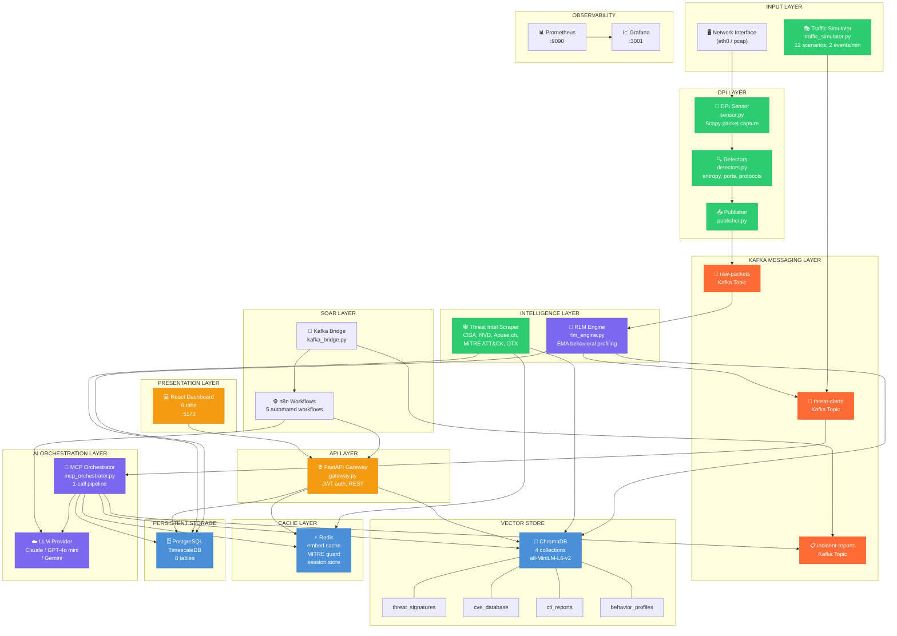
```mermaid
graph TB
    subgraph INGESTION["INPUT LAYER"]
        NIC["🖥️ Network Interface<br/>(eth0 / pcap)"]
        SIM["🎭 Traffic Simulator<br/>traffic_simulator.py<br/>12 scenarios, 2 events/min"]
    end

    subgraph DPI["DPI LAYER"]
        SENSOR["📡 DPI Sensor<br/>sensor.py<br/>Scapy packet capture"]
        DETECT["🔍 Detectors<br/>detectors.py<br/>entropy, ports, protocols"]
        PUB["📤 Publisher<br/>publisher.py"]
    end

    subgraph MESSAGING["KAFKA MESSAGING LAYER"]
        KRP["📨 raw-packets<br/>Kafka Topic"]
        KTA["🚨 threat-alerts<br/>Kafka Topic"]
        KIR["📋 incident-reports<br/>Kafka Topic"]
    end

    subgraph MODELS["INTELLIGENCE LAYER"]
        RLM["🧠 RLM Engine<br/>rlm_engine.py<br/>EMA behavioral profiling"]
        SCRAPER["🕸️ Threat Intel Scraper<br/>CISA, NVD, Abuse.ch,<br/>MITRE ATT&CK, OTX"]
    end

    subgraph VECTOR["VECTOR STORE"]
        CHROMA["🔮 ChromaDB<br/>4 collections<br/>all-MiniLM-L6-v2"]
        TS["threat_signatures"]
        CD["cve_database"]
        CTI["cti_reports"]
        BP["behavior_profiles"]
    end

    subgraph CACHE["CACHE LAYER"]
        REDIS["⚡ Redis<br/>embed cache<br/>MITRE guard<br/>session store"]
    end

    subgraph DB["PERSISTENT STORAGE"]
        PG["🗄️ PostgreSQL<br/>TimescaleDB<br/>8 tables"]
    end

    subgraph AGENTS["AI ORCHESTRATION LAYER"]
        MCP["🤖 MCP Orchestrator<br/>mcp_orchestrator.py<br/>1-call pipeline"]
        LLM["☁️ LLM Provider<br/>Claude / GPT-4o mini<br/>/ Gemini"]
    end

    subgraph API["API LAYER"]
        GW["🌐 FastAPI Gateway<br/>gateway.py<br/>JWT auth, REST"]
    end

    subgraph SOAR["SOAR LAYER"]
        N8N["⚙️ n8n Workflows<br/>5 automated workflows"]
        BRIDGE["🌉 Kafka Bridge<br/>kafka_bridge.py"]
    end

    subgraph OBS["OBSERVABILITY"]
        PROM["📊 Prometheus<br/>:9090"]
        GRAF["📈 Grafana<br/>:3001"]
    end

    subgraph FRONTEND["PRESENTATION LAYER"]
        REACT["💻 React Dashboard<br/>6 tabs<br/>:5173"]
    end

    %% DPI Pipeline
    NIC --> SENSOR
    SENSOR --> DETECT
    DETECT --> PUB
    PUB --> KRP

    %% Simulator Pipeline
    SIM --> KTA

    %% RLM Engine
    KRP --> RLM
    RLM --> CHROMA
    RLM --> KTA
    RLM --> PG

    %% Scraper
    SCRAPER --> CHROMA
    SCRAPER --> PG
    SCRAPER --> REDIS

    %% ChromaDB internal
    CHROMA --- TS
    CHROMA --- CD
    CHROMA --- CTI
    CHROMA --- BP

    %% MCP Investigation
    KTA --> MCP
    MCP --> CHROMA
    MCP --> REDIS
    MCP --> PG
    MCP --> LLM
    MCP --> KIR

    %% API
    GW --> PG
    GW --> REDIS
    GW --> CHROMA

    %% n8n
    BRIDGE --> KIR
    BRIDGE --> N8N
    N8N --> LLM
    N8N --> GW

    %% Frontend
    REACT --> GW

    %% Observability
    PROM --> GRAF

    %% Styling
    classDef kafka fill:#ff6b35,color:#fff,stroke:#e55a2b
    classDef storage fill:#4a90d9,color:#fff,stroke:#357abd
    classDef ai fill:#7b68ee,color:#fff,stroke:#6a5acd
    classDef service fill:#2ecc71,color:#fff,stroke:#27ae60
    classDef frontend fill:#f39c12,color:#fff,stroke:#e67e22

    class KRP,KTA,KIR kafka
    class PG,CHROMA,REDIS storage
    class MCP,LLM,RLM ai
    class SENSOR,DETECT,PUB,SCRAPER,SIM service
    class REACT,GW frontend
```

---

## 3. Service Inventory

### Core Services (docker-compose.yml)

| Service | Image / Dockerfile | Port | Role | Depends On |
|---------|-------------------|------|------|------------|
| `zookeeper` | `confluentinc/cp-zookeeper:7.5.0` | 2181 | Kafka coordination | — |
| `kafka` | `confluentinc/cp-kafka:7.5.0` | 9092 (host), 29092 (internal) | Message broker | zookeeper |
| `postgres` | `timescale/timescaledb:latest-pg16` | 5432 | Time-series + relational DB | — |
| `redis` | `redis:7-alpine` | 6379 | Cache, guards, sessions | — |
| `chromadb` | `chromadb/chroma:latest` | 8000 | Vector similarity store | — |
| `dpi-sensor` | `Dockerfile.dpi` | — | Packet capture & DPI | kafka |
| `rlm-engine` | `Dockerfile.rlm` | — | Behavioral profiling | kafka, postgres, redis, chromadb |
| `threat-intel-scraper` | `Dockerfile.scraper` | — | CTI ingestion every 4h | postgres, redis, chromadb |
| `mcp-orchestrator` | `Dockerfile.mcp` | 3000 | AI investigation pipeline | kafka, postgres, redis, chromadb |
| `api-gateway` | `Dockerfile.api` | 8080 | REST API (JWT auth) | postgres, redis, chromadb |
| `traffic-simulator` | `Dockerfile.simulator` | — | Synthetic threat generation | kafka |
| `frontend` | `Dockerfile.frontend` | 5173 | React SOC dashboard | api-gateway |
| `prometheus` | `prom/prometheus:latest` | 9090 | Metrics scraping | — |
| `grafana` | `grafana/grafana:latest` | 3001 | Metrics dashboards | prometheus |

### n8n Services (docker-compose.n8n.yml)

| Service | Port | Role |
|---------|------|------|
| `n8n` | 5678 | Workflow automation engine |
| `n8n-kafka-bridge` | — | Bridges Kafka `incident-reports` to n8n webhooks |

---

## 4. Docker Compose Dependency Graph

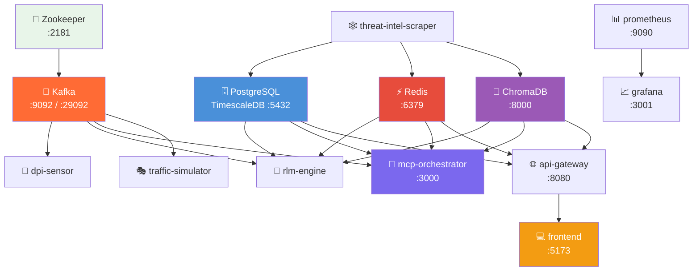
```mermaid
graph TD
    ZK["🦒 Zookeeper<br/>:2181"]
    KF["📨 Kafka<br/>:9092 / :29092"]
    PG["🗄️ PostgreSQL<br/>TimescaleDB :5432"]
    RD["⚡ Redis<br/>:6379"]
    CH["🔮 ChromaDB<br/>:8000"]

    DPI["📡 dpi-sensor"]
    RLM["🧠 rlm-engine"]
    SCR["🕸️ threat-intel-scraper"]
    MCP["🤖 mcp-orchestrator<br/>:3000"]
    API["🌐 api-gateway<br/>:8080"]
    SIM["🎭 traffic-simulator"]
    FE["💻 frontend<br/>:5173"]

    PROM["📊 prometheus<br/>:9090"]
    GRAF["📈 grafana<br/>:3001"]

    ZK --> KF
    KF --> DPI
    KF --> RLM
    KF --> MCP
    KF --> SIM
    PG --> RLM
    PG --> MCP
    PG --> API
    RD --> RLM
    RD --> MCP
    RD --> API
    CH --> RLM
    CH --> MCP
    CH --> API
    SCR --> PG
    SCR --> RD
    SCR --> CH
    API --> FE
    PROM --> GRAF

    style ZK fill:#e8f5e9
    style KF fill:#ff6b35,color:#fff
    style PG fill:#4a90d9,color:#fff
    style RD fill:#e74c3c,color:#fff
    style CH fill:#9b59b6,color:#fff
    style MCP fill:#7b68ee,color:#fff
    style FE fill:#f39c12,color:#fff
```

---

## 5. Pipeline 1 — DPI Real Traffic

This pipeline handles live network traffic. Every real packet captured from the network interface flows through this path.

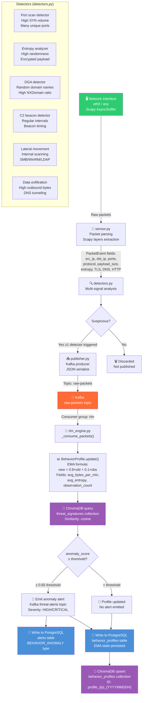
```mermaid
flowchart TD
    A["🖥️ Network Interface\neth0 / any\nScapy AsyncSniffer"]
    -->|Raw packets| B["📡 sensor.py\nPacket parsing\nScapy layers extraction"]

    B -->|PacketEvent fields:\nsrc_ip, dst_ip, ports,\nprotocol, payload_size,\nentropy, TLS, DNS, HTTP| C["🔍 detectors.py\nMulti-signal analysis"]

    C --> D{Suspicious?}

    D -->|Yes ≥1 detector triggered| E["📤 publisher.py\nKafka producer\nJSON serialize"]
    D -->|No| F["🗑️ Discarded\nNot published"]

    E -->|Topic: raw-packets| G["📨 Kafka\nraw-packets topic"]

    G -->|Consumer group: rlm| H["🧠 rlm_engine.py\n_consume_packets()"]

    H --> I["📊 BehaviorProfile.update()\nEMA formula:\nnew = 0.9×old + 0.1×obs\nFields: avg_bytes_per_min,\navg_entropy, observation_count"]

    I --> J["🔮 ChromaDB query\nthreat_signatures collection\nSimilarity: cosine"]

    J --> K{anomaly_score\n≥ threshold?}

    K -->|≥ 0.65 threshold| L["🚨 Emit anomaly alert\nKafka threat-alerts topic\nSeverity: HIGH/CRITICAL"]
    K -->|< threshold| M["💾 Profile updated\nNo alert emitted"]

    L --> N["💾 Write to PostgreSQL\nalerts table\nBEHAVIOR_ANOMALY type"]
    M --> O["💾 Write to PostgreSQL\nbehavior_profiles table\nEMA state persisted"]
    L --> O

    O --> P["🔮 ChromaDB upsert\nbehavior_profiles collection\nID: profile_{ip}_{YYYYMMDDH}"]

    subgraph DETECTORS["Detectors (detectors.py)"]
        D1["Port scan detector\nHigh SYN volume\nMany unique ports"]
        D2["Entropy analyzer\nHigh randomness\nEncrypted payload"]
        D3["DGA detector\nRandom domain names\nHigh NXDomain ratio"]
        D4["C2 beacon detector\nRegular intervals\nBeacon timing"]
        D5["Lateral movement\nInternal scanning\nSMB/WinRM/LDAP"]
        D6["Data exfiltration\nHigh outbound bytes\nDNS tunneling"]
    end

    style A fill:#2ecc71,color:#fff
    style G fill:#ff6b35,color:#fff
    style J fill:#9b59b6,color:#fff
    style N fill:#4a90d9,color:#fff
    style O fill:#4a90d9,color:#fff
    style P fill:#9b59b6,color:#fff
```

### What Gets Populated (DPI Pipeline)

| Data Store | Table / Collection | What Gets Written |
|-----------|-------------------|-------------------|
| Kafka | `raw-packets` | Every suspicious packet as JSON |
| Kafka | `threat-alerts` | Anomaly alerts (score ≥ threshold) |
| PostgreSQL | `packets` | Full packet metadata (TimescaleDB) |
| PostgreSQL | `alerts` | Anomaly alert records |
| PostgreSQL | `behavior_profiles` | EMA state per IP per hour |
| ChromaDB | `behavior_profiles` | Embedded profile text for semantic search |
| ChromaDB | `threat_signatures` | Seeded at startup (read at query time) |

---

## 6. Pipeline 2 — Traffic Simulator

This pipeline generates realistic synthetic threats for testing and training without live network traffic. It **completely bypasses** the DPI and RLM layers.

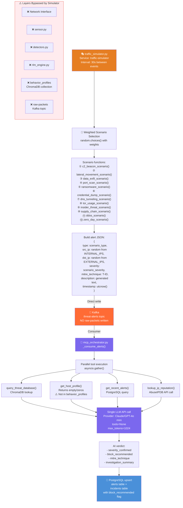
```mermaid
flowchart TD
    A["🎭 traffic_simulator.py\nService: traffic-simulator\nInterval: 30s between events"]

    A --> B["🎲 Weighted Scenario Selection\nrandom.choices() with weights"]

    B --> C["Scenario functions:\n① c2_beacon_scenario()\n② lateral_movement_scenario()\n③ data_exfil_scenario()\n④ port_scan_scenario()\n⑤ ransomware_scenario()\n⑥ credential_dump_scenario()\n⑦ dns_tunneling_scenario()\n⑧ tor_usage_scenario()\n⑨ insider_threat_scenario()\n⑩ supply_chain_scenario()\n⑪ ddos_scenario()\n⑫ zero_day_scenario()"]

    C --> D["Build alert JSON:\n{\n  type: scenario_type,\n  src_ip: random from INTERNAL_IPS,\n  dst_ip: random from EXTERNAL_IPS,\n  severity: scenario_severity,\n  mitre_technique: T-ID,\n  description: generated text,\n  timestamp: utcnow()\n}"]

    D -->|Direct write| E["📨 Kafka\nthreat-alerts topic\nNO raw-packets written"]

    E -->|Consumer| F["🤖 mcp_orchestrator.py\n_consume_alerts()"]

    F --> G["Parallel tool execution\nasyncio.gather()"]

    G --> H1["query_threat_database()\nChromaDB lookup"]
    G --> H2["get_host_profile()\nReturns empty/zeros\n⚠️ Not in behavior_profiles"]
    G --> H3["get_recent_alerts()\nPostgreSQL query"]
    G --> H4["lookup_ip_reputation()\nAbuseIPDB API call"]

    H1 & H2 & H3 & H4 --> I["Single LLM API call\nProvider: Claude/GPT-4o mini\ntools=None\nmax_tokens=1024"]

    I --> J["AI verdict:\n- severity_confirmed\n- block_recommended\n- mitre_technique\n- investigation_summary"]

    J --> K["💾 PostgreSQL upsert\nalerts table +\nincidents table\nwith block_recommended flag"]

    subgraph BYPASS["⚠️ Layers Bypassed by Simulator"]
        NIC["❌ Network Interface"]
        SENSOR["❌ sensor.py"]
        DETECT["❌ detectors.py"]
        RLM["❌ rlm_engine.py"]
        BP["❌ behavior_profiles\nChromaDB collection"]
        RP["❌ raw-packets\nKafka topic"]
    end

    style A fill:#e67e22,color:#fff
    style E fill:#ff6b35,color:#fff
    style F fill:#7b68ee,color:#fff
    style I fill:#7b68ee,color:#fff
    style K fill:#4a90d9,color:#fff
    style BYPASS fill:#ffebee,stroke:#e74c3c
```

### Simulator Scenario Reference

| Scenario | MITRE ID | Severity | Weight | Typical IPs |
|----------|----------|----------|--------|------------|
| C2 Beacon | T1071.001 | CRITICAL | 15% | Internal → External |
| Lateral Movement | T1021.002 | HIGH | 12% | Internal → Internal |
| Data Exfiltration | T1048 | CRITICAL | 12% | Internal → External |
| Port Scan | T1046 | MEDIUM | 10% | Internal → Any |
| Ransomware Staging | T1486 | CRITICAL | 8% | Internal → Internal |
| Credential Dumping | T1003 | HIGH | 8% | Internal → Internal |
| DNS Tunneling | T1568.002 | HIGH | 8% | Internal → External |
| Tor Usage | T1090.003 | HIGH | 7% | Internal → Tor exit |
| Insider Threat | T1078 | HIGH | 7% | Internal → External |
| Supply Chain | T1195 | CRITICAL | 5% | External → Internal |
| DDoS | T1499 | HIGH | 5% | External → Internal |
| Zero Day | T1190 | CRITICAL | 3% | External → Internal |

---

## 7. Pipeline Comparison & Data Gap

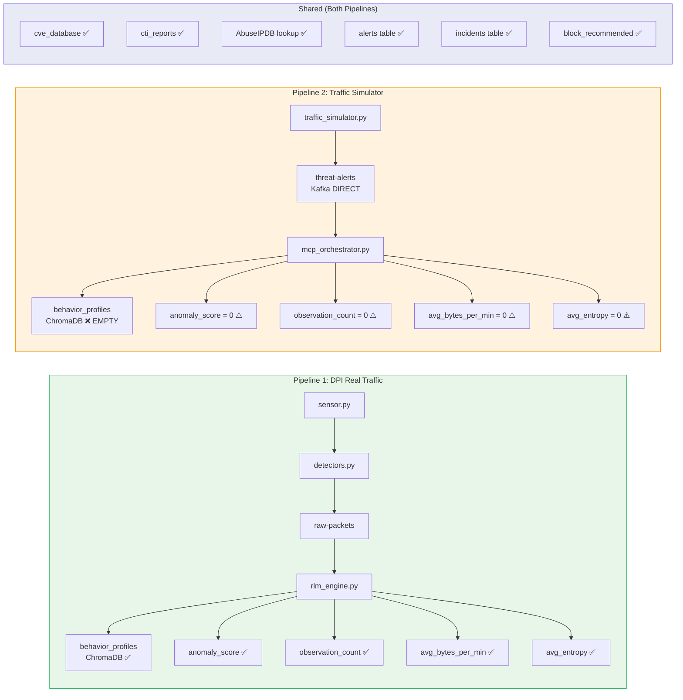
```mermaid
graph LR
    subgraph DPI_PATH["Pipeline 1: DPI Real Traffic"]
        direction TB
        P1A["sensor.py"] --> P1B["detectors.py"] --> P1C["raw-packets"]
        P1C --> P1D["rlm_engine.py"] --> P1E["behavior_profiles\nChromaDB ✅"]
        P1D --> P1F["anomaly_score ✅"]
        P1D --> P1G["observation_count ✅"]
        P1D --> P1H["avg_bytes_per_min ✅"]
        P1D --> P1I["avg_entropy ✅"]
    end

    subgraph SIM_PATH["Pipeline 2: Traffic Simulator"]
        direction TB
        P2A["traffic_simulator.py"] --> P2B["threat-alerts\nKafka DIRECT"]
        P2B --> P2C["mcp_orchestrator.py"]
        P2C --> P2D["behavior_profiles\nChromaDB ❌ EMPTY"]
        P2C --> P2E["anomaly_score = 0 ⚠️"]
        P2C --> P2F["observation_count = 0 ⚠️"]
        P2C --> P2G["avg_bytes_per_min = 0 ⚠️"]
        P2C --> P2H["avg_entropy = 0 ⚠️"]
    end

    subgraph SHARED["Shared (Both Pipelines)"]
        S1["cve_database ✅"]
        S2["cti_reports ✅"]
        S3["AbuseIPDB lookup ✅"]
        S4["alerts table ✅"]
        S5["incidents table ✅"]
        S6["block_recommended ✅"]
    end

    style DPI_PATH fill:#e8f5e9,stroke:#27ae60
    style SIM_PATH fill:#fff3e0,stroke:#f39c12
    style SHARED fill:#e8eaf6,stroke:#7b68ee
```

### Data Gap Summary Table

| Data Field | DPI Pipeline | Simulator Pipeline | Why |
|-----------|-------------|-------------------|-----|
| `anomaly_score` | ✅ Real value (0–1) | ❌ Always 0 | RLM only reads `raw-packets` |
| `observation_count` | ✅ Packet count | ❌ Always 0 | RLM never sees simulator IPs |
| `avg_bytes_per_min` | ✅ EMA average | ❌ Always 0 | EMA not updated without packets |
| `avg_entropy` | ✅ EMA average | ❌ Always 0 | EMA not updated without packets |
| `profile_text` | ✅ Rich description | ❌ "PROFILED" default | No RLM profile text |
| `behavior_profiles` (ChromaDB) | ✅ Populated | ❌ Empty | RLM never writes |
| `investigation_summary` | ✅ Full AI analysis | ✅ Full AI analysis | MCP runs for both |
| `block_recommended` | ✅ AI verdict | ✅ AI verdict | MCP runs for both |
| `mitre_technique` | ✅ Detected | ✅ Injected by scenario | Both paths set it |
| `cve_database` query | ✅ Available | ✅ Available | Both pipelines use it |
| `cti_reports` query | ✅ Available | ✅ Available | Both pipelines use it |
| `AbuseIPDB` reputation | ✅ Available | ✅ Available | Both pipelines use it |

---

## 8. Kafka Topic Architecture

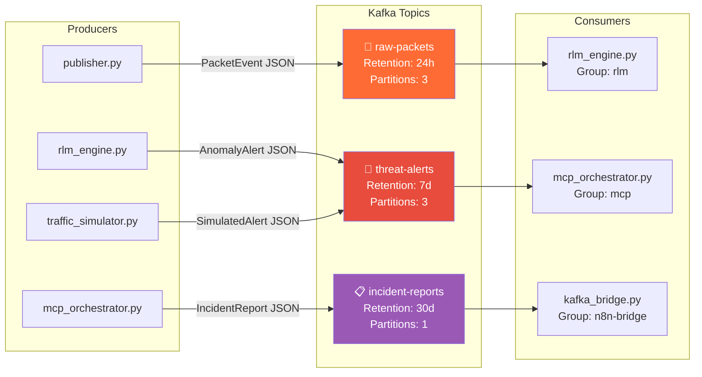
```mermaid
graph LR
    subgraph PRODUCERS["Producers"]
        PUB["publisher.py"]
        RLM_P["rlm_engine.py"]
        SIM_P["traffic_simulator.py"]
        MCP_P["mcp_orchestrator.py"]
    end

    subgraph TOPICS["Kafka Topics"]
        RP["📨 raw-packets\nRetention: 24h\nPartitions: 3"]
        TA["🚨 threat-alerts\nRetention: 7d\nPartitions: 3"]
        IR["📋 incident-reports\nRetention: 30d\nPartitions: 1"]
    end

    subgraph CONSUMERS["Consumers"]
        RLM_C["rlm_engine.py\nGroup: rlm"]
        MCP_C["mcp_orchestrator.py\nGroup: mcp"]
        BRIDGE_C["kafka_bridge.py\nGroup: n8n-bridge"]
    end

    PUB -->|PacketEvent JSON| RP
    RLM_P -->|AnomalyAlert JSON| TA
    SIM_P -->|SimulatedAlert JSON| TA
    MCP_P -->|IncidentReport JSON| IR

    RP --> RLM_C
    TA --> MCP_C
    IR --> BRIDGE_C

    style RP fill:#ff6b35,color:#fff
    style TA fill:#e74c3c,color:#fff
    style IR fill:#9b59b6,color:#fff
```

### Topic Message Schemas

**`raw-packets` message:**
```json
{
  "timestamp": "2026-03-30T10:15:00Z",
  "src_ip": "10.0.0.42",
  "dst_ip": "185.220.101.47",
  "src_port": 54321,
  "dst_port": 443,
  "protocol": "TCP",
  "payload_size": 1024,
  "entropy": 7.8,
  "flags": "SYN",
  "has_tls": true,
  "has_dns": false,
  "is_suspicious": true,
  "suspicion_reasons": ["high_entropy", "known_tor_exit"]
}
```

**`threat-alerts` message:**
```json
{
  "timestamp": "2026-03-30T10:15:05Z",
  "type": "C2_BEACON",
  "severity": "CRITICAL",
  "src_ip": "10.0.0.42",
  "dst_ip": "185.220.101.47",
  "src_port": 54321,
  "dst_port": 443,
  "mitre_technique": "T1071.001",
  "anomaly_score": 0.87,
  "description": "Periodic beacon detected with high entropy payload",
  "rlm_profile_summary": "avg_bytes=1024 entropy=7.8 obs=142"
}
```

**`incident-reports` message:**
```json
{
  "incident_id": "INC-2026-001",
  "severity": "CRITICAL",
  "title": "C2 Beacon: 10.0.0.42 → 185.220.101.47",
  "investigation_summary": "AI analysis confirms active C2 communication...",
  "block_recommended": true,
  "block_target_ip": "185.220.101.47",
  "mitre_technique": "T1071.001",
  "timestamp": "2026-03-30T10:15:10Z"
}
```

---

## 9. ChromaDB Collections Map

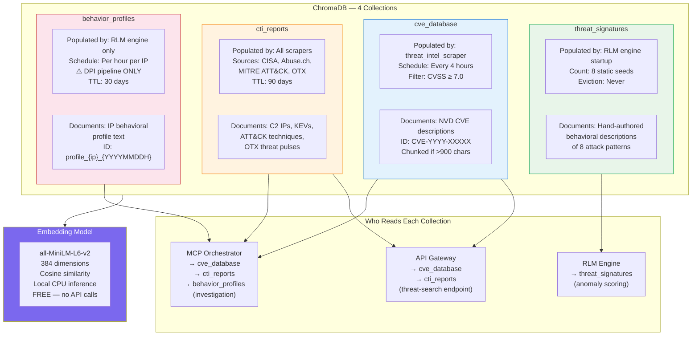
```mermaid
graph TB
    subgraph CHROMADB["ChromaDB — 4 Collections"]

        subgraph TS_COL["threat_signatures"]
            TS_P["Populated by: RLM engine startup\nCount: 8 static seeds\nEviction: Never"]
            TS_D["Documents: Hand-authored\nbehavioral descriptions\nof 8 attack patterns"]
        end

        subgraph CD_COL["cve_database"]
            CD_P["Populated by: threat_intel_scraper\nSchedule: Every 4 hours\nFilter: CVSS ≥ 7.0"]
            CD_D["Documents: NVD CVE descriptions\nID: CVE-YYYY-XXXXX\nChunked if >900 chars"]
        end

        subgraph CTI_COL["cti_reports"]
            CTI_P["Populated by: All scrapers\nSources: CISA, Abuse.ch,\nMITRE ATT&CK, OTX\nTTL: 90 days"]
            CTI_D["Documents: C2 IPs, KEVs,\nATT&CK techniques,\nOTX threat pulses"]
        end

        subgraph BP_COL["behavior_profiles"]
            BP_P["Populated by: RLM engine only\nSchedule: Per hour per IP\n⚠️ DPI pipeline ONLY\nTTL: 30 days"]
            BP_D["Documents: IP behavioral\nprofile text\nID: profile_{ip}_{YYYYMMDDH}"]
        end
    end

    subgraph READERS["Who Reads Each Collection"]
        R1["RLM Engine\n→ threat_signatures\n(anomaly scoring)"]
        R2["MCP Orchestrator\n→ cve_database\n→ cti_reports\n→ behavior_profiles\n(investigation)"]
        R3["API Gateway\n→ cve_database\n→ cti_reports\n(threat-search endpoint)"]
    end

    TS_COL --> R1
    CD_COL --> R2
    CTI_COL --> R2
    BP_COL --> R2
    CD_COL --> R3
    CTI_COL --> R3

    subgraph EMBED["Embedding Model"]
        EM["all-MiniLM-L6-v2\n384 dimensions\nCosine similarity\nLocal CPU inference\nFREE — no API calls"]
    end

    CHROMADB --> EMBED

    style TS_COL fill:#e8f5e9,stroke:#27ae60
    style CD_COL fill:#e3f2fd,stroke:#1976d2
    style CTI_COL fill:#fff3e0,stroke:#f57c00
    style BP_COL fill:#fce4ec,stroke:#c62828
    style EMBED fill:#7b68ee,color:#fff
```

---

## 10. PostgreSQL Database Schema (ERD)

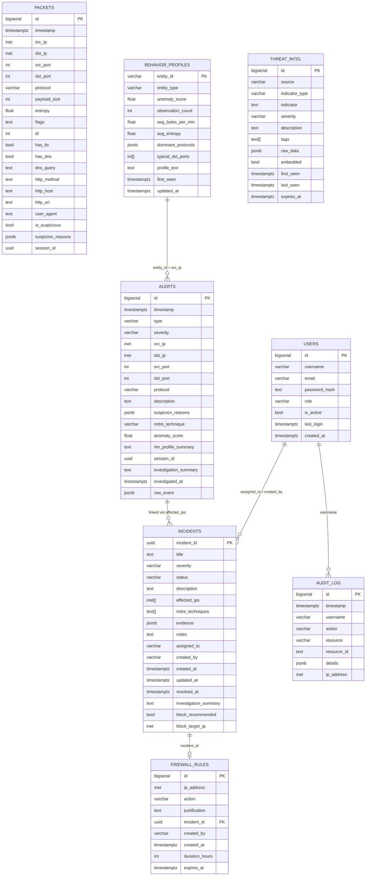
```mermaid
erDiagram
    PACKETS {
        bigserial id PK
        timestamptz timestamp
        inet src_ip
        inet dst_ip
        int src_port
        int dst_port
        varchar protocol
        int payload_size
        float entropy
        text flags
        int ttl
        bool has_tls
        bool has_dns
        text dns_query
        text http_method
        text http_host
        text http_uri
        text user_agent
        bool is_suspicious
        jsonb suspicion_reasons
        uuid session_id
    }

    ALERTS {
        bigserial id PK
        timestamptz timestamp
        varchar type
        varchar severity
        inet src_ip
        inet dst_ip
        int src_port
        int dst_port
        varchar protocol
        text description
        jsonb suspicion_reasons
        varchar mitre_technique
        float anomaly_score
        text rlm_profile_summary
        uuid session_id
        text investigation_summary
        timestamptz investigated_at
        jsonb raw_event
    }

    INCIDENTS {
        uuid incident_id PK
        text title
        varchar severity
        varchar status
        text description
        inet[] affected_ips
        text[] mitre_techniques
        jsonb evidence
        text notes
        varchar assigned_to
        varchar created_by
        timestamptz created_at
        timestamptz updated_at
        timestamptz resolved_at
        text investigation_summary
        bool block_recommended
        inet block_target_ip
    }

    BEHAVIOR_PROFILES {
        varchar entity_id PK
        varchar entity_type
        float anomaly_score
        int observation_count
        float avg_bytes_per_min
        float avg_entropy
        jsonb dominant_protocols
        int[] typical_dst_ports
        text profile_text
        timestamptz first_seen
        timestamptz updated_at
    }

    FIREWALL_RULES {
        bigserial id PK
        inet ip_address
        varchar action
        text justification
        uuid incident_id FK
        varchar created_by
        timestamptz created_at
        int duration_hours
        timestamptz expires_at
    }

    THREAT_INTEL {
        bigserial id PK
        varchar source
        varchar indicator_type
        text indicator
        varchar severity
        text description
        text[] tags
        jsonb raw_data
        bool embedded
        timestamptz first_seen
        timestamptz last_seen
        timestamptz expires_at
    }

    USERS {
        bigserial id PK
        varchar username
        varchar email
        text password_hash
        varchar role
        bool is_active
        timestamptz last_login
        timestamptz created_at
    }

    AUDIT_LOG {
        bigserial id PK
        timestamptz timestamp
        varchar username
        varchar action
        varchar resource
        text resource_id
        jsonb details
        inet ip_address
    }

    ALERTS ||--o{ INCIDENTS : "linked via affected_ips"
    INCIDENTS ||--o| FIREWALL_RULES : "incident_id"
    BEHAVIOR_PROFILES ||--o{ ALERTS : "entity_id = src_ip"
    USERS ||--o{ AUDIT_LOG : "username"
    USERS ||--o{ INCIDENTS : "assigned_to / created_by"
```

### TimescaleDB Optimizations on `packets`

| Policy | Setting | Purpose |
|--------|---------|---------|
| Compression | After 7 days | Reduces storage 90%+ for cold packet data |
| Retention | Drop after 30 days | Prevents unbounded table growth |
| Materialized view | `packets_per_minute` | Pre-aggregated 1-min counts for dashboard |
| Hypertable chunk | 1 day intervals | Fast time-range queries on timestamp |

---

## 11. 1-Call LLM Investigation Pipeline

This is the core architectural innovation of v1.1. All data gathering happens in parallel **before** the single LLM API call.

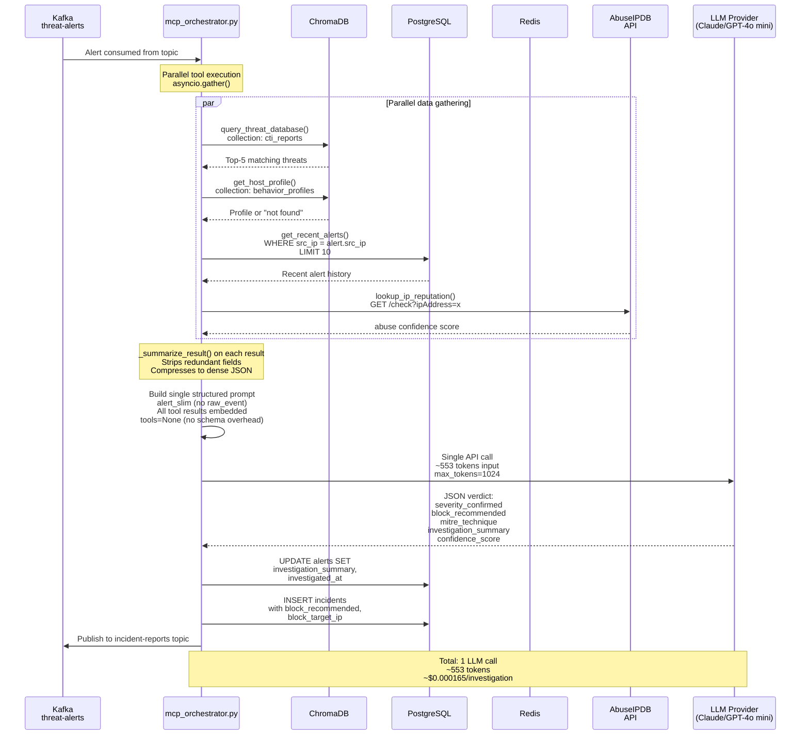
```mermaid
sequenceDiagram
    participant K as Kafka<br/>threat-alerts
    participant MCP as mcp_orchestrator.py
    participant CH as ChromaDB
    participant PG as PostgreSQL
    participant RD as Redis
    participant IP as AbuseIPDB<br/>API
    participant LLM as LLM Provider<br/>(Claude/GPT-4o mini)

    K->>MCP: Alert consumed from topic

    Note over MCP: Parallel tool execution<br/>asyncio.gather()

    par Parallel data gathering
        MCP->>CH: query_threat_database()<br/>collection: cti_reports
        CH-->>MCP: Top-5 matching threats

        MCP->>CH: get_host_profile()<br/>collection: behavior_profiles
        CH-->>MCP: Profile or "not found"

        MCP->>PG: get_recent_alerts()<br/>WHERE src_ip = alert.src_ip<br/>LIMIT 10
        PG-->>MCP: Recent alert history

        MCP->>IP: lookup_ip_reputation()<br/>GET /check?ipAddress=x
        IP-->>MCP: abuse confidence score
    end

    Note over MCP: _summarize_result() on each result<br/>Strips redundant fields<br/>Compresses to dense JSON

    MCP->>MCP: Build single structured prompt<br/>alert_slim (no raw_event)<br/>All tool results embedded<br/>tools=None (no schema overhead)

    MCP->>LLM: Single API call<br/>~553 tokens input<br/>max_tokens=1024

    LLM-->>MCP: JSON verdict:<br/>severity_confirmed<br/>block_recommended<br/>mitre_technique<br/>investigation_summary<br/>confidence_score

    MCP->>PG: UPDATE alerts SET<br/>investigation_summary,<br/>investigated_at

    MCP->>PG: INSERT incidents<br/>with block_recommended,<br/>block_target_ip

    MCP->>K: Publish to incident-reports topic

    Note over MCP,LLM: Total: 1 LLM call<br/>~553 tokens<br/>~$0.000165/investigation
```

### Token Budget Breakdown

| Component | Tokens (Input) | Notes |
|-----------|---------------|-------|
| System prompt | ~120 | Static SOC analyst persona |
| Alert (slim) | ~80 | No raw_event field |
| Tool result: threat_db | ~120 | 3 results, compressed |
| Tool result: host_profile | ~60 | EMA fields only |
| Tool result: recent_alerts | ~80 | Last 10, compressed |
| Tool result: ip_reputation | ~40 | Score + categories only |
| Instruction suffix | ~53 | "Return JSON only" |
| **Total input** | **~553** | |
| **LLM output** | **~280** | JSON verdict |
| **Total per investigation** | **~833** | 2:1 input:output ratio |

---

## 12. RAG Pipeline — Semantic Search Flow

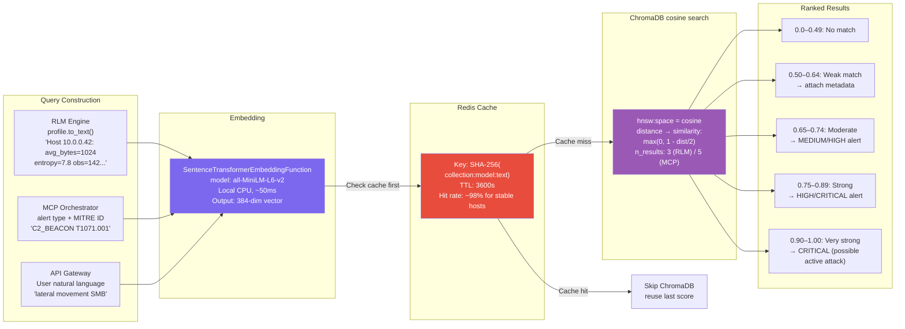
```mermaid
flowchart LR
    subgraph QUERY["Query Construction"]
        Q1["RLM Engine\nprofile.to_text()\n'Host 10.0.0.42: avg_bytes=1024\nentropy=7.8 obs=142...'"]
        Q2["MCP Orchestrator\nalert type + MITRE ID\n'C2_BEACON T1071.001'"]
        Q3["API Gateway\nUser natural language\n'lateral movement SMB'"]
    end

    subgraph EMBED["Embedding"]
        E1["SentenceTransformerEmbeddingFunction\nmodel: all-MiniLM-L6-v2\nLocal CPU, ~50ms\nOutput: 384-dim vector"]
    end

    subgraph CACHE["Redis Cache"]
        C1["Key: SHA-256(\ncollection:model:text)\nTTL: 3600s\nHit rate: ~98% for stable hosts"]
    end

    subgraph SEARCH["ChromaDB cosine search"]
        S1["hnsw:space = cosine\ndistance → similarity:\nmax(0, 1 - dist/2)\nn_results: 3 (RLM) / 5 (MCP)"]
    end

    subgraph RESULTS["Ranked Results"]
        R1["0.0–0.49: No match"]
        R2["0.50–0.64: Weak match\n→ attach metadata"]
        R3["0.65–0.74: Moderate\n→ MEDIUM/HIGH alert"]
        R4["0.75–0.89: Strong\n→ HIGH/CRITICAL alert"]
        R5["0.90–1.00: Very strong\n→ CRITICAL (possible active attack)"]
    end

    Q1 & Q2 & Q3 --> E1
    E1 -->|Check cache first| C1
    C1 -->|Cache miss| S1
    C1 -->|Cache hit| SKIP["Skip ChromaDB\nreuse last score"]
    S1 --> R1
    S1 --> R2
    S1 --> R3
    S1 --> R4
    S1 --> R5

    style E1 fill:#7b68ee,color:#fff
    style C1 fill:#e74c3c,color:#fff
    style S1 fill:#9b59b6,color:#fff
```

---

## 13. Human-in-the-Loop Response Flow

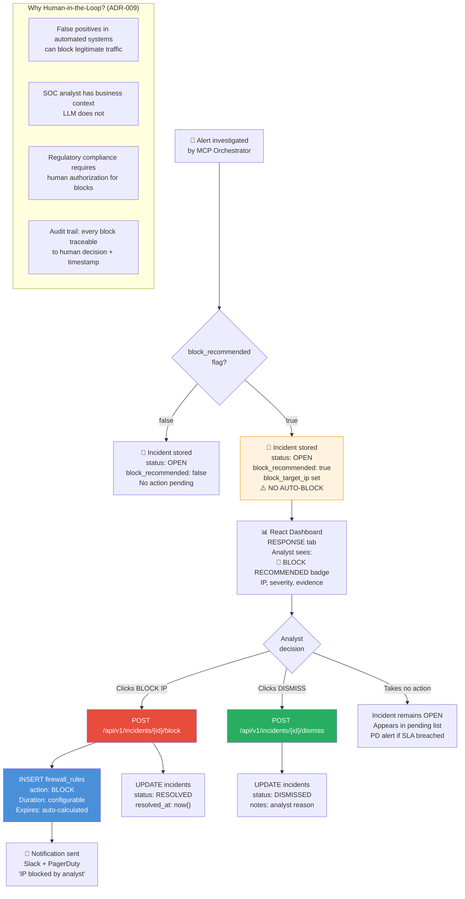
```mermaid
flowchart TD
    A["🚨 Alert investigated\nby MCP Orchestrator"]

    A --> B{block_recommended\nflag?}

    B -->|false| C["💾 Incident stored\nstatus: OPEN\nblock_recommended: false\nNo action pending"]

    B -->|true| D["💾 Incident stored\nstatus: OPEN\nblock_recommended: true\nblock_target_ip set\n⚠️ NO AUTO-BLOCK"]

    D --> E["📊 React Dashboard\nRESPONSE tab\nAnalyst sees:\n🔴 BLOCK RECOMMENDED badge\nIP, severity, evidence"]

    E --> F{Analyst\ndecision}

    F -->|Clicks BLOCK IP| G["POST /api/v1/incidents/{id}/block"]
    F -->|Clicks DISMISS| H["POST /api/v1/incidents/{id}/dismiss"]
    F -->|Takes no action| I["Incident remains OPEN\nAppears in pending list\nPD alert if SLA breached"]

    G --> J["INSERT firewall_rules\naction: BLOCK\nDuration: configurable\nExpires: auto-calculated"]
    G --> K["UPDATE incidents\nstatus: RESOLVED\nresolved_at: now()"]

    H --> L["UPDATE incidents\nstatus: DISMISSED\nnotes: analyst reason"]

    J --> M["🔔 Notification sent\nSlack + PagerDuty\n'IP blocked by analyst'"]

    subgraph WHY["Why Human-in-the-Loop? (ADR-009)"]
        W1["False positives in automated systems\ncan block legitimate traffic"]
        W2["SOC analyst has business context\nLLM does not"]
        W3["Regulatory compliance requires\nhuman authorization for blocks"]
        W4["Audit trail: every block traceable\nto human decision + timestamp"]
    end

    style D fill:#fff3e0,stroke:#f39c12
    style G fill:#e74c3c,color:#fff
    style H fill:#27ae60,color:#fff
    style J fill:#4a90d9,color:#fff
```

---

## 14. LLM Provider Abstraction Layer

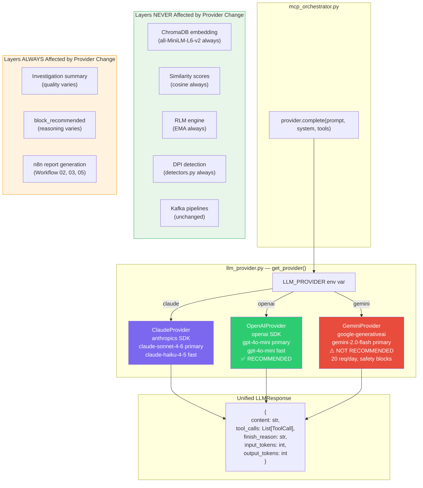
```mermaid
graph TB
    subgraph ORCHESTRATOR["mcp_orchestrator.py"]
        CALL["provider.complete(prompt, system, tools)"]
    end

    subgraph PROVIDER["llm_provider.py — get_provider()"]
        ENV["LLM_PROVIDER env var"]
        ENV -->|claude| CLAUDE_P["ClaudeProvider\nanthropics SDK\nclaude-sonnet-4-6 primary\nclaude-haiku-4-5 fast"]
        ENV -->|openai| OPENAI_P["OpenAIProvider\nopenai SDK\ngpt-4o-mini primary\ngpt-4o-mini fast\n✅ RECOMMENDED"]
        ENV -->|gemini| GEMINI_P["GeminiProvider\ngoogle-generativeai\ngemini-2.0-flash primary\n⚠️ NOT RECOMMENDED\n20 req/day, safety blocks"]
    end

    subgraph RESPONSE["Unified LLMResponse"]
        LR["{\n  content: str,\n  tool_calls: List[ToolCall],\n  finish_reason: str,\n  input_tokens: int,\n  output_tokens: int\n}"]
    end

    CALL --> ENV
    CLAUDE_P --> LR
    OPENAI_P --> LR
    GEMINI_P --> LR

    subgraph NEVER_AFFECTED["Layers NEVER Affected by Provider Change"]
        NA1["ChromaDB embedding\n(all-MiniLM-L6-v2 always)"]
        NA2["Similarity scores\n(cosine always)"]
        NA3["RLM engine\n(EMA always)"]
        NA4["DPI detection\n(detectors.py always)"]
        NA5["Kafka pipelines\n(unchanged)"]
    end

    subgraph ALWAYS_AFFECTED["Layers ALWAYS Affected by Provider Change"]
        AA1["Investigation summary\n(quality varies)"]
        AA2["block_recommended\n(reasoning varies)"]
        AA3["n8n report generation\n(Workflow 02, 03, 05)"]
    end

    style CLAUDE_P fill:#7b68ee,color:#fff
    style OPENAI_P fill:#2ecc71,color:#fff
    style GEMINI_P fill:#e74c3c,color:#fff
    style NEVER_AFFECTED fill:#e8f5e9,stroke:#27ae60
    style ALWAYS_AFFECTED fill:#fff3e0,stroke:#f39c12
```

### Provider Configuration

| Setting | Claude | OpenAI (Default) | Gemini |
|---------|--------|-----------------|--------|
| `LLM_PROVIDER` | `claude` | `openai` | `gemini` |
| Primary model | `claude-sonnet-4-6` | `gpt-4o-mini` | `gemini-2.0-flash` |
| Fast/tier model | `claude-haiku-4-5` | `gpt-4o-mini` | `gemini-2.0-flash` |
| Input cost/1M tokens | $3.00 | $0.15 | Free |
| Output cost/1M tokens | $15.00 | $0.60 | Free |
| Cost/investigation | ~$0.002 | ~$0.000165 | ~$0 |
| Free tier limit | None | None | 20 req/day |
| Security content | ✅ Full support | ✅ Full support | ⚠️ Safety filter blocks |
| Recommended | ✅ Yes | ✅ Yes (default) | ❌ No |

---

## 15. n8n SOAR Workflow Map


```mermaid
graph TB
    subgraph TRIGGERS["Triggers"]
        T1["Kafka Bridge\n/webhook/incident\nAny new incident"]
        T2["Cron: 06:00 UTC\nDaily"]
        T3["Cron: Every 4h\nCTI refresh"]
        T4["Cron: Every 30min\nSLA check"]
        T5["Cron: Monday 09:00\nWeekly"]
    end

    subgraph WF01["Workflow 01\nCritical Alert SOAR"]
        W1A["Filter: severity=CRITICAL"] --> W1B["GET /api/v1/incidents/{id}"]
        W1B --> W1C["Build Slack message\nwith evidence + MITRE"]
        W1C --> W1D["POST Slack webhook"]
        W1C --> W1E["POST PagerDuty\ncreate_event"]
    end

    subgraph WF02["Workflow 02\nDaily SOC Report"]
        W2A["GET /api/v1/stats\n24h summary"] --> W2B["LLM: Generate\nSOC narrative\n(Workflow 03 model)"]
        W2B --> W2C["Format HTML email"]
        W2C --> W2D["Send to SOC team\nvia SMTP"]
    end

    subgraph WF03["Workflow 03\nCVE Intel Pipeline"]
        W3A["GET /api/v1/threat-search\nQuery: 'critical vulnerabilities'"] --> W3B["LLM: Impact analysis\nper CVE"]
        W3B --> W3C["POST /api/v1/threat-intel\nStore enriched intel"]
    end

    subgraph WF04["Workflow 04\nSLA Watchdog"]
        W4A["GET /api/v1/incidents\nstatus=OPEN"] --> W4B["Filter: created_at\n> SLA threshold\n(default 4h)"]
        W4B --> W4C["POST Slack\n'SLA breach: INC-XXX\nunassigned 4h+'"]
    end

    subgraph WF05["Workflow 05\nWeekly Board Report"]
        W5A["GET /api/v1/stats\n7-day summary"] --> W5B["LLM: Executive\nnarrative + risk score"]
        W5B --> W5C["Generate PDF"]
        W5C --> W5D["Email to leadership"]
    end

    T1 --> WF01
    T2 --> WF02
    T3 --> WF03
    T4 --> WF04
    T5 --> WF05

    style T1 fill:#e74c3c,color:#fff
    style WF01 fill:#fce4ec,stroke:#c62828
    style WF02 fill:#e3f2fd,stroke:#1976d2
    style WF03 fill:#e8f5e9,stroke:#27ae60
    style WF04 fill:#fff3e0,stroke:#f57c00
    style WF05 fill:#f3e5f5,stroke:#7b1fa2
```

---

## 16. REST API Endpoint Map

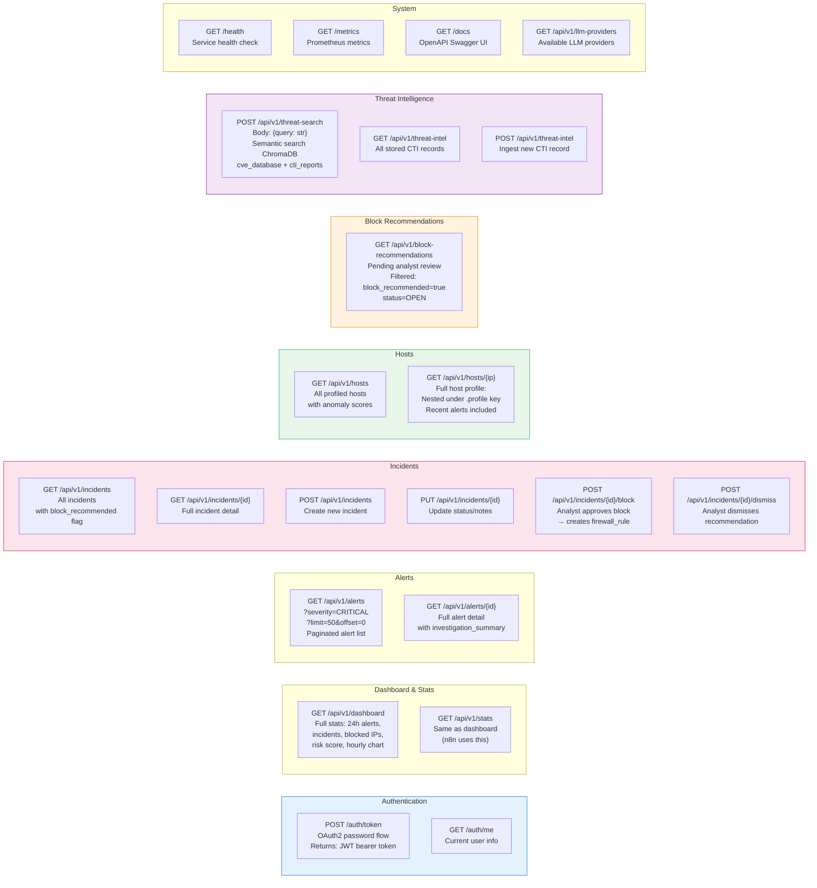
```mermaid
graph LR
    subgraph AUTH["Authentication"]
        A1["POST /auth/token\nOAuth2 password flow\nReturns: JWT bearer token"]
        A2["GET /auth/me\nCurrent user info"]
    end

    subgraph DASHBOARD["Dashboard & Stats"]
        D1["GET /api/v1/dashboard\nFull stats: 24h alerts,\nincidents, blocked IPs,\nrisk score, hourly chart"]
        D2["GET /api/v1/stats\nSame as dashboard\n(n8n uses this)"]
    end

    subgraph ALERTS["Alerts"]
        AL1["GET /api/v1/alerts\n?severity=CRITICAL\n?limit=50&offset=0\nPaginated alert list"]
        AL2["GET /api/v1/alerts/{id}\nFull alert detail\nwith investigation_summary"]
    end

    subgraph INCIDENTS["Incidents"]
        I1["GET /api/v1/incidents\nAll incidents\nwith block_recommended flag"]
        I2["GET /api/v1/incidents/{id}\nFull incident detail"]
        I3["POST /api/v1/incidents\nCreate new incident"]
        I4["PUT /api/v1/incidents/{id}\nUpdate status/notes"]
        I5["POST /api/v1/incidents/{id}/block\nAnalyst approves block\n→ creates firewall_rule"]
        I6["POST /api/v1/incidents/{id}/dismiss\nAnalyst dismisses recommendation"]
    end

    subgraph HOSTS["Hosts"]
        H1["GET /api/v1/hosts\nAll profiled hosts\nwith anomaly scores"]
        H2["GET /api/v1/hosts/{ip}\nFull host profile:\nNested under .profile key\nRecent alerts included"]
    end

    subgraph BLOCKREC["Block Recommendations"]
        BR1["GET /api/v1/block-recommendations\nPending analyst review\nFiltered: block_recommended=true\nstatus=OPEN"]
    end

    subgraph INTEL["Threat Intelligence"]
        TI1["POST /api/v1/threat-search\nBody: {query: str}\nSemantic search ChromaDB\ncve_database + cti_reports"]
        TI2["GET /api/v1/threat-intel\nAll stored CTI records"]
        TI3["POST /api/v1/threat-intel\nIngest new CTI record"]
    end

    subgraph SYSTEM["System"]
        S1["GET /health\nService health check"]
        S2["GET /metrics\nPrometheus metrics"]
        S3["GET /docs\nOpenAPI Swagger UI"]
        S4["GET /api/v1/llm-providers\nAvailable LLM providers"]
    end

    style AUTH fill:#e3f2fd,stroke:#1976d2
    style INCIDENTS fill:#fce4ec,stroke:#c62828
    style HOSTS fill:#e8f5e9,stroke:#27ae60
    style BLOCKREC fill:#fff3e0,stroke:#f57c00
    style INTEL fill:#f3e5f5,stroke:#7b1fa2
```

### `/api/v1/hosts/{ip}` Response Structure

```json
{
  "ip": "10.0.0.42",
  "is_blocked": false,
  "block_count": 0,
  "incident_count": 3,
  "profile": {
    "entity_id": "10.0.0.42",
    "anomaly_score": 0.87,
    "observation_count": 1420,
    "avg_bytes_per_min": 2048.5,
    "avg_entropy": 7.2,
    "profile_text": "High-entropy outbound traffic, consistent beacon timing",
    "dominant_protocols": {"TCP": 0.85, "UDP": 0.15},
    "typical_dst_ports": [443, 80, 8080],
    "first_seen": "2026-03-29T08:00:00Z",
    "updated_at": "2026-03-30T10:15:00Z"
  },
  "recent_alerts": [
    {
      "id": 1042,
      "type": "C2_BEACON",
      "severity": "CRITICAL",
      "mitre_technique": "T1071.001",
      "timestamp": "2026-03-30T10:15:05Z"
    }
  ]
}
```

> **Important:** All behavioral metrics are nested under the `profile` key. Frontend code must access `hostProfile.profile?.anomaly_score` — NOT `hostProfile.anomaly_score`.

---

## 17. React Dashboard — 6 Tab Architecture

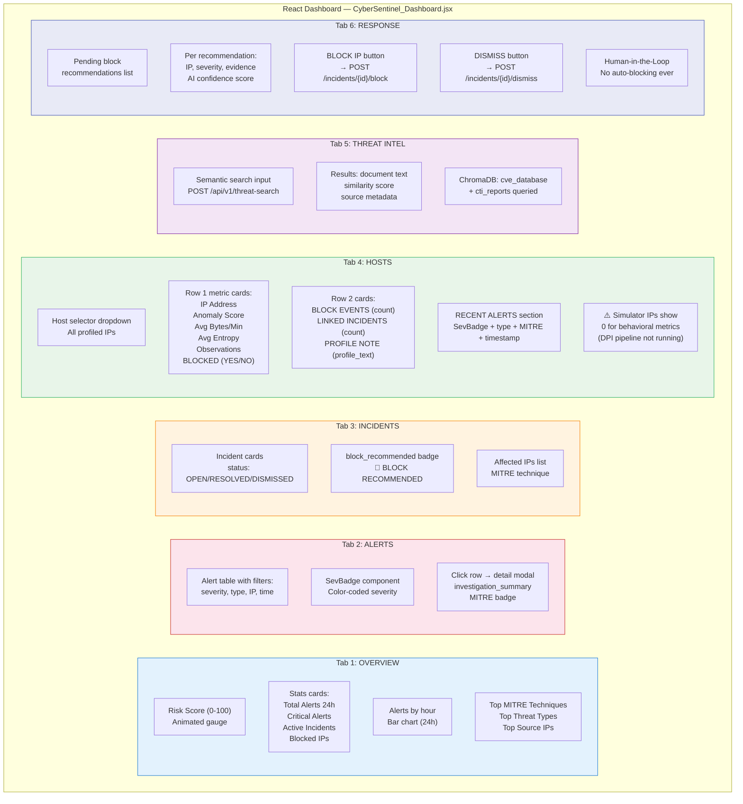
```mermaid
graph TB
    subgraph DASHBOARD["React Dashboard — CyberSentinel_Dashboard.jsx"]

        subgraph T1["Tab 1: OVERVIEW"]
            OV1["Risk Score (0-100)\nAnimated gauge"]
            OV2["Stats cards:\nTotal Alerts 24h\nCritical Alerts\nActive Incidents\nBlocked IPs"]
            OV3["Alerts by hour\nBar chart (24h)"]
            OV4["Top MITRE Techniques\nTop Threat Types\nTop Source IPs"]
        end

        subgraph T2["Tab 2: ALERTS"]
            AL1["Alert table with filters:\nseverity, type, IP, time"]
            AL2["SevBadge component\nColor-coded severity"]
            AL3["Click row → detail modal\ninvestigation_summary\nMITRE badge"]
        end

        subgraph T3["Tab 3: INCIDENTS"]
            INC1["Incident cards\nstatus: OPEN/RESOLVED/DISMISSED"]
            INC2["block_recommended badge\n🔴 BLOCK RECOMMENDED"]
            INC3["Affected IPs list\nMITRE technique"]
        end

        subgraph T4["Tab 4: HOSTS"]
            H1["Host selector dropdown\nAll profiled IPs"]
            H2["Row 1 metric cards:\nIP Address\nAnomaly Score\nAvg Bytes/Min\nAvg Entropy\nObservations\nBLOCKED (YES/NO)"]
            H3["Row 2 cards:\nBLOCK EVENTS (count)\nLINKED INCIDENTS (count)\nPROFILE NOTE (profile_text)"]
            H4["RECENT ALERTS section\nSevBadge + type + MITRE + timestamp"]
            H5["⚠️ Simulator IPs show\n0 for behavioral metrics\n(DPI pipeline not running)"]
        end

        subgraph T5["Tab 5: THREAT INTEL"]
            TI1["Semantic search input\nPOST /api/v1/threat-search"]
            TI2["Results: document text\nsimilarity score\nsource metadata"]
            TI3["ChromaDB: cve_database\n+ cti_reports queried"]
        end

        subgraph T6["Tab 6: RESPONSE"]
            R1["Pending block\nrecommendations list"]
            R2["Per recommendation:\nIP, severity, evidence\nAI confidence score"]
            R3["BLOCK IP button\n→ POST /incidents/{id}/block"]
            R4["DISMISS button\n→ POST /incidents/{id}/dismiss"]
            R5["Human-in-the-Loop\nNo auto-blocking ever"]
        end
    end

    style T1 fill:#e3f2fd,stroke:#1976d2
    style T2 fill:#fce4ec,stroke:#c62828
    style T3 fill:#fff3e0,stroke:#f57c00
    style T4 fill:#e8f5e9,stroke:#27ae60
    style T5 fill:#f3e5f5,stroke:#7b1fa2
    style T6 fill:#e8eaf6,stroke:#3f51b5
```

---

## 18. Data Lifecycle — Alert to Resolution

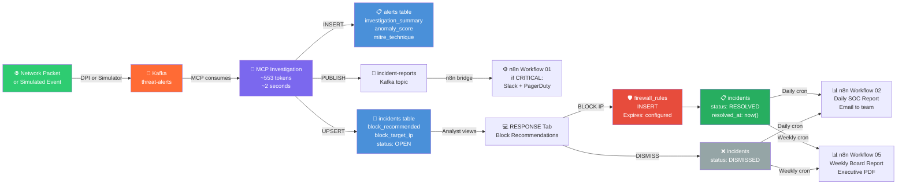
```mermaid
flowchart LR
    A["🌐 Network Packet\nor Simulated Event"]
    -->|DPI or Simulator| B["🚨 Kafka\nthreat-alerts"]

    B -->|MCP consumes| C["🤖 MCP Investigation\n~553 tokens\n~2 seconds"]

    C -->|INSERT| D["📋 alerts table\ninvestigation_summary\nanomaly_score\nmitre_technique"]

    C -->|UPSERT| E["📁 incidents table\nblock_recommended\nblock_target_ip\nstatus: OPEN"]

    C -->|PUBLISH| F["📨 incident-reports\nKafka topic"]

    F -->|n8n bridge| G["⚙️ n8n Workflow 01\nif CRITICAL:\nSlack + PagerDuty"]

    E -->|Analyst views| H["💻 RESPONSE Tab\nBlock Recommendations"]

    H -->|BLOCK IP| I["🛡️ firewall_rules\nINSERT\nExpires: configured"]
    H -->|DISMISS| J["❌ incidents\nstatus: DISMISSED"]

    I --> K["📋 incidents\nstatus: RESOLVED\nresolved_at: now()"]

    K & J -->|Daily cron| L["📊 n8n Workflow 02\nDaily SOC Report\nEmail to team"]

    K & J -->|Weekly cron| M["📊 n8n Workflow 05\nWeekly Board Report\nExecutive PDF"]

    style A fill:#2ecc71,color:#fff
    style B fill:#ff6b35,color:#fff
    style C fill:#7b68ee,color:#fff
    style D fill:#4a90d9,color:#fff
    style E fill:#4a90d9,color:#fff
    style I fill:#e74c3c,color:#fff
    style J fill:#95a5a6,color:#fff
    style K fill:#27ae60,color:#fff
```

---

## 19. Token Economics & Cost Model

### Investigation Cost Analysis

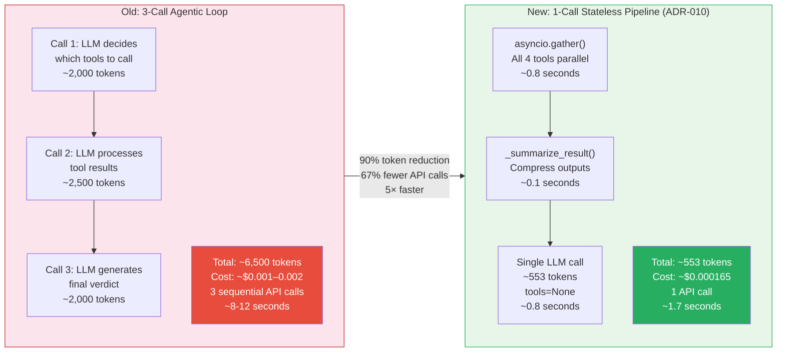
```mermaid
graph LR
    subgraph OLD["Old: 3-Call Agentic Loop"]
        O1["Call 1: LLM decides\nwhich tools to call\n~2,000 tokens"]
        O2["Call 2: LLM processes\ntool results\n~2,500 tokens"]
        O3["Call 3: LLM generates\nfinal verdict\n~2,000 tokens"]
        O1 --> O2 --> O3
        OTOTAL["Total: ~6,500 tokens\nCost: ~$0.001–0.002\n3 sequential API calls\n~8-12 seconds"]
    end

    subgraph NEW["New: 1-Call Stateless Pipeline (ADR-010)"]
        N1["asyncio.gather()\nAll 4 tools parallel\n~0.8 seconds"]
        N2["_summarize_result()\nCompress outputs\n~0.1 seconds"]
        N3["Single LLM call\n~553 tokens\ntools=None\n~0.8 seconds"]
        N1 --> N2 --> N3
        NTOTAL["Total: ~553 tokens\nCost: ~$0.000165\n1 API call\n~1.7 seconds"]
    end

    OLD -->|"90% token reduction\n67% fewer API calls\n5× faster"| NEW

    style OLD fill:#fce4ec,stroke:#c62828
    style NEW fill:#e8f5e9,stroke:#27ae60
    style OTOTAL fill:#e74c3c,color:#fff
    style NTOTAL fill:#27ae60,color:#fff
```

### Budget Projections (OpenAI GPT-4o mini)

| Budget | Investigations | Days at 30-min intervals | Days at 10-min intervals |
|--------|---------------|--------------------------|--------------------------|
| $1 | ~6,000 | ~125 days | ~41 days |
| $5 | ~30,000 | ~625 days | ~208 days |
| $10 | ~60,000 | ~1,250 days | ~416 days |
| $20 | ~120,000 | ~2,500 days | ~833 days |

### Token Input:Output Ratio

| Ratio | Meaning | CyberSentinel v1.1 |
|-------|---------|-------------------|
| 10:1 (old) | Huge prompts, tiny output — wasteful | Old 3-call loop |
| 5:1 | Moderate waste | Many chat-style LLM apps |
| **2:1 (current)** | **Dense JSON prompts, rich structured output** | **ADR-010 pipeline** |
| 1:1 | Balanced — unusual for structured inference | — |

A 2:1 ratio is optimal for structured JSON inference: every input token delivers information that improves the verdict, and every output token is a structured field the dashboard consumes.

---

## 20. Security Architecture

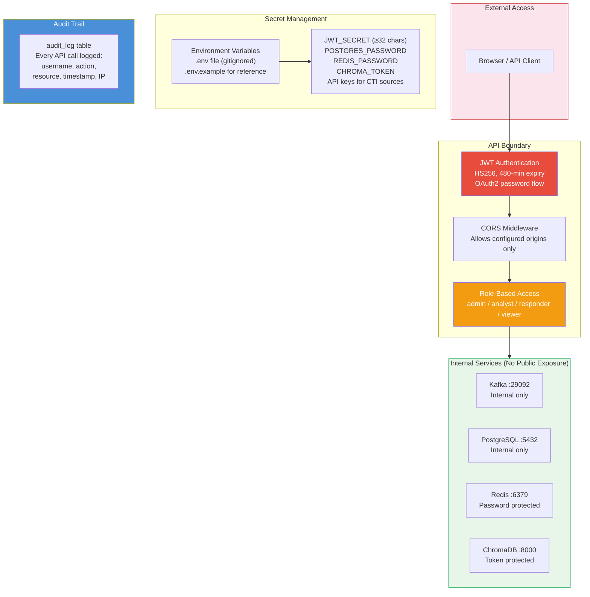
```mermaid
graph TB
    subgraph EXTERNAL["External Access"]
        USER["Browser / API Client"]
    end

    subgraph BOUNDARY["API Boundary"]
        JWT["JWT Authentication\nHS256, 480-min expiry\nOAuth2 password flow"]
        CORS["CORS Middleware\nAllows configured origins only"]
        RBAC["Role-Based Access\nadmin / analyst / responder / viewer"]
    end

    subgraph INTERNAL["Internal Services (No Public Exposure)"]
        KAFKA_S["Kafka :29092\nInternal only"]
        PG_S["PostgreSQL :5432\nInternal only"]
        REDIS_S["Redis :6379\nPassword protected"]
        CHROMA_S["ChromaDB :8000\nToken protected"]
    end

    subgraph SECRETS["Secret Management"]
        ENV["Environment Variables\n.env file (gitignored)\n.env.example for reference"]
        VARS["JWT_SECRET (≥32 chars)\nPOSTGRES_PASSWORD\nREDIS_PASSWORD\nCHROMA_TOKEN\nAPI keys for CTI sources"]
    end

    subgraph AUDIT["Audit Trail"]
        AUDITLOG["audit_log table\nEvery API call logged:\nusername, action,\nresource, timestamp, IP"]
    end

    USER --> JWT
    JWT --> CORS
    CORS --> RBAC
    RBAC --> INTERNAL
    ENV --> VARS

    style JWT fill:#e74c3c,color:#fff
    style RBAC fill:#f39c12,color:#fff
    style AUDIT fill:#4a90d9,color:#fff
    style EXTERNAL fill:#fce4ec,stroke:#c62828
    style INTERNAL fill:#e8f5e9,stroke:#27ae60
```

---

## 21. Observability Stack

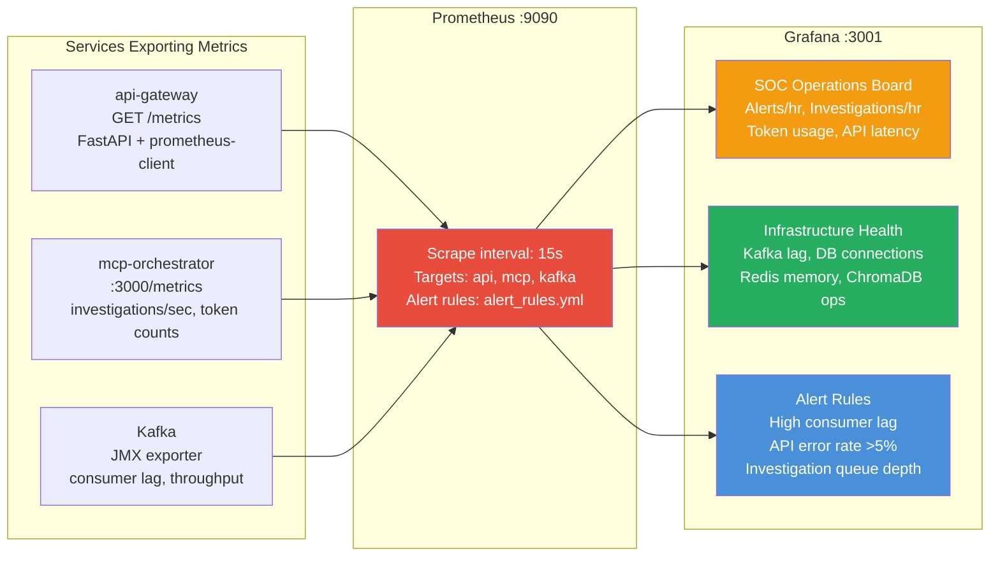
```mermaid
graph LR
    subgraph SERVICES["Services Exporting Metrics"]
        API_M["api-gateway\nGET /metrics\nFastAPI + prometheus-client"]
        MCP_M["mcp-orchestrator\n:3000/metrics\ninvestigations/sec, token counts"]
        KF_M["Kafka\nJMX exporter\nconsumer lag, throughput"]
    end

    subgraph COLLECTION["Prometheus :9090"]
        PROM_S["Scrape interval: 15s\nTargets: api, mcp, kafka\nAlert rules: alert_rules.yml"]
    end

    subgraph VISUALIZATION["Grafana :3001"]
        G1["SOC Operations Board\nAlerts/hr, Investigations/hr\nToken usage, API latency"]
        G2["Infrastructure Health\nKafka lag, DB connections\nRedis memory, ChromaDB ops"]
        G3["Alert Rules\nHigh consumer lag\nAPI error rate >5%\nInvestigation queue depth"]
    end

    API_M & MCP_M & KF_M --> PROM_S
    PROM_S --> G1
    PROM_S --> G2
    PROM_S --> G3

    style PROM_S fill:#e74c3c,color:#fff
    style G1 fill:#f39c12,color:#fff
    style G2 fill:#27ae60,color:#fff
    style G3 fill:#4a90d9,color:#fff
```

---

## 22. Environment Configuration Reference

### Minimal Required Variables

```bash
# LLM Provider (choose one)
LLM_PROVIDER=openai          # claude | openai | gemini
OPENAI_API_KEY=sk-...        # or ANTHROPIC_API_KEY / GOOGLE_API_KEY

# Security (MUST change from defaults)
JWT_SECRET=your-secret-min-32-chars-here
POSTGRES_PASSWORD=your-pg-password
REDIS_PASSWORD=your-redis-password
CHROMA_TOKEN=your-chroma-token

# Threat Intel APIs (optional but recommended)
ABUSEIPDB_KEY=your-key       # IP reputation lookups
NVD_API_KEY=your-key         # CVE database (faster without key but rate-limited)
```

### Full Configuration Map

| Category | Variable | Default | Description |
|----------|---------|---------|-------------|
| LLM | `LLM_PROVIDER` | `openai` | `claude` / `openai` / `gemini` |
| LLM | `LLM_MODEL_PRIMARY` | Provider default | Override primary model |
| LLM | `LLM_MODEL_FAST` | Provider default | Override fast model |
| DPI | `CAPTURE_INTERFACE` | `eth0` | Network interface to capture |
| DPI | `BPF_FILTER` | `ip` | Berkeley Packet Filter expression |
| RLM | `RLM_ALPHA` | `0.1` | EMA smoothing factor (0–1) |
| RLM | `RLM_ANOMALY_THRESHOLD` | `0.65` | Minimum score to emit alert |
| RLM | `RLM_THREAT_MATCH_THRESHOLD` | `0.50` | Minimum ChromaDB similarity |
| RLM | `RLM_MIN_OBSERVATIONS` | `20` | Packets needed before scoring |
| ChromaDB | `EMBEDDING_MODEL` | `all-MiniLM-L6-v2` | Sentence transformer model |
| ChromaDB | `EMBED_CACHE_TTL_SEC` | `3600` | Redis embedding cache TTL |
| ChromaDB | `PROFILE_TTL_DAYS` | `30` | behavior_profiles eviction |
| ChromaDB | `CTI_TTL_DAYS` | `90` | cti_reports eviction |
| ChromaDB | `MITRE_REEMBED_INTERVAL_DAYS` | `7` | Re-embed guard interval |
| MCP | `INVESTIGATION_INTERVAL_SEC` | `1800` | Seconds between investigations |
| Scraper | `SCRAPE_INTERVAL_HOURS` | `4` | CTI refresh interval |
| Notifications | `SLACK_WEBHOOK` | — | Slack incoming webhook URL |
| Notifications | `PAGERDUTY_KEY` | — | PagerDuty integration key |

---

## 23. Deployment Guide

### Prerequisites

```
Docker Desktop ≥ 4.x
Docker Compose v2.x
4 GB RAM minimum (8 GB recommended)
5 GB disk space
LLM provider API key (OpenAI recommended)
```

### Quick Start

```bash
# 1. Clone and configure
git clone <repo>
cd cybersentinel-ai
cp .env.example .env
# Edit .env — set LLM_PROVIDER, API keys, JWT_SECRET

# 2. Start core services
docker-compose up -d

# 3. Verify all services are running
docker-compose ps

# 4. Check logs
docker-compose logs -f mcp-orchestrator
docker-compose logs -f api-gateway

# 5. Access the dashboard
open http://localhost:5173
# Default login: admin / cybersentinel2025

# 6. (Optional) Start n8n SOAR
docker-compose -f n8n/docker-compose.n8n.yml up -d
open http://localhost:5678
```

### Service Startup Order

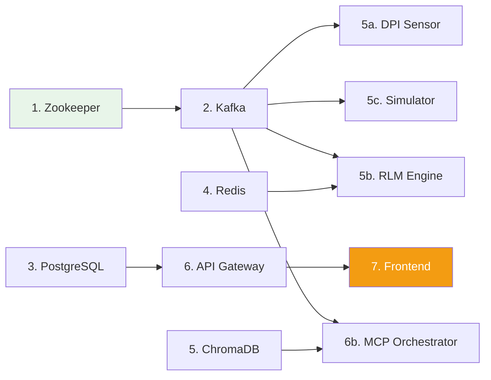
```mermaid
graph LR
    ZK["1. Zookeeper"] --> KF["2. Kafka"]
    PG["3. PostgreSQL"] --> API["6. API Gateway"]
    RD["4. Redis"] --> RLM["5b. RLM Engine"]
    CH["5. ChromaDB"] --> MCP["6b. MCP Orchestrator"]
    KF --> DPI["5a. DPI Sensor"]
    KF --> SIM["5c. Simulator"]
    KF --> RLM
    KF --> MCP
    API --> FE["7. Frontend"]

    style ZK fill:#e8f5e9
    style FE fill:#f39c12,color:#fff
```

### Rebuild a Single Service

```bash
# After code changes to a specific service:
docker-compose up -d --build frontend
docker-compose up -d --build mcp-orchestrator
docker-compose up -d --build api-gateway

# Full rebuild (nuclear option):
docker-compose down
docker-compose up -d --build
```

### Reset Everything (Data Loss Warning)

```bash
# Wipes all data: PostgreSQL, ChromaDB, Redis, Kafka
./scripts/setup/reset.sh

# Or manually:
docker-compose down -v
docker-compose up -d
```

---

## Appendix A — File Structure Reference

```
cybersentinel-ai/
├── README.md                          # Project overview and quick start
├── docker-compose.yml                 # All core services
├── .env.example                       # Environment variable template
│
├── src/
│   ├── dpi/
│   │   ├── sensor.py                  # Scapy packet capture
│   │   ├── detectors.py               # Multi-signal threat detectors
│   │   └── publisher.py               # Kafka producer for raw-packets
│   ├── models/
│   │   ├── rlm_engine.py              # EMA behavioral profiling
│   │   ├── profile.py                 # BehaviorProfile dataclass + to_text()
│   │   └── signatures.py             # 8 threat signature seeds
│   ├── agents/
│   │   ├── mcp_orchestrator.py        # 1-call investigation pipeline
│   │   ├── llm_provider.py            # Claude/OpenAI/Gemini abstraction
│   │   ├── tools.py                   # MCP tool definitions
│   │   └── prompts.py                 # LLM system prompts
│   ├── api/
│   │   ├── gateway.py                 # FastAPI routes (JWT auth)
│   │   ├── auth.py                    # JWT helpers
│   │   └── schemas.py                 # Pydantic models
│   ├── ingestion/
│   │   ├── threat_intel_scraper.py    # CISA, NVD, Abuse.ch, MITRE, OTX
│   │   ├── embedder.py                # ChromaDB + embedding governance
│   │   └── sources.py                 # Scraper source configs
│   ├── simulation/
│   │   └── traffic_simulator.py       # 12-scenario threat simulator
│   └── core/
│       ├── config.py                  # All config from env vars
│       ├── constants.py               # MITRE IDs, thresholds
│       └── logger.py                  # Structured logging
│
├── frontend/src/
│   ├── CyberSentinel_Dashboard.jsx    # Main 6-tab SOC dashboard
│   ├── CyberSentinel_Landing.jsx      # Landing/login page
│   └── App.jsx                        # React router
│
├── n8n/
│   ├── workflows/
│   │   ├── 01_critical_alert_soar.json
│   │   ├── 02_daily_soc_report.json
│   │   ├── 03_cve_intel_pipeline.json
│   │   ├── 04_sla_watchdog.json
│   │   └── 05_weekly_board_report.json
│   └── bridge/kafka_bridge.py         # Kafka → n8n webhook bridge
│
├── scripts/db/init.sql                # PostgreSQL schema + seed data
├── configs/prometheus/                # Prometheus config + alert rules
├── configs/grafana/                   # Grafana datasource config
└── docs/                             # All documentation (this folder)
```

---

## Appendix B — MITRE ATT&CK Coverage

| Technique ID | Name | Detected By | Alert Type |
|-------------|------|------------|-----------|
| T1071.001 | Application Layer Protocol: Web Protocols (C2) | detectors.py + simulator | C2_BEACON |
| T1021.002 | Remote Services: SMB/Windows Admin Shares | detectors.py + simulator | LATERAL_MOVEMENT |
| T1048 | Exfiltration Over Alternative Protocol | detectors.py + simulator | DATA_EXFILTRATION |
| T1046 | Network Service Discovery (Port Scan) | detectors.py + simulator | PORT_SCAN |
| T1568.002 | Dynamic Resolution: Domain Generation Algorithms | detectors.py + simulator | DGA_DETECTED |
| T1486 | Data Encrypted for Impact (Ransomware) | simulator | RANSOMWARE_STAGING |
| T1003 | OS Credential Dumping | simulator | CREDENTIAL_DUMP |
| T1090.003 | Proxy: Multi-hop Proxy (Tor) | detectors.py + simulator | TOR_PROXY |
| T1078 | Valid Accounts (Insider Threat) | simulator | INSIDER_THREAT |
| T1195 | Supply Chain Compromise | simulator | SUPPLY_CHAIN |
| T1499 | Endpoint Denial of Service | simulator | DDOS_DETECTED |
| T1190 | Exploit Public-Facing Application (0-day) | simulator | ZERO_DAY_EXPLOIT |
| T1595 | Active Scanning | detectors.py | ACTIVE_SCAN |
| T1041 | Exfiltration Over C2 Channel | detectors.py | C2_EXFIL |
| T1071.004 | Application Layer Protocol: DNS | detectors.py + simulator | DNS_TUNNEL |

---

*CyberSentinel AI — Master Project Document — v1.1 — 2026*
*Generated from live source code. All diagrams render natively on GitHub.*
