# CyberSentinel AI — Master Project Document

**Version 1.3.0 | 2026 | Comprehensive Technical Reference with Visual Diagrams**

> This document is the single source of truth for the entire CyberSentinel AI platform. Every diagram, table, and explanation is derived directly from the live source code. Mermaid diagrams render natively on GitHub, VS Code (Mermaid Preview extension), Notion, Obsidian, and GitBook.

---

## Table of Contents

1. [Project Overview](#1-project-overview)
2. [Full System Architecture](#2-full-system-architecture)
3. [Docker Container Inventory](#3-docker-container-inventory)
4. [Docker Compose Deployment Architecture](#4-docker-compose-deployment-architecture)
5. [Pipeline 1 — DPI Real Traffic (IPv4 + IPv6)](#5-pipeline-1--dpi-real-traffic-ipv4--ipv6)
6. [Pipeline 2 — Traffic Simulator](#6-pipeline-2--traffic-simulator)
7. [Pipeline Comparison](#7-pipeline-comparison)
8. [Kafka Topic Architecture](#8-kafka-topic-architecture)
9. [ChromaDB Collections Map](#9-chromadb-collections-map)
10. [PostgreSQL Database Schema (ERD)](#10-postgresql-database-schema-erd)
11. [1-Call LLM Investigation Pipeline](#11-1-call-llm-investigation-pipeline)
12. [Campaign Tracking and Kill Chain Correlation](#12-campaign-tracking-and-kill-chain-correlation)
13. [RAG Pipeline — Semantic Search Flow](#13-rag-pipeline--semantic-search-flow)
14. [Human-in-the-Loop Response Flow](#14-human-in-the-loop-response-flow)
15. [LLM Provider Abstraction Layer](#15-llm-provider-abstraction-layer)
16. [n8n SOAR Workflow Map](#16-n8n-soar-workflow-map)
17. [REST API Endpoint Map](#17-rest-api-endpoint-map)
18. [React Dashboard — 6 Tab Architecture](#18-react-dashboard--6-tab-architecture)
19. [Data Lifecycle — Alert to Resolution](#19-data-lifecycle--alert-to-resolution)
20. [Token Economics and Cost Model](#20-token-economics-and-cost-model)
21. [Security Architecture](#21-security-architecture)
22. [Observability Stack](#22-observability-stack)
23. [Environment Configuration Reference](#23-environment-configuration-reference)
24. [Deployment Guide](#24-deployment-guide)
25. [Appendix A — File Structure Reference](#appendix-a--file-structure-reference)
26. [Appendix B — MITRE ATT&CK Coverage](#appendix-b--mitre-attck-coverage)
27. [Appendix C — v1.3.0 Changes](#appendix-c--v130-changes)
28. [Appendix D — Document Index](#appendix-d--document-index)

---

## 1. Project Overview

### What Is CyberSentinel AI?

CyberSentinel AI is an **enterprise-grade AI-powered threat detection and response platform** built for Security Operations Centers (SOCs). It combines real-time deep packet inspection, behavioral profiling with IsolationForest anomaly detection, semantic threat correlation using RAG (Retrieval-Augmented Generation), AI-driven investigation, and attacker campaign tracking into a unified Docker Compose-deployed pipeline of 14 containers.

### Core Capabilities

| Capability | Implementation | Status |
|-----------|---------------|--------|
| Real-time packet capture and DPI (IPv4 + IPv6) | `src/dpi/sensor.py` — Scapy AsyncSniffer | Production |
| Behavioral profiling (EMA + IsolationForest blend) | `src/models/rlm_engine.py` | Production |
| Semantic threat correlation | ChromaDB + all-MiniLM-L6-v2 (local CPU) | Production |
| AI-driven investigation (1-call pipeline) | `src/agents/mcp_orchestrator.py` | Production |
| Attacker campaign tracking | `attacker_campaigns` + `campaign_incidents` tables | Production |
| Multi-provider LLM support | `src/agents/llm_provider.py` | Production |
| Human-in-the-loop SOAR | FastAPI + React RESPONSE tab | Production |
| PII masking before Kafka publish | `_mask_pii()` in `sensor.py` | Production |
| Threat intelligence ingestion | `src/ingestion/threat_intel_scraper.py` | Production |
| Traffic simulation for testing | `src/simulation/traffic_simulator.py` (17 scenarios) | Production |
| n8n SOAR automation | `n8n/workflows/` (5 workflows) | Production |
| SOC React dashboard | `frontend/src/CyberSentinel_Dashboard.jsx` | Production |
| Observability | Prometheus + Grafana (inside Docker Compose) | Production |

### Novel Technical Contributions

1. **Stateless 1-Call LLM Investigation** — All MCP tools execute in parallel via `asyncio.gather()` before a single LLM API call. No agentic loop. Reduces token cost 90% vs traditional 3-call agentic pattern (~553 tokens/investigation, ~$0.000165).

2. **IsolationForest Sequence Anomaly Layer** — `SequenceAnomalyDetector` class sits on a 50-observation rolling buffer per IP. Detects gradual score progressions (e.g. `[0.30 → 0.33 → 0.37 → 0.41 → 0.46]`) that never cross the threshold individually. 25% blend weight over ChromaDB base score.

3. **Dual-Pipeline Architecture** — Real DPI (IPv4 + IPv6) and traffic simulator both publish to the same `raw-packets` Kafka topic. Identical processing from Kafka onwards. Simulator generates realistic burst traffic for 17 threat scenarios without a physical interface.

4. **Attacker Campaign Correlation** — Every incident is automatically linked to an `attacker_campaigns` record by src_ip within a 24-hour window. MITRE stages union across incidents reveals kill chains. Fire-and-forget via `asyncio.ensure_future()` to avoid blocking the investigation pipeline.

5. **Human-in-the-Loop SOAR** — LLM sets `block_recommended` flag but never auto-blocks. Analyst approves or dismisses via dashboard RESPONSE tab. Eliminates false-positive blocking in production.

---

## 2. Full System Architecture

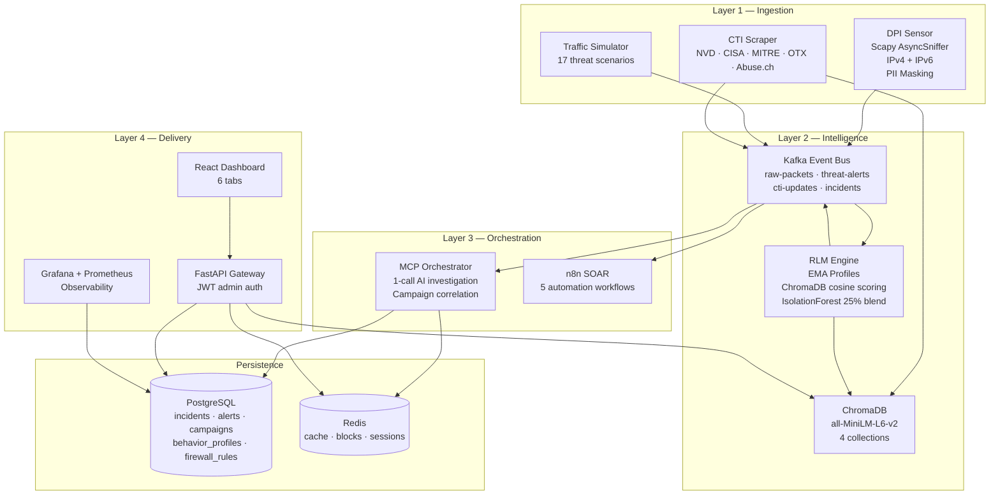
```mermaid
graph TB
    subgraph INGESTION["Layer 1 — Ingestion"]
        DPI[DPI Sensor\nScapy AsyncSniffer\nIPv4 + IPv6\nPII Masking]
        SIM[Traffic Simulator\n17 threat scenarios]
        CTI[CTI Scraper\nNVD · CISA · MITRE · OTX · Abuse.ch]
    end

    subgraph INTELLIGENCE["Layer 2 — Intelligence"]
        KAFKA[Kafka Event Bus\nraw-packets · threat-alerts\ncti-updates · incidents]
        RLM[RLM Engine\nEMA Profiles\nChromaDB cosine scoring\nIsolationForest 25% blend]
        CHROMA[ChromaDB\nall-MiniLM-L6-v2\n4 collections]
    end

    subgraph ORCHESTRATION["Layer 3 — Orchestration"]
        MCP[MCP Orchestrator\n1-call AI investigation\nCampaign correlation]
        N8N[n8n SOAR\n5 automation workflows]
    end

    subgraph DELIVERY["Layer 4 — Delivery"]
        API[FastAPI Gateway\nJWT admin auth]
        DASH[React Dashboard\n6 tabs]
        GRAF[Grafana + Prometheus\nObservability]
    end

    subgraph DATA["Persistence"]
        PG[(PostgreSQL\nincidents · alerts · campaigns\nbehavior_profiles · firewall_rules)]
        REDIS[(Redis\ncache · blocks · sessions)]
    end

    DPI --> KAFKA
    SIM --> KAFKA
    CTI --> CHROMA
    CTI --> KAFKA
    KAFKA --> RLM
    RLM --> CHROMA
    RLM --> KAFKA
    KAFKA --> MCP
    KAFKA --> N8N
    MCP --> PG
    MCP --> REDIS
    API --> PG
    API --> REDIS
    API --> CHROMA
    DASH --> API
    GRAF --> PG
```

---

## 3. Docker Container Inventory

The platform runs as **14 Docker containers** on the `cybersentinel-net` bridge network via `docker compose up -d`.

### Infrastructure Containers

| Container | Image | Port | Volume | Role |
|-----------|-------|------|--------|------|
| `cybersentinel-zookeeper` | `confluentinc/cp-zookeeper:7.5.0` | 2181 | — | Kafka coordination |
| `cybersentinel-kafka` | `confluentinc/cp-kafka:7.5.0` | 9092 / 29092 | `kafka_data` | Event streaming backbone |
| `cybersentinel-postgres` | `timescale/timescaledb:latest-pg16` | 5432 | `postgres_data` | PostgreSQL — all persistent data |
| `cybersentinel-redis` | `redis:7-alpine` | 6379 | `redis_data` | Cache, block rules, session windows |
| `cybersentinel-chromadb` | `chromadb/chroma:latest` | 8000 | `chromadb_data` | Vector similarity store |

### Core Service Containers

| Container | Image | Port | Role |
|-----------|-------|------|------|
| `cybersentinel-dpi` | `Dockerfile.dpi` | — | Live packet capture (`network_mode: host`) |
| `cybersentinel-rlm` | `Dockerfile.rlm` | — | Behavioral profiling + anomaly scoring |
| `cybersentinel-scraper` | `Dockerfile.scraper` | — | CTI ingestion every 4 hours |
| `cybersentinel-mcp` | `Dockerfile.mcp` | 3000 | AI investigation pipeline |
| `cybersentinel-api` | `Dockerfile.api` | 8080 | REST API, JWT auth |
| `cybersentinel-simulator` | `Dockerfile.simulator` | — | Synthetic threat generation |

### Delivery Containers

| Container | Image | Port | Volume | Role |
|-----------|-------|------|--------|------|
| `cybersentinel-frontend` | `Dockerfile.frontend` | 5173 | — | React SOC dashboard |
| `cybersentinel-prometheus` | `prom/prometheus:v2.47.0` | 9090 | — | Metrics collection |
| `cybersentinel-grafana` | `grafana/grafana:10.2.0` | 3001 | `grafana_data` | Metrics dashboards |

### N8N (Standalone — Not in docker-compose.yml)

| Container | Port | Volume | Notes |
|-----------|------|--------|-------|
| `N8N` | 5678 | `D:/N8N` | Started via `scripts/start_n8n.ps1`; joined to `cybersentinel-net` |

---

## 4. Docker Compose Deployment Architecture

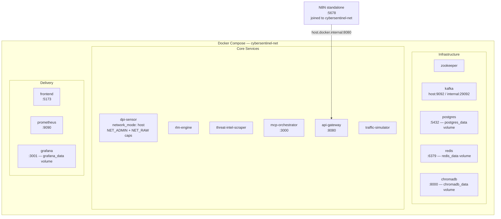
```mermaid
graph TB
    subgraph DC["Docker Compose — cybersentinel-net"]
        subgraph INFRA["Infrastructure"]
            ZK[zookeeper]
            KF[kafka\nhost:9092 / internal:29092]
            PG[postgres\n:5432 — postgres_data volume]
            RD[redis\n:6379 — redis_data volume]
            CD[chromadb\n:8000 — chromadb_data volume]
        end

        subgraph CORE["Core Services"]
            DPI[dpi-sensor\nnetwork_mode: host\nNET_ADMIN + NET_RAW caps]
            RLM[rlm-engine]
            SCR[threat-intel-scraper]
            MCP[mcp-orchestrator\n:3000]
            API[api-gateway\n:8080]
            SIM[traffic-simulator]
        end

        subgraph DELIVERY["Delivery"]
            FE[frontend\n:5173]
            PR[prometheus\n:9090]
            GR[grafana\n:3001 — grafana_data volume]
        end
    end

    N8N[N8N standalone\n:5678\njoined to cybersentinel-net] -->|host.docker.internal:8080| API
```

**Named volumes** survive `docker compose down` but are removed by `docker compose down -v` (full reset).

**Kafka restart fix:** If `InconsistentClusterIdException` occurs, run: `docker compose stop kafka zookeeper && docker volume rm cybersentinel-ai_kafka_data && docker compose up -d`.

---

## 5. Pipeline 1 — DPI Real Traffic (IPv4 + IPv6)

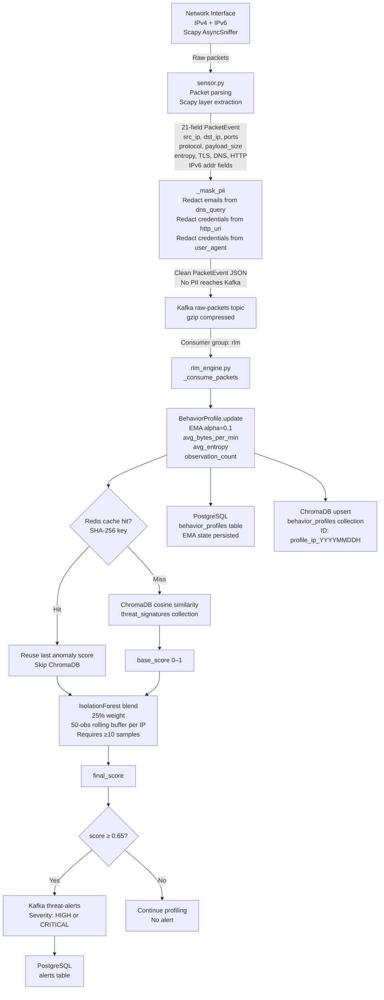
```mermaid
flowchart TD
    A[Network Interface\nIPv4 + IPv6\nScapy AsyncSniffer]
    -->|Raw packets| B[sensor.py\nPacket parsing\nScapy layer extraction]

    B -->|21-field PacketEvent\nsrc_ip, dst_ip, ports\nprotocol, payload_size\nentropy, TLS, DNS, HTTP\nIPv6 addr fields| C[_mask_pii\nRedact emails from dns_query\nRedact credentials from http_uri\nRedact credentials from user_agent]

    C -->|Clean PacketEvent JSON\nNo PII reaches Kafka| D[Kafka raw-packets topic\ngzip compressed]

    D -->|Consumer group: rlm| E[rlm_engine.py\n_consume_packets]

    E --> F[BehaviorProfile.update\nEMA alpha=0.1\navg_bytes_per_min\navg_entropy\nobservation_count]

    F --> G{Redis cache hit?\nSHA-256 key}
    G -->|Hit| H[Reuse last anomaly score\nSkip ChromaDB]
    G -->|Miss| I[ChromaDB cosine similarity\nthreat_signatures collection]

    I --> J[base_score 0–1]
    H --> K
    J --> K[IsolationForest blend\n25% weight\n50-obs rolling buffer per IP\nRequires ≥10 samples]

    K --> L[final_score]
    L --> M{score ≥ 0.65?}
    M -->|Yes| N[Kafka threat-alerts\nSeverity: HIGH or CRITICAL]
    M -->|No| O[Continue profiling\nNo alert]

    N --> P[PostgreSQL\nalerts table]
    F --> Q[PostgreSQL\nbehavior_profiles table\nEMA state persisted]
    F --> R[ChromaDB upsert\nbehavior_profiles collection\nID: profile_ip_YYYYMMDDH]
```

### What Gets Populated

| Store | Table / Collection | Written By |
|-------|-------------------|-----------|
| Kafka `raw-packets` | — | DPI sensor (PII-masked) |
| Kafka `threat-alerts` | — | RLM engine (score ≥ 0.65) |
| PostgreSQL | `alerts` | RLM engine |
| PostgreSQL | `behavior_profiles` | RLM engine (UPSERT per IP per hour) |
| ChromaDB | `behavior_profiles` | RLM engine (embedded profile text) |
| ChromaDB | `threat_signatures` | Seeded at startup — read at query time |

---

## 6. Pipeline 2 — Traffic Simulator

> Both pipelines publish to the same `raw-packets` Kafka topic. Processing is **identical** from Kafka onwards.

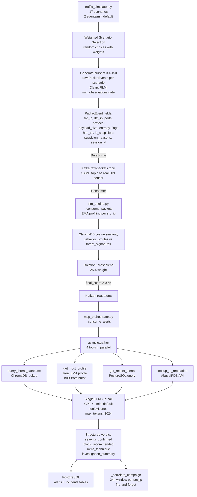
```mermaid
flowchart TD
    A[traffic_simulator.py\n17 scenarios\n2 events/min default]

    A --> B[Weighted Scenario Selection\nrandom.choices with weights]

    B --> C[Generate burst of 30–150\nraw PacketEvents per scenario\nClears RLM min_observations gate]

    C --> D[PacketEvent fields:\nsrc_ip, dst_ip, ports, protocol\npayload_size, entropy, flags\nhas_tls, is_suspicious\nsuspicion_reasons, session_id]

    D -->|Burst write| E[Kafka raw-packets topic\nSAME topic as real DPI sensor]

    E -->|Consumer| F[rlm_engine.py\n_consume_packets\nEMA profiling per src_ip]

    F --> G[ChromaDB cosine similarity\nbehavior_profiles vs threat_signatures]

    G --> H[IsolationForest blend\n25% weight]

    H -->|final_score ≥ 0.65| I[Kafka threat-alerts]

    I --> J[mcp_orchestrator.py\n_consume_alerts]

    J --> K[asyncio.gather\n4 tools in parallel]

    K --> L1[query_threat_database\nChromaDB lookup]
    K --> L2[get_host_profile\nReal EMA profile\nbuilt from burst]
    K --> L3[get_recent_alerts\nPostgreSQL query]
    K --> L4[lookup_ip_reputation\nAbuseIPDB API]

    L1 & L2 & L3 & L4 --> M[Single LLM API call\nGPT-4o mini default\ntools=None, max_tokens=1024]

    M --> N[Structured verdict:\nseverity_confirmed\nblock_recommended\nmitre_technique\ninvestigation_summary]

    N --> O[PostgreSQL\nalerts + incidents tables]
    N --> P[_correlate_campaign\n24h window per src_ip\nfire-and-forget]
```

### Simulator Scenario Reference

#### MITRE ATT&CK Mapped (12 scenarios)

| Scenario | MITRE ID | Severity | Weight | Burst Size |
|----------|----------|----------|--------|-----------|
| C2 Beacon | T1071.001 | CRITICAL | 5 | ~60 |
| Data Exfiltration | T1048.003 | HIGH | 4 | ~80 |
| Lateral Movement SMB | T1021.002 | HIGH | 3 | ~50 |
| Port Scan | T1046 | MEDIUM | 2 | ~150 |
| DNS Tunneling | T1071.004 | HIGH | 3 | ~100 |
| Brute Force SSH | T1110.001 | HIGH | 3 | ~120 |
| RDP Lateral Movement | T1021.001 | HIGH | 3 | ~45 |
| Exploit Public App | T1190 | CRITICAL | 4 | ~30 |
| High Entropy Payload | T1027 | HIGH | 3 | ~40 |
| Protocol Tunneling | T1572 | HIGH | 3 | ~60 |
| Credential Spray | T1110.003 | HIGH | 3 | ~90 |
| Reverse Shell | T1059.004 | CRITICAL | 4 | ~45 |

#### Novel Threats — AI Must Classify (5 scenarios)

| Scenario | Type | Severity | Description |
|----------|------|----------|-------------|
| Polymorphic Beacon | POLYMORPHIC_BEACON | HIGH | Intervals mutate to evade timing detection |
| Covert Storage Channel | COVERT_STORAGE_CHANNEL | HIGH | Data hidden in IP header ToS/reserved fields |
| Slow-Drip Exfil | SLOW_DRIP_EXFIL | HIGH | 1–2 bytes/packet over thousands of sessions |
| Mesh C2 Relay | MESH_C2_RELAY | CRITICAL | Multi-hop internal relay, no direct external contact |
| Synthetic Idle | SYNTHETIC_IDLE_TRAFFIC | MEDIUM | Mimics legitimate traffic but statistically wrong |

---

## 7. Pipeline Comparison

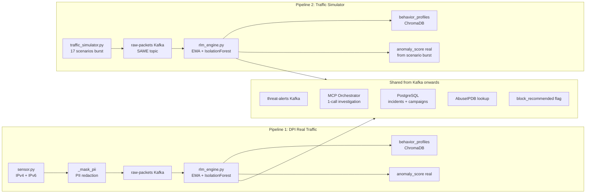
```mermaid
graph LR
    subgraph DPI_PATH["Pipeline 1: DPI Real Traffic"]
        direction TB
        P1A[sensor.py\nIPv4 + IPv6] --> P1B[_mask_pii\nPII redaction]
        P1B --> P1C[raw-packets Kafka]
        P1C --> P1D[rlm_engine.py\nEMA + IsolationForest]
        P1D --> P1E[behavior_profiles\nChromaDB]
        P1D --> P1F[anomaly_score real]
    end

    subgraph SIM_PATH["Pipeline 2: Traffic Simulator"]
        direction TB
        P2A[traffic_simulator.py\n17 scenarios burst] --> P2B[raw-packets Kafka\nSAME topic]
        P2B --> P2C[rlm_engine.py\nEMA + IsolationForest]
        P2C --> P2D[behavior_profiles\nChromaDB]
        P2C --> P2E[anomaly_score real\nfrom scenario burst]
    end

    subgraph SHARED["Shared from Kafka onwards"]
        S1[threat-alerts Kafka]
        S2[MCP Orchestrator\n1-call investigation]
        S3[PostgreSQL\nincidents + campaigns]
        S4[AbuseIPDB lookup]
        S5[block_recommended flag]
    end

    P1D --> SHARED
    P2C --> SHARED
```

| Data Field | DPI Pipeline | Simulator Pipeline |
|-----------|-------------|-------------------|
| `anomaly_score` | Real (genuine traffic) | Real (burst through RLM) |
| `observation_count` | Real packet count | Burst count (30–150 per scenario) |
| `avg_bytes_per_min` | EMA of real bytes | EMA of scenario-realistic values |
| `avg_entropy` | EMA of real payloads | EMA of scenario entropy values |
| `IsolationForest score` | Real sequence | Scenario burst sequence |
| `investigation_summary` | AI structured verdict | AI structured verdict |
| `block_recommended` | AI verdict | AI verdict |
| `campaign_correlation` | 24h window | 24h window |
| Raw packet bytes (pcap) | Real network bytes | Not captured — no physical interface |
| PII masking | Applied by `_mask_pii()` | Not needed — synthetic IPs only |
| IPv6 support | Full — BPF `ip or ip6` | Synthetic — includes IPv6 scenarios |

---

## 8. Kafka Topic Architecture

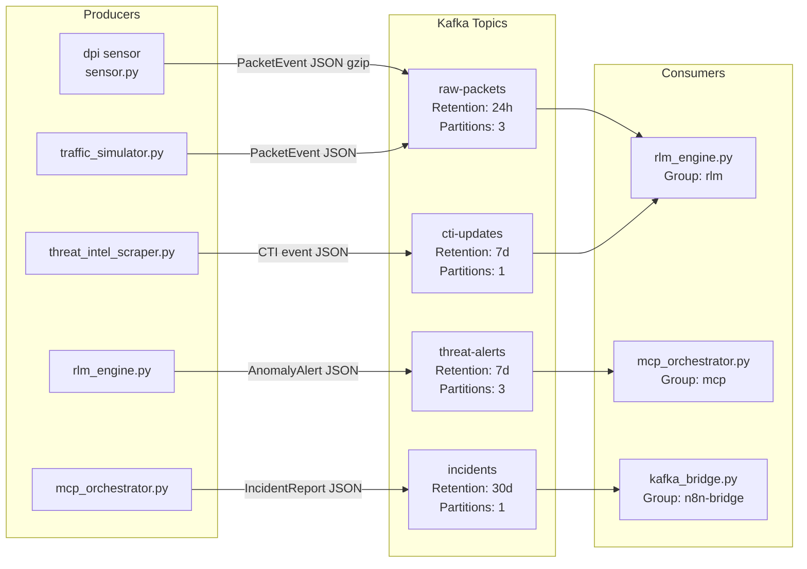
```mermaid
graph LR
    subgraph PRODUCERS["Producers"]
        DPI_P[dpi sensor\nsensor.py]
        SIM_P[traffic_simulator.py]
        RLM_P[rlm_engine.py]
        MCP_P[mcp_orchestrator.py]
        CTI_P[threat_intel_scraper.py]
    end

    subgraph TOPICS["Kafka Topics"]
        RP[raw-packets\nRetention: 24h\nPartitions: 3]
        TA[threat-alerts\nRetention: 7d\nPartitions: 3]
        INC[incidents\nRetention: 30d\nPartitions: 1]
        CTI[cti-updates\nRetention: 7d\nPartitions: 1]
    end

    subgraph CONSUMERS["Consumers"]
        RLM_C[rlm_engine.py\nGroup: rlm]
        MCP_C[mcp_orchestrator.py\nGroup: mcp]
        BRIDGE_C[kafka_bridge.py\nGroup: n8n-bridge]
    end

    DPI_P -->|PacketEvent JSON gzip| RP
    SIM_P -->|PacketEvent JSON| RP
    RLM_P -->|AnomalyAlert JSON| TA
    MCP_P -->|IncidentReport JSON| INC
    CTI_P -->|CTI event JSON| CTI

    RP --> RLM_C
    TA --> MCP_C
    INC --> BRIDGE_C
    CTI --> RLM_C
```

### Topic Message Schemas

**`raw-packets` message:**
```json
{
  "timestamp": "2026-04-16T10:15:00Z",
  "src_ip": "10.0.0.42",
  "dst_ip": "185.220.101.47",
  "src_port": 54321,
  "dst_port": 443,
  "protocol": "TCP",
  "payload_size": 1024,
  "entropy": 7.8,
  "flags": "SYN",
  "has_tls": true,
  "has_dns": false,
  "is_suspicious": true,
  "suspicion_reasons": ["high_entropy", "known_tor_exit"],
  "source": "dpi"
}
```

**`threat-alerts` message:**
```json
{
  "timestamp": "2026-04-16T10:15:05Z",
  "type": "C2_BEACON",
  "severity": "CRITICAL",
  "src_ip": "10.0.0.42",
  "dst_ip": "185.220.101.47",
  "src_port": 54321,
  "dst_port": 443,
  "mitre_technique": "T1071.001",
  "anomaly_score": 0.87,
  "description": "Periodic beacon detected with high entropy payload",
  "rlm_profile_summary": "avg_bytes=1024 entropy=7.8 obs=142"
}
```

---

## 9. ChromaDB Collections Map

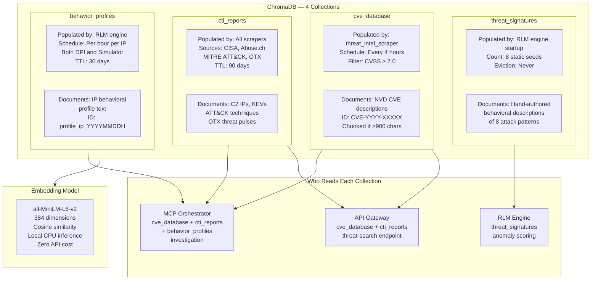
```mermaid
graph TB
    subgraph CHROMADB["ChromaDB — 4 Collections"]

        subgraph TS_COL["threat_signatures"]
            TS_P[Populated by: RLM engine startup\nCount: 8 static seeds\nEviction: Never]
            TS_D[Documents: Hand-authored\nbehavioral descriptions\nof 8 attack patterns]
        end

        subgraph CD_COL["cve_database"]
            CD_P[Populated by: threat_intel_scraper\nSchedule: Every 4 hours\nFilter: CVSS ≥ 7.0]
            CD_D[Documents: NVD CVE descriptions\nID: CVE-YYYY-XXXXX\nChunked if >900 chars]
        end

        subgraph CTI_COL["cti_reports"]
            CTI_P[Populated by: All scrapers\nSources: CISA, Abuse.ch\nMITRE ATT&CK, OTX\nTTL: 90 days]
            CTI_D[Documents: C2 IPs, KEVs\nATT&CK techniques\nOTX threat pulses]
        end

        subgraph BP_COL["behavior_profiles"]
            BP_P[Populated by: RLM engine\nSchedule: Per hour per IP\nBoth DPI and Simulator\nTTL: 30 days]
            BP_D[Documents: IP behavioral\nprofile text\nID: profile_ip_YYYYMMDDH]
        end
    end

    subgraph READERS["Who Reads Each Collection"]
        R1[RLM Engine\nthreat_signatures\nanomaly scoring]
        R2[MCP Orchestrator\ncve_database + cti_reports\n+ behavior_profiles\ninvestigation]
        R3[API Gateway\ncve_database + cti_reports\nthreat-search endpoint]
    end

    TS_COL --> R1
    CD_COL --> R2
    CTI_COL --> R2
    BP_COL --> R2
    CD_COL --> R3
    CTI_COL --> R3

    subgraph EMBED["Embedding Model"]
        EM[all-MiniLM-L6-v2\n384 dimensions\nCosine similarity\nLocal CPU inference\nZero API cost]
    end

    CHROMADB --> EMBED
```

---

## 10. PostgreSQL Database Schema (ERD)

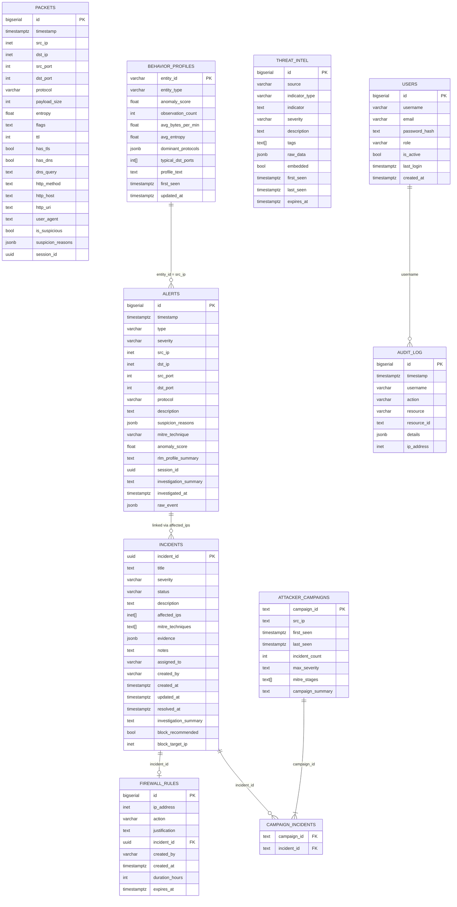
```mermaid
erDiagram
    PACKETS {
        bigserial id PK
        timestamptz timestamp
        inet src_ip
        inet dst_ip
        int src_port
        int dst_port
        varchar protocol
        int payload_size
        float entropy
        text flags
        int ttl
        bool has_tls
        bool has_dns
        text dns_query
        text http_method
        text http_host
        text http_uri
        text user_agent
        bool is_suspicious
        jsonb suspicion_reasons
        uuid session_id
    }

    ALERTS {
        bigserial id PK
        timestamptz timestamp
        varchar type
        varchar severity
        inet src_ip
        inet dst_ip
        int src_port
        int dst_port
        varchar protocol
        text description
        jsonb suspicion_reasons
        varchar mitre_technique
        float anomaly_score
        text rlm_profile_summary
        uuid session_id
        text investigation_summary
        timestamptz investigated_at
        jsonb raw_event
    }

    INCIDENTS {
        uuid incident_id PK
        text title
        varchar severity
        varchar status
        text description
        inet[] affected_ips
        text[] mitre_techniques
        jsonb evidence
        text notes
        varchar assigned_to
        varchar created_by
        timestamptz created_at
        timestamptz updated_at
        timestamptz resolved_at
        text investigation_summary
        bool block_recommended
        inet block_target_ip
    }

    BEHAVIOR_PROFILES {
        varchar entity_id PK
        varchar entity_type
        float anomaly_score
        int observation_count
        float avg_bytes_per_min
        float avg_entropy
        jsonb dominant_protocols
        int[] typical_dst_ports
        text profile_text
        timestamptz first_seen
        timestamptz updated_at
    }

    FIREWALL_RULES {
        bigserial id PK
        inet ip_address
        varchar action
        text justification
        uuid incident_id FK
        varchar created_by
        timestamptz created_at
        int duration_hours
        timestamptz expires_at
    }

    THREAT_INTEL {
        bigserial id PK
        varchar source
        varchar indicator_type
        text indicator
        varchar severity
        text description
        text[] tags
        jsonb raw_data
        bool embedded
        timestamptz first_seen
        timestamptz last_seen
        timestamptz expires_at
    }

    ATTACKER_CAMPAIGNS {
        text campaign_id PK
        text src_ip
        timestamptz first_seen
        timestamptz last_seen
        int incident_count
        text max_severity
        text[] mitre_stages
        text campaign_summary
    }

    CAMPAIGN_INCIDENTS {
        text campaign_id FK
        text incident_id FK
    }

    USERS {
        bigserial id PK
        varchar username
        varchar email
        text password_hash
        varchar role
        bool is_active
        timestamptz last_login
        timestamptz created_at
    }

    AUDIT_LOG {
        bigserial id PK
        timestamptz timestamp
        varchar username
        varchar action
        varchar resource
        text resource_id
        jsonb details
        inet ip_address
    }

    ALERTS ||--o{ INCIDENTS : "linked via affected_ips"
    INCIDENTS ||--o| FIREWALL_RULES : "incident_id"
    BEHAVIOR_PROFILES ||--o{ ALERTS : "entity_id = src_ip"
    USERS ||--o{ AUDIT_LOG : "username"
    INCIDENTS ||--o{ CAMPAIGN_INCIDENTS : "incident_id"
    ATTACKER_CAMPAIGNS ||--|{ CAMPAIGN_INCIDENTS : "campaign_id"
```

### TimescaleDB Optimizations on `packets`

| Policy | Setting | Purpose |
|--------|---------|---------|
| Compression | After 7 days | Reduces storage 90%+ for cold packet data |
| Retention | Drop after 30 days | Prevents unbounded table growth |
| Materialized view | `packets_per_minute` | Pre-aggregated 1-min counts for dashboard |
| Hypertable chunk | 1 day intervals | Fast time-range queries on timestamp |

---

## 11. 1-Call LLM Investigation Pipeline

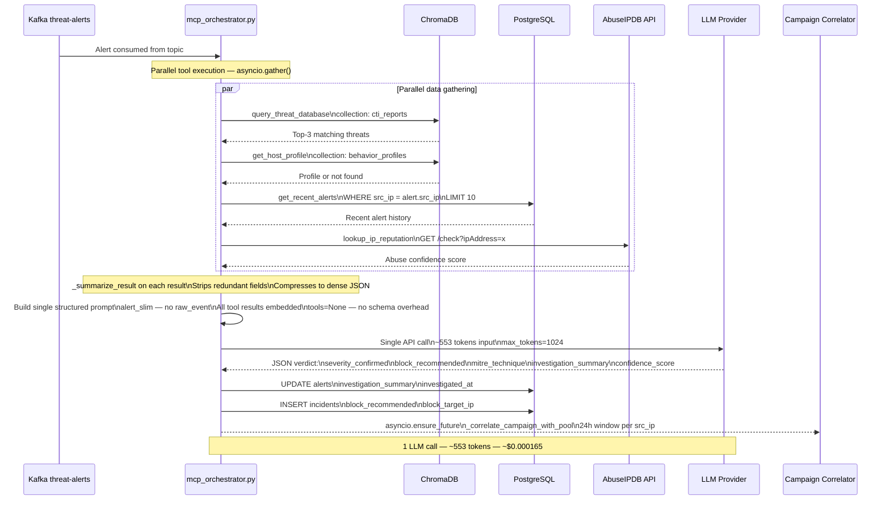
```mermaid
sequenceDiagram
    participant K as Kafka threat-alerts
    participant MCP as mcp_orchestrator.py
    participant CH as ChromaDB
    participant PG as PostgreSQL
    participant IP as AbuseIPDB API
    participant LLM as LLM Provider
    participant CAM as Campaign Correlator

    K->>MCP: Alert consumed from topic

    Note over MCP: Parallel tool execution — asyncio.gather()

    par Parallel data gathering
        MCP->>CH: query_threat_database\ncollection: cti_reports
        CH-->>MCP: Top-3 matching threats

        MCP->>CH: get_host_profile\ncollection: behavior_profiles
        CH-->>MCP: Profile or not found

        MCP->>PG: get_recent_alerts\nWHERE src_ip = alert.src_ip\nLIMIT 10
        PG-->>MCP: Recent alert history

        MCP->>IP: lookup_ip_reputation\nGET /check?ipAddress=x
        IP-->>MCP: Abuse confidence score
    end

    Note over MCP: _summarize_result on each result\nStrips redundant fields\nCompresses to dense JSON

    MCP->>MCP: Build single structured prompt\nalert_slim — no raw_event\nAll tool results embedded\ntools=None — no schema overhead

    MCP->>LLM: Single API call\n~553 tokens input\nmax_tokens=1024

    LLM-->>MCP: JSON verdict:\nseverity_confirmed\nblock_recommended\nmitre_technique\ninvestigation_summary\nconfidence_score

    MCP->>PG: UPDATE alerts\ninvestigation_summary\ninvestigated_at

    MCP->>PG: INSERT incidents\nblock_recommended\nblock_target_ip

    MCP-->>CAM: asyncio.ensure_future\n_correlate_campaign_with_pool\n24h window per src_ip

    Note over MCP,LLM: 1 LLM call — ~553 tokens — ~$0.000165
```

### Token Budget Breakdown

| Component | Tokens (Input) | Notes |
|-----------|---------------|-------|
| System prompt | ~120 | Static SOC analyst persona |
| Alert (slim) | ~80 | No raw_event field |
| Tool result: threat_db | ~120 | 3 results, compressed |
| Tool result: host_profile | ~60 | EMA fields only |
| Tool result: recent_alerts | ~80 | Last 10, compressed |
| Tool result: ip_reputation | ~40 | Score + categories only |
| Instruction suffix | ~53 | "Return JSON only" |
| **Total input** | **~553** | |
| **LLM output** | **~280** | JSON verdict |
| **Total per investigation** | **~833** | 2:1 input:output ratio |

---

## 12. Campaign Tracking and Kill Chain Correlation

Every investigation automatically links the incident to an attacker campaign. Incidents from the same source IP within 24 hours are grouped together, revealing multi-stage attack kill chains.

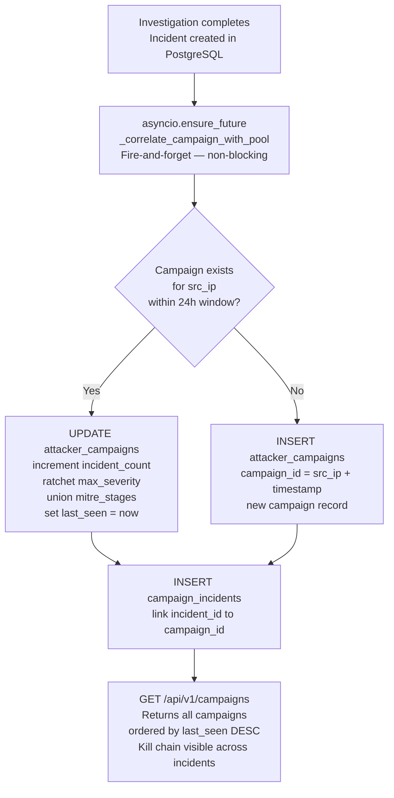
```mermaid
flowchart TD
    A[Investigation completes\nIncident created in PostgreSQL] --> B

    B[asyncio.ensure_future\n_correlate_campaign_with_pool\nFire-and-forget — non-blocking]

    B --> C{Campaign exists\nfor src_ip\nwithin 24h window?}

    C -->|Yes| D[UPDATE attacker_campaigns\nincrement incident_count\nratchet max_severity\nunion mitre_stages\nset last_seen = now]

    C -->|No| E[INSERT attacker_campaigns\ncampaign_id = src_ip + timestamp\nnew campaign record]

    D --> F[INSERT campaign_incidents\nlink incident_id to campaign_id]
    E --> F

    F --> G[GET /api/v1/campaigns\nReturns all campaigns\nordered by last_seen DESC\nKill chain visible across incidents]
```

### Campaign Database Tables

**`attacker_campaigns` columns:**

| Column | Type | Description |
|--------|------|-------------|
| `campaign_id` | text PK | `{src_ip}_{first_seen_epoch}` |
| `src_ip` | text | Source IP for all grouped incidents |
| `first_seen` | timestamptz | When first incident in campaign occurred |
| `last_seen` | timestamptz | When most recent incident occurred |
| `incident_count` | int | Total incidents in campaign |
| `max_severity` | text | Highest severity seen (ratchet — never decreases) |
| `mitre_stages` | text[] | Union of all MITRE techniques across incidents |
| `campaign_summary` | text | AI-generated narrative (optional) |

**`campaign_incidents` columns:**

| Column | Type | Description |
|--------|------|-------------|
| `campaign_id` | text FK | References `attacker_campaigns` |
| `incident_id` | text FK | References `incidents` |

---

## 13. RAG Pipeline — Semantic Search Flow

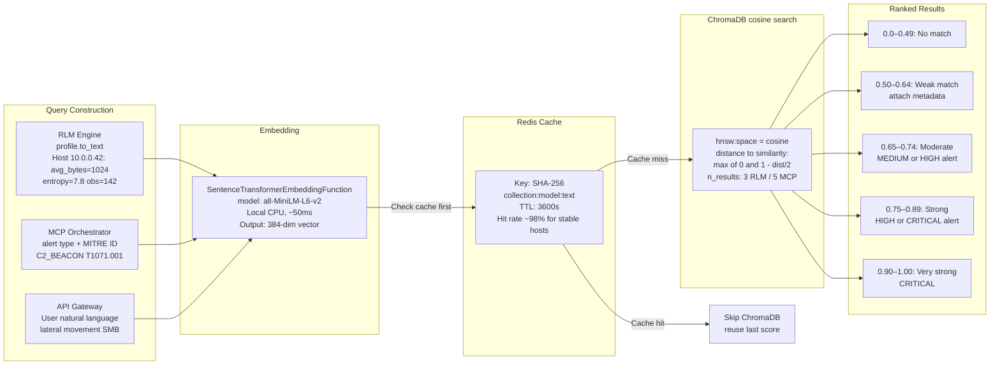
```mermaid
flowchart LR
    subgraph QUERY["Query Construction"]
        Q1[RLM Engine\nprofile.to_text\nHost 10.0.0.42: avg_bytes=1024\nentropy=7.8 obs=142]
        Q2[MCP Orchestrator\nalert type + MITRE ID\nC2_BEACON T1071.001]
        Q3[API Gateway\nUser natural language\nlateral movement SMB]
    end

    subgraph EMBED["Embedding"]
        E1[SentenceTransformerEmbeddingFunction\nmodel: all-MiniLM-L6-v2\nLocal CPU, ~50ms\nOutput: 384-dim vector]
    end

    subgraph CACHE["Redis Cache"]
        C1[Key: SHA-256\ncollection:model:text\nTTL: 3600s\nHit rate ~98% for stable hosts]
    end

    subgraph SEARCH["ChromaDB cosine search"]
        S1[hnsw:space = cosine\ndistance to similarity:\nmax of 0 and 1 - dist/2\nn_results: 3 RLM / 5 MCP]
    end

    subgraph RESULTS["Ranked Results"]
        R1[0.0–0.49: No match]
        R2[0.50–0.64: Weak match\nattach metadata]
        R3[0.65–0.74: Moderate\nMEDIUM or HIGH alert]
        R4[0.75–0.89: Strong\nHIGH or CRITICAL alert]
        R5[0.90–1.00: Very strong\nCRITICAL]
    end

    Q1 & Q2 & Q3 --> E1
    E1 -->|Check cache first| C1
    C1 -->|Cache miss| S1
    C1 -->|Cache hit| SKIP[Skip ChromaDB\nreuse last score]
    S1 --> R1
    S1 --> R2
    S1 --> R3
    S1 --> R4
    S1 --> R5
```

---

## 14. Human-in-the-Loop Response Flow

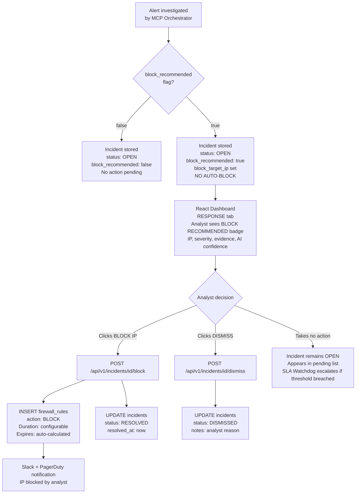
```mermaid
flowchart TD
    A[Alert investigated\nby MCP Orchestrator]

    A --> B{block_recommended\nflag?}

    B -->|false| C[Incident stored\nstatus: OPEN\nblock_recommended: false\nNo action pending]

    B -->|true| D[Incident stored\nstatus: OPEN\nblock_recommended: true\nblock_target_ip set\nNO AUTO-BLOCK]

    D --> E[React Dashboard\nRESPONSE tab\nAnalyst sees BLOCK RECOMMENDED badge\nIP, severity, evidence, AI confidence]

    E --> F{Analyst decision}

    F -->|Clicks BLOCK IP| G[POST /api/v1/incidents/id/block]
    F -->|Clicks DISMISS| H[POST /api/v1/incidents/id/dismiss]
    F -->|Takes no action| I[Incident remains OPEN\nAppears in pending list\nSLA Watchdog escalates if threshold breached]

    G --> J[INSERT firewall_rules\naction: BLOCK\nDuration: configurable\nExpires: auto-calculated]
    G --> K[UPDATE incidents\nstatus: RESOLVED\nresolved_at: now]

    H --> L[UPDATE incidents\nstatus: DISMISSED\nnotes: analyst reason]

    J --> M[Slack + PagerDuty notification\nIP blocked by analyst]
```

---

## 15. LLM Provider Abstraction Layer

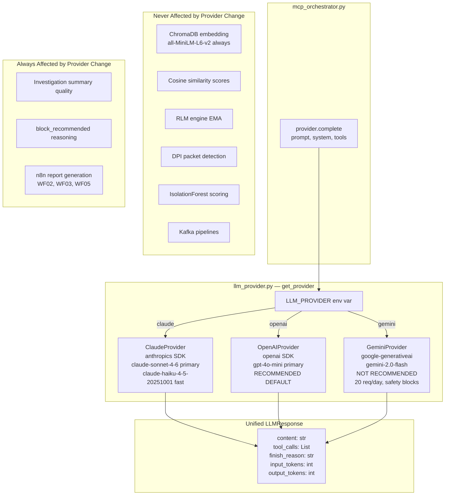
```mermaid
graph TB
    subgraph ORCHESTRATOR["mcp_orchestrator.py"]
        CALL[provider.complete\nprompt, system, tools]
    end

    subgraph PROVIDER["llm_provider.py — get_provider"]
        ENV[LLM_PROVIDER env var]
        ENV -->|claude| CLAUDE_P[ClaudeProvider\nanthropics SDK\nclaude-sonnet-4-6 primary\nclaude-haiku-4-5-20251001 fast]
        ENV -->|openai| OPENAI_P[OpenAIProvider\nopenai SDK\ngpt-4o-mini primary\nRECOMMENDED DEFAULT]
        ENV -->|gemini| GEMINI_P[GeminiProvider\ngoogle-generativeai\ngemini-2.0-flash\nNOT RECOMMENDED\n20 req/day, safety blocks]
    end

    subgraph RESPONSE["Unified LLMResponse"]
        LR[content: str\ntool_calls: List\nfinish_reason: str\ninput_tokens: int\noutput_tokens: int]
    end

    CALL --> ENV
    CLAUDE_P --> LR
    OPENAI_P --> LR
    GEMINI_P --> LR

    subgraph NEVER_AFFECTED["Never Affected by Provider Change"]
        NA1[ChromaDB embedding\nall-MiniLM-L6-v2 always]
        NA2[Cosine similarity scores]
        NA3[RLM engine EMA]
        NA4[DPI packet detection]
        NA5[IsolationForest scoring]
        NA6[Kafka pipelines]
    end

    subgraph ALWAYS_AFFECTED["Always Affected by Provider Change"]
        AA1[Investigation summary quality]
        AA2[block_recommended reasoning]
        AA3[n8n report generation\nWF02, WF03, WF05]
    end
```

### Provider Configuration

| Setting | Claude | OpenAI (Default) | Gemini |
|---------|--------|-----------------|--------|
| `LLM_PROVIDER` | `claude` | `openai` | `gemini` |
| Primary model | `claude-sonnet-4-6` | `gpt-4o-mini` | `gemini-2.0-flash` |
| Fast tier model | `claude-haiku-4-5-20251001` | `gpt-4o-mini` | `gemini-2.0-flash` |
| Input cost / 1M tokens | $3.00 | $0.15 | Free |
| Output cost / 1M tokens | $15.00 | $0.60 | Free |
| Cost per investigation | ~$0.002 | ~$0.000165 | ~$0 |
| Free tier limit | None | None | 20 req/day |
| Security content | Full support | Full support | Safety filter blocks |
| Recommended | Yes | Yes (default) | No |

---

## 16. n8n SOAR Workflow Map


```mermaid
graph TB
    subgraph TRIGGERS["Triggers"]
        T1[Kafka Bridge\nCRITICAL + HIGH alerts\nvia webhook]
        T2[Cron: 7AM Mon–Fri\nDaily SOC Report]
        T3[Kafka Bridge\ncritical-cve events\nfrom CTI scraper]
        T4[Cron: Every 15 minutes\nSLA enforcement]
        T5[Cron: Monday 8AM\nWeekly Board Report]
    end

    subgraph WF01["WF01 — Critical Alert SOAR"]
        W1A[Enrich alert\nCorrelate RLM + AbuseIPDB] --> W1B[POST /api/v1/incidents]
        W1B --> W1C[Jira security ticket]
        W1C --> W1D[Slack Block Kit]
        W1C --> W1E[PagerDuty — CRITICAL only]
        W1C --> W1F[MS Teams MessageCard]
    end

    subgraph WF02["WF02 — Daily SOC Report"]
        W2A[Fetch 24h stats] --> W2B[OpenAI GPT-4o mini\nHTTP Request node]
        W2B --> W2C[Slack Block Kit report]
    end

    subgraph WF03["WF03 — CVE Intel Pipeline"]
        W3A[CVE event from CTI scraper] --> W3B[OpenAI: 3-sentence impact]
        W3B --> W3C[Jira vulnerability ticket]
        W3B --> W3D[Slack + Telegram alert]
    end

    subgraph WF04["WF04 — SLA Watchdog"]
        W4A[Fetch open incidents] --> W4B[Check SLA thresholds]
        W4B -->|Breached| W4C[PagerDuty + ServiceNow P1]
        W4B -->|Warning| W4D[Slack warning]
    end

    subgraph WF05["WF05 — Weekly Board Report"]
        W5A[Fetch 7-day metrics] --> W5B[OpenAI GPT-4o mini\nHTTP Request node]
        W5B --> W5C[Slack executive report]
    end

    T1 --> WF01
    T2 --> WF02
    T3 --> WF03
    T4 --> WF04
    T5 --> WF05
```

---

## 17. REST API Endpoint Map

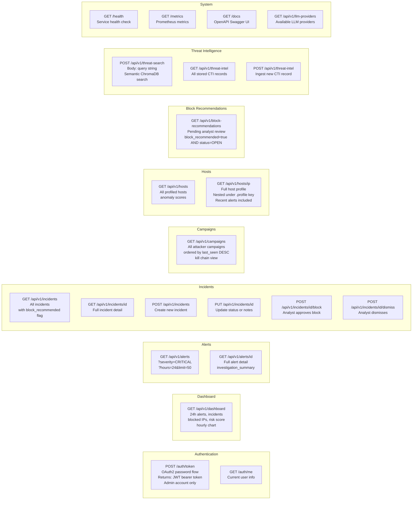
```mermaid
graph LR
    subgraph AUTH["Authentication"]
        A1[POST /auth/token\nOAuth2 password flow\nReturns: JWT bearer token\nAdmin account only]
        A2[GET /auth/me\nCurrent user info]
    end

    subgraph DASHBOARD["Dashboard"]
        D1[GET /api/v1/dashboard\n24h alerts, incidents\nblocked IPs, risk score\nhourly chart]
    end

    subgraph ALERTS["Alerts"]
        AL1[GET /api/v1/alerts\n?severity=CRITICAL\n?hours=24&limit=50]
        AL2[GET /api/v1/alerts/id\nFull alert detail\ninvestigation_summary]
    end

    subgraph INCIDENTS["Incidents"]
        I1[GET /api/v1/incidents\nAll incidents\nwith block_recommended flag]
        I2[GET /api/v1/incidents/id\nFull incident detail]
        I3[POST /api/v1/incidents\nCreate new incident]
        I4[PUT /api/v1/incidents/id\nUpdate status or notes]
        I5[POST /api/v1/incidents/id/block\nAnalyst approves block]
        I6[POST /api/v1/incidents/id/dismiss\nAnalyst dismisses]
    end

    subgraph CAMPAIGNS["Campaigns"]
        C1[GET /api/v1/campaigns\nAll attacker campaigns\nordered by last_seen DESC\nkill chain view]
    end

    subgraph HOSTS["Hosts"]
        H1[GET /api/v1/hosts\nAll profiled hosts\nanomaly scores]
        H2[GET /api/v1/hosts/ip\nFull host profile\nNested under .profile key\nRecent alerts included]
    end

    subgraph BLOCKREC["Block Recommendations"]
        BR1[GET /api/v1/block-recommendations\nPending analyst review\nblock_recommended=true AND status=OPEN]
    end

    subgraph INTEL["Threat Intelligence"]
        TI1[POST /api/v1/threat-search\nBody: query string\nSemantic ChromaDB search]
        TI2[GET /api/v1/threat-intel\nAll stored CTI records]
        TI3[POST /api/v1/threat-intel\nIngest new CTI record]
    end

    subgraph SYSTEM["System"]
        S1[GET /health\nService health check]
        S2[GET /metrics\nPrometheus metrics]
        S3[GET /docs\nOpenAPI Swagger UI]
        S4[GET /api/v1/llm-providers\nAvailable LLM providers]
    end
```

### Authentication Note

The current deployment uses a single `admin` account. All authenticated endpoints accept the admin JWT token. The `users` table schema includes a `role` column for future multi-user expansion, but role-based access differentiation is not enforced in the API code.

### `/api/v1/hosts/{ip}` Response Structure

```json
{
  "ip": "10.0.0.42",
  "is_blocked": false,
  "block_count": 0,
  "incident_count": 3,
  "profile": {
    "entity_id": "10.0.0.42",
    "anomaly_score": 0.87,
    "observation_count": 1420,
    "avg_bytes_per_min": 2048.5,
    "avg_entropy": 7.2,
    "profile_text": "High-entropy outbound traffic, consistent beacon timing",
    "dominant_protocols": {"TCP": 0.85, "UDP": 0.15},
    "typical_dst_ports": [443, 80, 8080],
    "first_seen": "2026-04-16T08:00:00Z",
    "updated_at": "2026-04-16T10:15:00Z"
  },
  "recent_alerts": [
    {
      "id": 1042,
      "type": "C2_BEACON",
      "severity": "CRITICAL",
      "mitre_technique": "T1071.001",
      "timestamp": "2026-04-16T10:15:05Z"
    }
  ]
}
```

> **Important:** All behavioral metrics are nested under the `profile` key. Frontend must access `hostProfile.profile?.anomaly_score` — NOT `hostProfile.anomaly_score`.

---

## 18. React Dashboard — 6 Tab Architecture

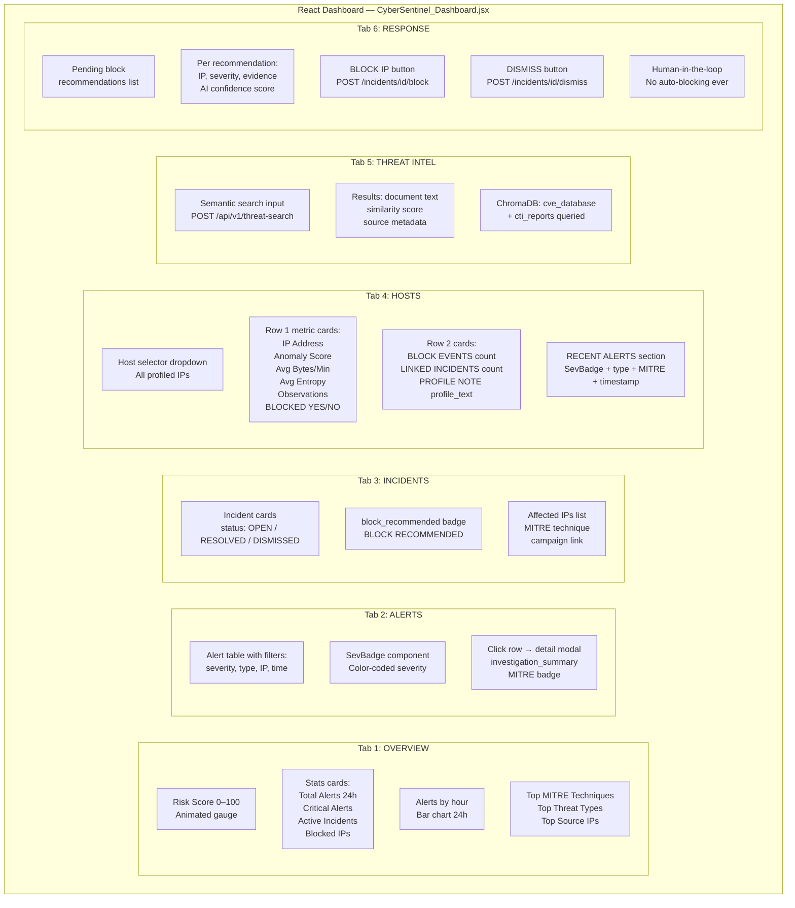
```mermaid
graph TB
    subgraph DASHBOARD["React Dashboard — CyberSentinel_Dashboard.jsx"]

        subgraph T1["Tab 1: OVERVIEW"]
            OV1[Risk Score 0–100\nAnimated gauge]
            OV2[Stats cards:\nTotal Alerts 24h\nCritical Alerts\nActive Incidents\nBlocked IPs]
            OV3[Alerts by hour\nBar chart 24h]
            OV4[Top MITRE Techniques\nTop Threat Types\nTop Source IPs]
        end

        subgraph T2["Tab 2: ALERTS"]
            AL1[Alert table with filters:\nseverity, type, IP, time]
            AL2[SevBadge component\nColor-coded severity]
            AL3[Click row → detail modal\ninvestigation_summary\nMITRE badge]
        end

        subgraph T3["Tab 3: INCIDENTS"]
            INC1[Incident cards\nstatus: OPEN / RESOLVED / DISMISSED]
            INC2[block_recommended badge\nBLOCK RECOMMENDED]
            INC3[Affected IPs list\nMITRE technique\ncampaign link]
        end

        subgraph T4["Tab 4: HOSTS"]
            H1[Host selector dropdown\nAll profiled IPs]
            H2[Row 1 metric cards:\nIP Address\nAnomaly Score\nAvg Bytes/Min\nAvg Entropy\nObservations\nBLOCKED YES/NO]
            H3[Row 2 cards:\nBLOCK EVENTS count\nLINKED INCIDENTS count\nPROFILE NOTE profile_text]
            H4[RECENT ALERTS section\nSevBadge + type + MITRE + timestamp]
        end

        subgraph T5["Tab 5: THREAT INTEL"]
            TI1[Semantic search input\nPOST /api/v1/threat-search]
            TI2[Results: document text\nsimilarity score\nsource metadata]
            TI3[ChromaDB: cve_database\n+ cti_reports queried]
        end

        subgraph T6["Tab 6: RESPONSE"]
            R1[Pending block\nrecommendations list]
            R2[Per recommendation:\nIP, severity, evidence\nAI confidence score]
            R3[BLOCK IP button\nPOST /incidents/id/block]
            R4[DISMISS button\nPOST /incidents/id/dismiss]
            R5[Human-in-the-loop\nNo auto-blocking ever]
        end
    end
```

---

## 19. Data Lifecycle — Alert to Resolution

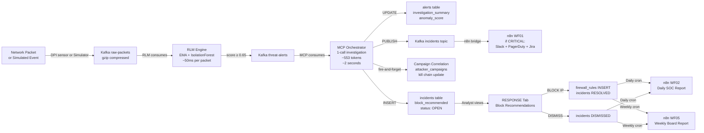
```mermaid
flowchart LR
    A[Network Packet\nor Simulated Event]
    -->|DPI sensor or Simulator| B[Kafka raw-packets\ngzip compressed]

    B -->|RLM consumes| C[RLM Engine\nEMA + IsolationForest\n~50ms per packet]

    C -->|score ≥ 0.65| D[Kafka threat-alerts]

    D -->|MCP consumes| E[MCP Orchestrator\n1-call investigation\n~553 tokens\n~2 seconds]

    E -->|UPDATE| F[alerts table\ninvestigation_summary\nanomaly_score]

    E -->|INSERT| G[incidents table\nblock_recommended\nstatus: OPEN]

    E -->|fire-and-forget| H[Campaign Correlation\nattacker_campaigns\nkill chain update]

    E -->|PUBLISH| I[Kafka incidents topic]

    I -->|n8n bridge| J[n8n WF01\nif CRITICAL:\nSlack + PagerDuty + Jira]

    G -->|Analyst views| K[RESPONSE Tab\nBlock Recommendations]

    K -->|BLOCK IP| L[firewall_rules INSERT\nincidents RESOLVED]
    K -->|DISMISS| M[incidents DISMISSED]

    L & M -->|Daily cron| N[n8n WF02\nDaily SOC Report]
    L & M -->|Weekly cron| O[n8n WF05\nWeekly Board Report]
```

---

## 20. Token Economics and Cost Model

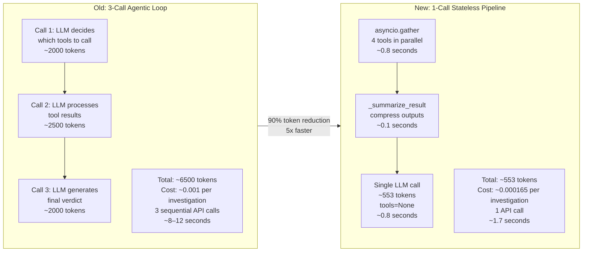
```mermaid
graph LR
    subgraph OLD["Old: 3-Call Agentic Loop"]
        O1[Call 1: LLM decides\nwhich tools to call\n~2000 tokens]
        O2[Call 2: LLM processes\ntool results\n~2500 tokens]
        O3[Call 3: LLM generates\nfinal verdict\n~2000 tokens]
        O1 --> O2 --> O3
        OTOTAL[Total: ~6500 tokens\nCost: ~0.001 per investigation\n3 sequential API calls\n~8–12 seconds]
    end

    subgraph NEW["New: 1-Call Stateless Pipeline"]
        N1[asyncio.gather\n4 tools in parallel\n~0.8 seconds]
        N2[_summarize_result\ncompress outputs\n~0.1 seconds]
        N3[Single LLM call\n~553 tokens\ntools=None\n~0.8 seconds]
        N1 --> N2 --> N3
        NTOTAL[Total: ~553 tokens\nCost: ~0.000165 per investigation\n1 API call\n~1.7 seconds]
    end

    OLD -->|90% token reduction\n5x faster| NEW
```

### Budget Projections (OpenAI GPT-4o mini at $0.000165/investigation)

| Budget | Investigations | Days at 30-min intervals | Days at 10-min intervals |
|--------|---------------|--------------------------|--------------------------|
| $1 | ~6,000 | ~125 days | ~41 days |
| $5 | ~30,000 | ~625 days | ~208 days |
| $10 | ~60,000 | ~1,250 days | ~416 days |
| $20 | ~120,000 | ~2,500 days | ~833 days |

---

## 21. Security Architecture

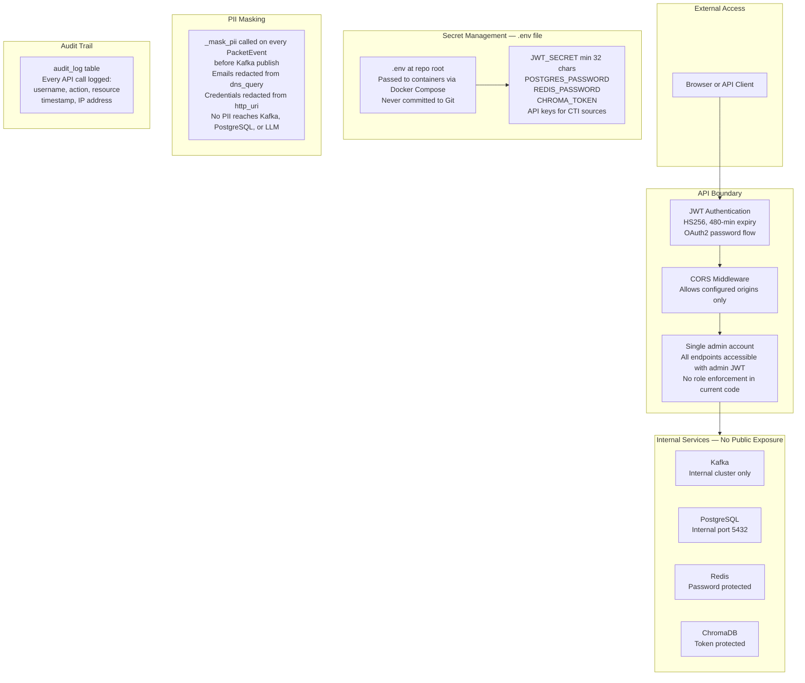
```mermaid
graph TB
    subgraph EXTERNAL["External Access"]
        USER[Browser or API Client]
    end

    subgraph BOUNDARY["API Boundary"]
        JWT[JWT Authentication\nHS256, 480-min expiry\nOAuth2 password flow]
        CORS[CORS Middleware\nAllows configured origins only]
        ADMIN[Single admin account\nAll endpoints accessible with admin JWT\nNo role enforcement in current code]
    end

    subgraph INTERNAL["Internal Services — No Public Exposure"]
        KAFKA_S[Kafka\nInternal cluster only]
        PG_S[PostgreSQL\nInternal port 5432]
        REDIS_S[Redis\nPassword protected]
        CHROMA_S[ChromaDB\nToken protected]
    end

    subgraph SECRETS["Secret Management — .env file"]
        ENV[.env at repo root\nPassed to containers via Docker Compose\nNever committed to Git]
        VARS[JWT_SECRET min 32 chars\nPOSTGRES_PASSWORD\nREDIS_PASSWORD\nCHROMA_TOKEN\nAPI keys for CTI sources]
    end

    subgraph PIIMASK["PII Masking"]
        PII[_mask_pii called on every PacketEvent\nbefore Kafka publish\nEmails redacted from dns_query\nCredentials redacted from http_uri\nNo PII reaches Kafka, PostgreSQL, or LLM]
    end

    subgraph AUDIT["Audit Trail"]
        AUDITLOG[audit_log table\nEvery API call logged:\nusername, action, resource\ntimestamp, IP address]
    end

    USER --> JWT
    JWT --> CORS
    CORS --> ADMIN
    ADMIN --> INTERNAL
    ENV --> VARS
```

---

## 22. Observability Stack

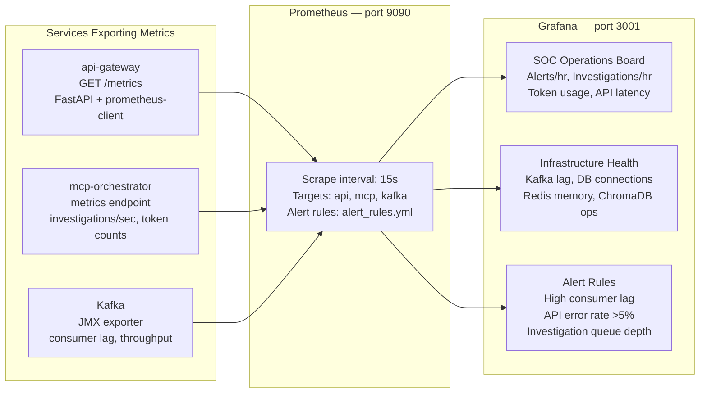
```mermaid
graph LR
    subgraph SERVICES["Services Exporting Metrics"]
        API_M[api-gateway\nGET /metrics\nFastAPI + prometheus-client]
        MCP_M[mcp-orchestrator\nmetrics endpoint\ninvestigations/sec, token counts]
        KF_M[Kafka\nJMX exporter\nconsumer lag, throughput]
    end

    subgraph COLLECTION["Prometheus — port 9090"]
        PROM_S[Scrape interval: 15s\nTargets: api, mcp, kafka\nAlert rules: alert_rules.yml]
    end

    subgraph VISUALIZATION["Grafana — port 3001"]
        G1[SOC Operations Board\nAlerts/hr, Investigations/hr\nToken usage, API latency]
        G2[Infrastructure Health\nKafka lag, DB connections\nRedis memory, ChromaDB ops]
        G3[Alert Rules\nHigh consumer lag\nAPI error rate >5%\nInvestigation queue depth]
    end

    API_M & MCP_M & KF_M --> PROM_S
    PROM_S --> G1
    PROM_S --> G2
    PROM_S --> G3
```

| Service | Access URL |
|---------|-----------|
| Grafana | http://localhost:3001 |
| Prometheus | http://localhost:9090 |

---

## 23. Environment Configuration Reference

### Minimal Required Variables

```bash
# LLM Provider (choose one)
LLM_PROVIDER=openai               # claude | openai | gemini
OPENAI_API_KEY=sk-...             # or ANTHROPIC_API_KEY / GOOGLE_API_KEY

# Security — change all from defaults
JWT_SECRET=your-secret-min-32-chars-here
POSTGRES_PASSWORD=your-pg-password
REDIS_PASSWORD=your-redis-password
CHROMA_TOKEN=your-chroma-token

# Threat Intel APIs (optional but recommended)
ABUSEIPDB_KEY=your-key            # IP reputation lookups
NVD_API_KEY=your-key              # CVE database — faster with key
```

### Full Configuration Map

| Category | Variable | Default | Description |
|----------|---------|---------|-------------|
| LLM | `LLM_PROVIDER` | `openai` | `claude` / `openai` / `gemini` |
| LLM | `LLM_MODEL_PRIMARY` | Provider default | Override primary model |
| LLM | `LLM_MODEL_FAST` | Provider default | Override fast tier model |
| DPI | `CAPTURE_INTERFACE` | `eth0` | Network interface — `auto` for Windows host script |
| DPI | `BPF_FILTER` | `ip or ip6` | Berkeley Packet Filter — IPv4 and IPv6 |
| RLM | `RLM_ALPHA` | `0.1` | EMA smoothing factor (0–1) |
| RLM | `RLM_ANOMALY_THRESHOLD` | `0.65` | Minimum score to emit alert |
| RLM | `RLM_THREAT_MATCH_THRESHOLD` | `0.50` | Minimum ChromaDB similarity |
| RLM | `RLM_MIN_OBSERVATIONS` | `20` | Packets needed before scoring |
| RLM | `ISOLATION_FOREST_WEIGHT` | `0.25` | IsolationForest blend weight (0–1) |
| RLM | `ISOLATION_FOREST_MIN_SAMPLES` | `10` | Minimum observations before blending |
| ChromaDB | `EMBEDDING_MODEL` | `all-MiniLM-L6-v2` | Sentence transformer model |
| ChromaDB | `EMBED_CACHE_TTL_SEC` | `3600` | Redis embedding cache TTL |
| ChromaDB | `PROFILE_TTL_DAYS` | `30` | behavior_profiles eviction |
| ChromaDB | `CTI_TTL_DAYS` | `90` | cti_reports eviction |
| MCP | `INVESTIGATION_INTERVAL_SEC` | `1800` | Seconds between investigations |
| Scraper | `SCRAPE_INTERVAL_HOURS` | `4` | CTI refresh interval |

---

## 24. Deployment Guide

### Prerequisites

```
Docker Desktop 24.0+ with 16 GB RAM allocated
.env file at repo root with API keys filled in
```

### Everyday Start

```powershell
# Step 1 — Open Docker Desktop, wait for the green whale icon

# Step 2 — Start all 14 services
docker compose up -d

# Step 3 — Start N8N (if not already running)
docker ps --filter name=N8N
# If not running:
.\scripts\start_n8n.ps1

# Step 4 — Open dashboard
# http://localhost:5173
```

### Full Deploy (first time or after a reset)

```mermaid
flowchart TD
    A[cp .env.example .env\nfill in LLM_PROVIDER + API key] --> B
    B[docker compose up -d\nstarts all 14 services] --> C
    C[Wait ~2-3 minutes\nfor Kafka health check] --> D
    D[docker compose ps\ncheck all containers Up] --> E
    E{Database migrations\nneeded?}
    E -->|First deploy| F[Run migrations\ndocker exec cybersentinel-postgres psql < scripts/db/migrate_campaigns.sql]
    E -->|Existing deploy| G[Skip]
    F --> H[Start N8N SOAR\n.\\scripts\\start_n8n.ps1]
    G --> H
    H --> I[Open http://localhost:5173]
```

```powershell
# Full deploy commands
docker compose up -d

# Wait for all services to be healthy
docker compose ps

# Database migration (first deploy only)
docker exec -i cybersentinel-postgres psql -U sentinel -d cybersentinel `
  < scripts/db/migrate_campaigns.sql
docker exec -i cybersentinel-postgres psql -U sentinel -d cybersentinel `
  < scripts/db/migrate_multitenancy.sql

# Start N8N SOAR
.\scripts\start_n8n.ps1
```

### Common Troubleshooting

**Kafka in restart loop (`InconsistentClusterIdException`):**
```powershell
docker compose stop kafka zookeeper
docker volume rm cybersentinel-ai_kafka_data
docker compose up -d
```

**Dashboard not reachable:**
```powershell
docker compose ps
docker compose logs api-gateway | tail -20
docker compose restart frontend
```

**Rebuild a service after code change:**
```powershell
docker compose up -d --build rlm-engine
docker compose up -d --build --force-recreate mcp-orchestrator
```

---

## Appendix A — File Structure Reference

```
cybersentinel-ai/
├── .env                               # Secrets and config (gitignored)
├── .env.example                       # Template
├── docker-compose.tls.yml             # Optional TLS variant
│
├── src/
│   ├── dpi/
│   │   └── sensor.py                  # Scapy AsyncSniffer, IPv4+IPv6, _mask_pii
│   ├── models/
│   │   └── rlm_engine.py              # EMA profiling + SequenceAnomalyDetector
│   ├── agents/
│   │   ├── mcp_orchestrator.py        # 1-call investigation + campaign correlation
│   │   └── llm_provider.py            # Claude/OpenAI/Gemini abstraction
│   ├── api/
│   │   └── gateway.py                 # FastAPI routes, JWT auth, all endpoints
│   ├── ingestion/
│   │   ├── threat_intel_scraper.py    # CISA, NVD, Abuse.ch, MITRE, OTX
│   │   └── embedder.py                # ChromaDB governance + cache invalidation
│   ├── simulation/
│   │   └── traffic_simulator.py       # 17-scenario threat simulator
│   └── core/
│       └── config.py                  # All config from env vars
│
├── frontend/src/
│   ├── CyberSentinel_Dashboard.jsx    # Main 6-tab SOC dashboard
│   ├── CyberSentinel_Landing.jsx      # Landing/login page
│   └── App.jsx                        # React router
│
├── docker/
│   ├── Dockerfile.rlm
│   ├── Dockerfile.mcp
│   ├── Dockerfile.api
│   ├── Dockerfile.frontend
│   └── Dockerfile.dpi
│
├── n8n/
│   ├── workflows/
│   │   ├── 01_critical_alert_soar.json
│   │   ├── 02_daily_soc_report.json
│   │   ├── 03_cve_intel_pipeline.json
│   │   ├── 04_sla_watchdog.json
│   │   └── 05_weekly_board_report.json
│   └── bridge/kafka_bridge.py
│
├── scripts/
│   ├── start_n8n.ps1                  # Start N8N container on cybersentinel-net
│   ├── start_live_dpi.ps1             # Windows DPI with Npcap
│   ├── activate_n8n_workflows.py      # Repair n8n SQLite activation state
│   ├── db/
│   │   ├── migrate_campaigns.sql      # attacker_campaigns + campaign_incidents
│   │   └── migrate_multitenancy.sql   # tenant_id columns on all data tables
│   ├── rotate_secrets.sh              # Rotate JWT + Redis + Postgres secrets
│   └── gen_certs.sh                   # TLS cert generation
│
├── configs/
│   ├── nginx-proxy/                   # nginx config for access containers
│   ├── prometheus/                    # Prometheus config + alert rules
│   └── grafana/                       # Grafana datasource config
│
└── docs/
    ├── MASTER.md                      # This file — full reference with diagrams
    ├── ARCHITECTURE.md                # Deep-dive design document
    ├── CHANGELOG.md                   # Version history with ADRs
    ├── WORKFLOWS.md                   # n8n SOAR workflow specs
    ├── RUNNING.md                     # How to start, stop, and understand
    ├── LIVE_DPI_SETUP.md              # DPI setup — Docker container (Linux/macOS) + Windows Npcap
    ├── API_REFERENCE.md               # All REST endpoints with schemas
    ├── DATABASE.md                    # Schema reference, migrations, queries
    ├── PIPELINES.md                   # DPI vs simulator pipeline comparison
    ├── TRD.md                         # Technical Requirements Document
    ├── LIMITATIONS.md                 # Known limitations
    └── LIMITATIONS_FIXES.md          # Fixes applied for known limitations
```

---

## Appendix B — MITRE ATT&CK Coverage

| Technique ID | Name | Detected By | Alert Type |
|-------------|------|------------|-----------|
| T1071.001 | Application Layer Protocol: C2 via Web | sensor.py + simulator | C2_BEACON |
| T1071.004 | Application Layer Protocol: DNS | sensor.py + simulator | DNS_TUNNEL |
| T1021.002 | Remote Services: SMB | sensor.py + simulator | LATERAL_MOVEMENT |
| T1021.001 | Remote Services: RDP | simulator | LATERAL_MOVEMENT_RDP |
| T1048.003 | Exfiltration over Alternative Protocol | sensor.py + simulator | DATA_EXFILTRATION |
| T1046 | Network Service Discovery (Port Scan) | sensor.py + simulator | PORT_SCAN |
| T1110.001 | Brute Force: SSH | simulator | BRUTE_FORCE |
| T1110.003 | Brute Force: Credential Spray | simulator | CREDENTIAL_SPRAY |
| T1190 | Exploit Public-Facing Application | simulator | EXPLOIT_APP |
| T1027 | Obfuscated Files / High Entropy | sensor.py + simulator | HIGH_ENTROPY_PAYLOAD |
| T1572 | Protocol Tunneling | simulator | PROTOCOL_TUNNEL |
| T1059.004 | Command and Scripting: Unix Shell (Reverse Shell) | simulator | REVERSE_SHELL |
| T1568.002 | Dynamic Resolution: DGA | sensor.py | DGA_DETECTED |
| T1595 | Active Scanning | sensor.py | ACTIVE_SCAN |
| T1041 | Exfiltration Over C2 Channel | sensor.py | C2_EXFIL |

**Novel (AI-classified) threats:**

| Type | Behaviour |
|------|-----------|
| POLYMORPHIC_BEACON | Beacon intervals mutate to evade timing detectors |
| COVERT_STORAGE_CHANNEL | Data encoded in IP header reserved fields |
| SLOW_DRIP_EXFIL | Tiny amounts per session over thousands of connections |
| MESH_C2_RELAY | Multi-hop internal relay with no direct external contact |
| SYNTHETIC_IDLE_TRAFFIC | Mimics legitimate traffic with statistical anomalies |

---

## Appendix C — v1.3.0 Changes

All changes were applied during the v1.3.0 development cycle. See `docs/CHANGELOG.md` for full ADR entries.

### New Features

| Feature | Where | Impact |
|---------|-------|--------|
| Attacker campaign tracking | `mcp_orchestrator.py` + `attacker_campaigns` table | Kill chain correlation across incidents |
| IsolationForest sequence anomaly | `rlm_engine.py` — `SequenceAnomalyDetector` class | Detects gradual score progressions |
| IPv6 support | `sensor.py` BPF filter `ip or ip6` | Captures both address families |
| PII masking | `sensor.py` — `_mask_pii()` | Emails + credentials redacted before Kafka |
| Cache invalidation fix | `rlm_engine.py` — deletes `threat_intel_updated:*` keys | Fixes thundering-herd re-embed on CTI refresh |
| Campaign API endpoint | `gateway.py` — `GET /api/v1/campaigns` | Kill chain visible in dashboard |

### Infrastructure

| Change | Detail |
|--------|--------|
| Docker Compose deployment | Platform runs as 14 containers via `docker compose up -d` (Kubernetes was evaluated and reverted — see ADR-016) |
| Kafka restart fix | `docker-compose.yml` kafka service cleans stale ZooKeeper broker registrations before starting — prevents `InconsistentClusterIdException` |
| N8N SOAR | Standalone container started via `scripts/start_n8n.ps1`, joined to `cybersentinel-net` |
| Database migrations | `scripts/db/migrate_campaigns.sql` + `migrate_multitenancy.sql` |
| TLS certificates | `scripts/gen_certs.sh` + `docker-compose.tls.yml` (optional) |

---

## Appendix D — Document Index

| Document | Version | Purpose |
|----------|---------|---------|
| `MASTER.md` | v1.3.0 | This file — full architecture, all diagrams, comprehensive reference |
| `ARCHITECTURE.md` | v1.3.0 | Design principles, layer breakdown, failure modes |
| `CHANGELOG.md` | v1.3.0 | Full version history with ADRs |
| `RUNNING.md` | v1.3.0 | How to start, stop, and understand the platform |
| `WORKFLOWS.md` | v1.3.0 | n8n SOAR workflow specs, node sequences, credential reference |
| `LIVE_DPI_SETUP.md` | v1.3.0 | DPI setup — Docker container (Linux/macOS) + Windows Npcap |
| `API_REFERENCE.md` | v1.3.0 | All REST API endpoints with request/response schemas |
| `DATABASE.md` | v1.3.0 | Schema reference, migrations, campaign correlation queries |
| `PIPELINES.md` | v1.3.0 | DPI vs simulator pipeline deep comparison |
| `TRD.md` | v1.3.0 | Technical Requirements Document |
| `LIMITATIONS.md` | v1.3.0 | Known limitations and boundaries |
| `LIMITATIONS_FIXES.md` | v1.3.0 | Fixes applied for known limitations |
| `N8N_OPERATIONS.md` | v1.3.0 | n8n troubleshooting, activation scripts |
| `ABBREVIATIONS.md` | v1.3.0 | Glossary — all cybersecurity and project abbreviations |
| `RAG_DESIGN.md` | v1.3.0 | RAG pipeline and ChromaDB governance detail |
| `THREAT_SIGNATURES.md` | v1.3.0 | All RLM threat signatures — MITRE mapping and scoring |

---

*CyberSentinel AI — Master Project Document — v1.3.0 — 2026*
*All diagrams render natively on GitHub, VS Code, and GitBook.*
