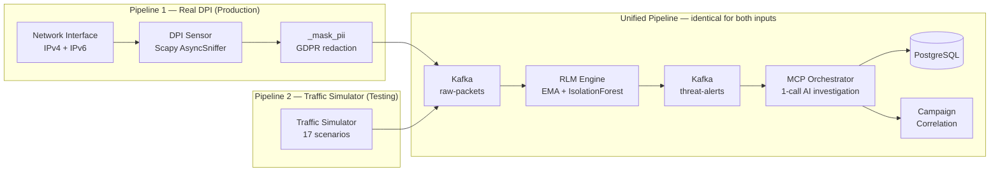
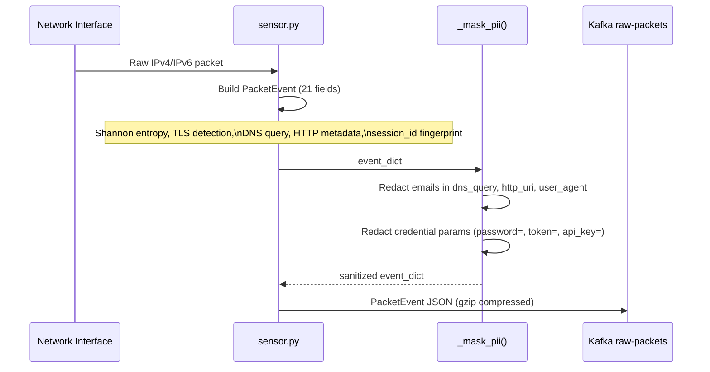
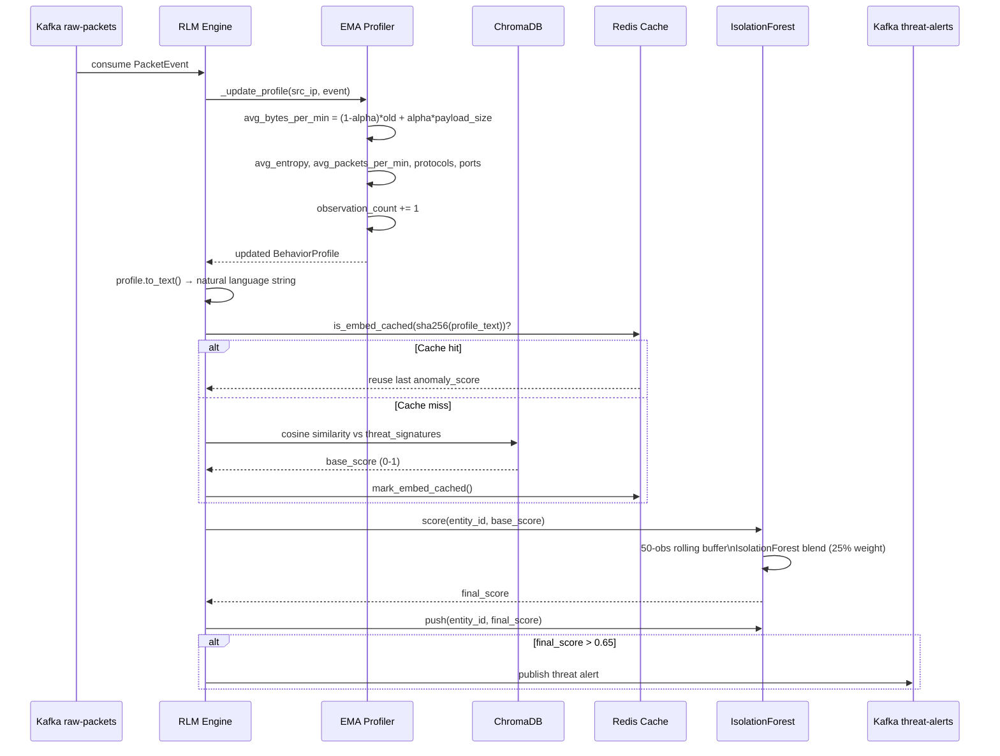
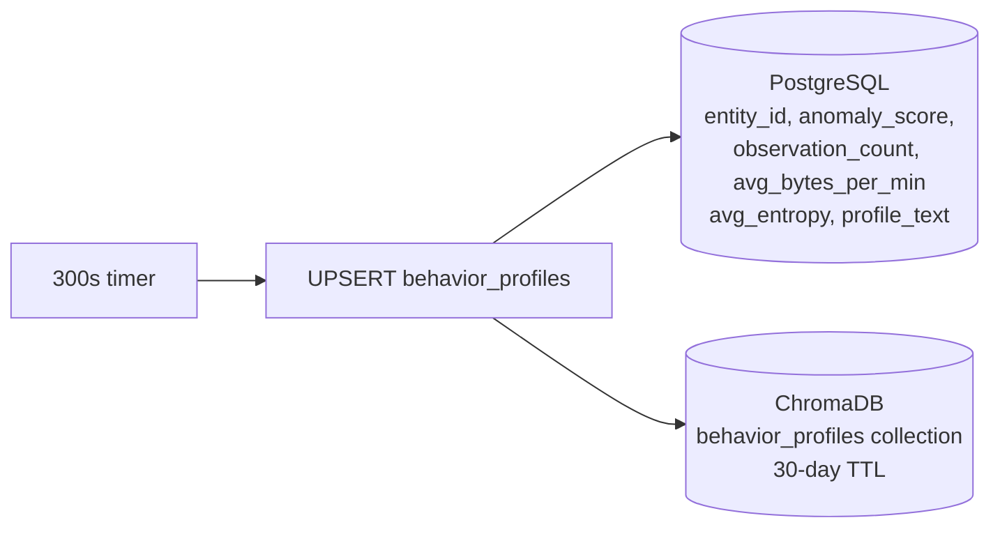
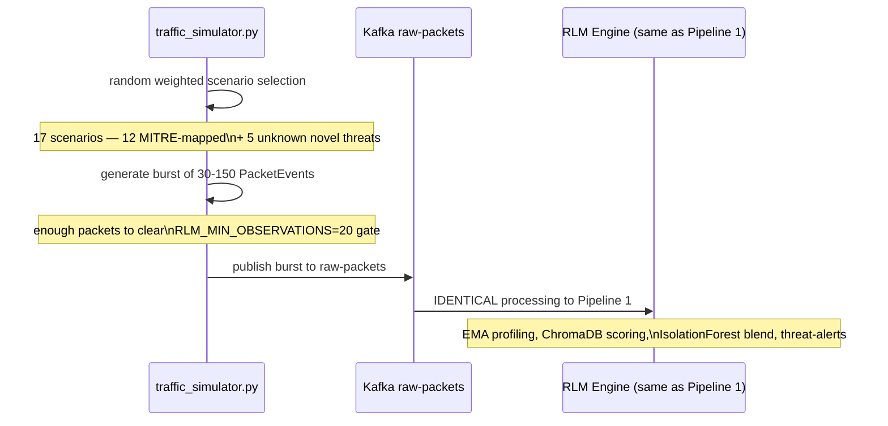
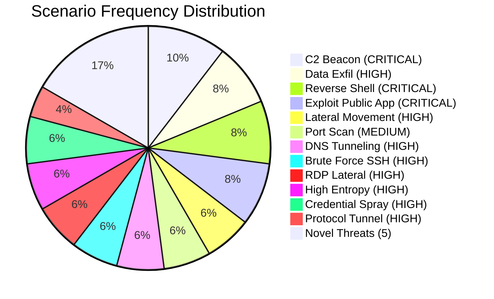
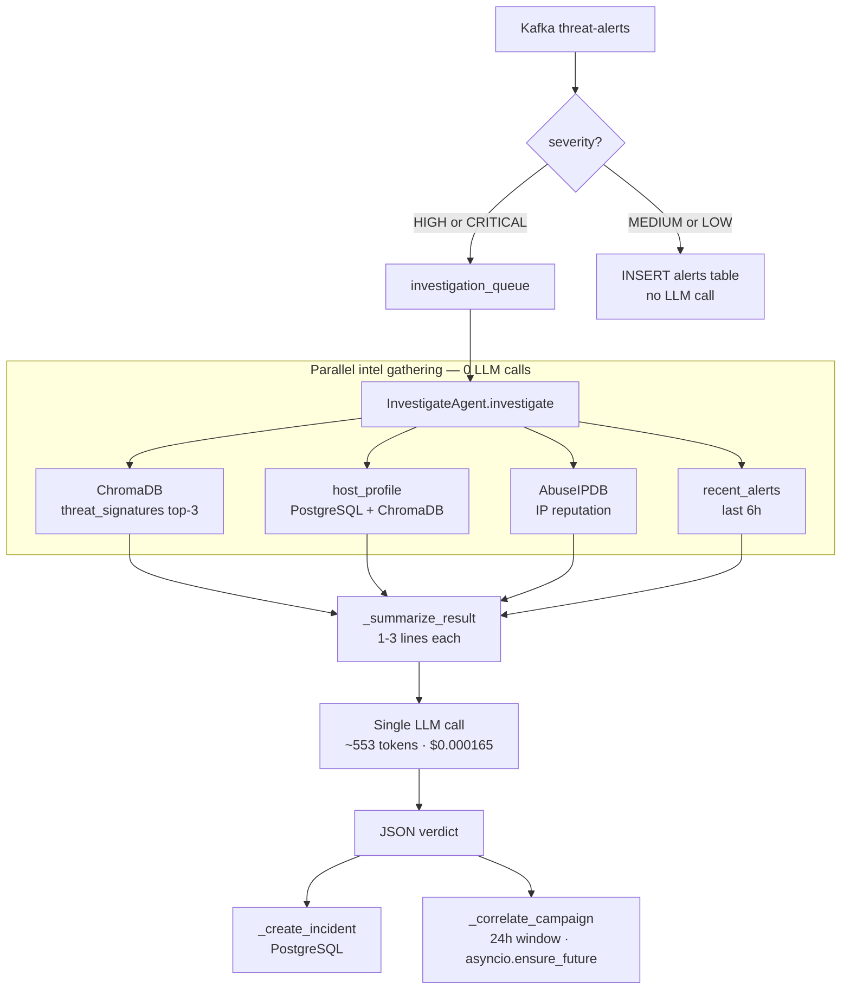

# The Two Input Pipelines

**CyberSentinel AI v1.3.0 — DPI Real Pipeline vs Traffic Simulator**

Both pipelines feed the same unified processing stack through the `raw-packets` Kafka topic. From that point onwards the code path is **identical** — same RLM engine, same IsolationForest layer, same AI investigation.

---

## Overview



---

## Pipeline 1 — Real DPI Path (Production)

### Packet Capture and PII Masking



**PacketEvent fields:** `timestamp`, `src_ip`, `dst_ip`, `src_port`, `dst_port`, `protocol`, `payload_size`, `flags`, `ttl`, `entropy`, `has_tls`, `has_dns`, `dns_query`, `http_method`, `http_host`, `http_uri`, `user_agent`, `is_suspicious`, `suspicion_reasons`, `session_id`

**IPv6 support:** `BPF_FILTER=ip or ip6` captures both address families. All 21 PacketEvent fields support IPv6 addresses.

### RLM Engine Processing



### Profile Persistence

Every 300 seconds the RLM engine UPSERTs all in-memory profiles to PostgreSQL:



---

## Pipeline 2 — Traffic Simulator Path (Testing & Demo)

### What the Simulator Generates

`src/simulation/traffic_simulator.py` generates 17 threat scenarios as **bursts of 30–150 raw `PacketEvent` dicts** and publishes them to the **same `raw-packets` Kafka topic** that the real DPI sensor uses.



### Simulator Scenarios

#### MITRE ATT&CK Mapped (12)

| Scenario | MITRE ID | Severity | Burst Size |
|----------|----------|----------|-----------|
| C2 Beacon | T1071.001 | CRITICAL | ~60 pkts |
| Data Exfiltration | T1048.003 | HIGH | ~80 pkts |
| Lateral Movement SMB | T1021.002 | HIGH | ~50 pkts |
| Port Scan | T1046 | MEDIUM | ~150 pkts |
| DNS Tunneling | T1071.004 | HIGH | ~100 pkts |
| Brute Force SSH | T1110.001 | HIGH | ~120 pkts |
| RDP Lateral Movement | T1021.001 | HIGH | ~45 pkts |
| Exploit Public App | T1190 | CRITICAL | ~30 pkts |
| High Entropy Payload | T1027 | HIGH | ~40 pkts |
| Protocol Tunneling | T1572 | HIGH | ~60 pkts |
| Credential Spray | T1110.003 | HIGH | ~90 pkts |
| Reverse Shell | T1059.004 | CRITICAL | ~45 pkts |

#### Unknown Novel Threats — AI Must Classify (5)

| Scenario | Type | Severity | Description |
|----------|------|----------|-------------|
| Polymorphic Beacon | POLYMORPHIC_BEACON | HIGH | Beacon intervals mutate to evade timing detection |
| Covert Storage Channel | COVERT_STORAGE_CHANNEL | HIGH | Data encoded in IP header reserved/ToS fields |
| Slow-Drip Exfil | SLOW_DRIP_EXFIL | HIGH | 1–2 bytes/packet over thousands of sessions |
| Mesh C2 Relay | MESH_C2_RELAY | CRITICAL | Multi-hop internal relay, no direct external contact |
| Synthetic Idle Traffic | SYNTHETIC_IDLE_TRAFFIC | MEDIUM | Mimics legitimate traffic but statistically wrong |

Unknown threats have no MITRE mapping — the AI investigation must classify them and recommend a technique ID.

### Scenario Weighting



---

## MCP Orchestrator — Shared Final Stage

Both pipelines feed the same MCP Orchestrator:



### Pending Incidents When AI Is Paused

When AI investigation is paused for a source, the MCP orchestrator still creates a **pending incident** via `_create_pending_incident()`:

- Status: `OPEN`, investigation_summary: `"AI investigation was paused"`
- `block_recommended`: `True` for CRITICAL/HIGH severity, `False` for MEDIUM/LOW
- `block_target_ip`: set to `src_ip` for CRITICAL/HIGH

CRITICAL and HIGH alerts always surface in the RESPONSE tab even without full AI analysis.

---

## What Each Pipeline Populates

| Data | Real DPI | Simulator (v1.3) |
|------|----------|-----------------|
| `alerts` table | Yes | Yes |
| `incidents` table | Yes | Yes |
| `attacker_campaigns` table | Yes | Yes |
| `firewall_rules` table | Yes | Yes (via block recommendations) |
| `packets` table | Yes (every suspicious packet) | Yes (PacketEvent bursts) |
| `behavior_profiles.observation_count` | Yes (real packet count) | Yes (burst count: 30–150) |
| `behavior_profiles.avg_bytes_per_min` | Yes (real EMA) | Yes (scenario-realistic EMA) |
| `behavior_profiles.avg_entropy` | Yes (real EMA) | Yes (scenario entropy EMA) |
| `behavior_profiles.anomaly_score` | Yes (IsolationForest blended) | Yes (IsolationForest blended) |
| ChromaDB `behavior_profiles` collection | Yes | Yes |
| Raw packet bytes (pcap level) | Yes | No (no physical NIC) |

---

## Source Isolation — Investigation Pausing

AI investigation can be paused **per source** independently via Redis keys:

| Redis Key | Effect |
|-----------|--------|
| `investigations:paused:simulator` | Pauses only simulator investigations |
| `investigations:paused:dpi` | Pauses only real DPI investigations |

Toggle via the Dashboard (POST `/api/v1/control?source=simulator`). Useful for testing the simulator without burning LLM API quota while keeping live DPI investigations running.

---

## Configuring the Simulator Rate

```bash
# .env
SIMULATION_RATE=2   # events per minute (default: 1 every 30s)
SIMULATION_RATE=10  # faster testing: 1 every 6s
SIMULATION_RATE=1   # budget-conscious: 1 per minute
```

---

## When to Use Each Pipeline

| Use Case | Pipeline |
|----------|----------|
| Production SOC deployment | Real DPI |
| Testing AI investigation | Simulator |
| Testing block recommendations | Simulator (reliable CRITICAL alerts) |
| Testing n8n SOAR workflows | Simulator (predictable event types) |
| Demo to stakeholders | Simulator (no network infrastructure needed) |
| Testing IsolationForest progression detection | Both |
| Academic evaluation with real metrics | Real DPI preferred |
| Budget-limited API testing | Simulator + pause AI |

---

*Pipeline Architecture — CyberSentinel AI v1.3.0 — 2026*
