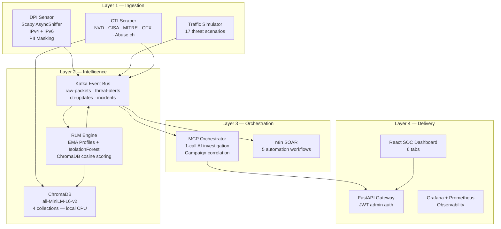
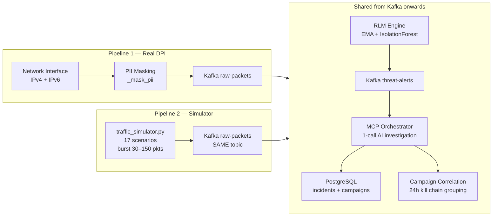

# CyberSentinel AI

> **Autonomous Threat Intelligence and Zero-Day Detection Platform**
> Enterprise-grade AI-powered Security Operations Centre — detecting, investigating, and recommending responses to cyber threats in under 60 seconds.

---

## What Is This

CyberSentinel AI is a full-stack, production-deployable cybersecurity platform built as an academic capstone project. It combines five cutting-edge disciplines into a single autonomous system:

- **Real-time packet analysis** — Deep Packet Inspection via Scapy, IPv4 and IPv6, with PII masking before any data is published
- **Behavioral AI profiling** — EMA-based host profiling blended with IsolationForest sequence anomaly detection (RLM engine)
- **Semantic threat intelligence** — ChromaDB vector embeddings with local all-MiniLM-L6-v2 (zero API cost, zero data leaving the deployment)
- **Autonomous investigation** — Single LLM API call per alert, ~553 tokens, multi-provider (Claude / GPT-4o mini / Gemini)
- **Human-in-the-loop SOAR** — AI recommends blocks, analyst approves via RESPONSE tab, n8n drives 5 automated workflows

The platform deploys as **14 Docker containers** with a single command (`docker compose up -d`).

---

## The Problem It Solves

| Metric | Industry Average | CyberSentinel AI |
|--------|-----------------|-----------------|
| Breach detection time | 194 days | Under 1 second |
| Alert triage | Manual by analyst | Autonomous AI (~553 tokens, ~$0.000165) |
| Incident creation | Hours to days | Under 60 seconds |
| False positive blocking | Common with auto-block systems | Eliminated — human analyst approves every block |
| CVE awareness | Manual monitoring | Automated, every 4 hours |
| Attack campaign tracking | Manual correlation | Automatic 24-hour kill chain grouping |
| Block decisions | Ad-hoc, no audit trail | Human-in-the-loop, full audit log |

---

## Architecture at a Glance



---

## Two Input Pipelines — Identical from Kafka Onwards



Both pipelines produce **identical** alert and incident records. The only difference: Pipeline 1 reads real network packets from a physical interface; Pipeline 2 generates scenario-realistic packet bursts in software.

---

## Repository Structure

```
cybersentinel-ai/
│
├── src/
│   ├── core/                         # Shared: config, logger, constants
│   ├── dpi/
│   │   └── sensor.py                 # Scapy AsyncSniffer, IPv4+IPv6, _mask_pii
│   ├── models/
│   │   └── rlm_engine.py             # EMA profiling + SequenceAnomalyDetector
│   ├── agents/
│   │   ├── mcp_orchestrator.py       # 1-call investigation + campaign correlation
│   │   └── llm_provider.py           # Claude / OpenAI / Gemini abstraction
│   ├── ingestion/
│   │   ├── embedder.py               # ChromaDB governance + cache invalidation
│   │   └── threat_intel_scraper.py   # NVD, CISA, Abuse.ch, MITRE, OTX
│   ├── simulation/
│   │   └── traffic_simulator.py      # 17 scenarios → raw-packets
│   └── api/
│       └── gateway.py                # FastAPI routes, JWT auth, all endpoints
│
├── frontend/src/
│   ├── CyberSentinel_Dashboard.jsx   # 6-tab SOC dashboard
│   ├── CyberSentinel_Landing.jsx     # Landing/login page
│   └── App.jsx                       # React router
│
├── docker/                           # One Dockerfile per service
├── docker-compose.yml                # All 14 services
│
├── n8n/
│   ├── bridge/kafka_bridge.py        # Routes Kafka topics → n8n webhooks
│   └── workflows/                    # 5 n8n workflow JSON files
│
├── scripts/
│   ├── start_n8n.ps1                 # Starts N8N container with correct env vars
│   ├── activate_n8n_workflows.py     # Repair n8n SQLite activation state
│   ├── start_live_dpi.ps1            # Windows DPI with Npcap
│   ├── db/migrate_campaigns.sql      # attacker_campaigns + campaign_incidents
│   └── db/migrate_multitenancy.sql   # tenant_id columns on all data tables
│
├── configs/                          # Prometheus + Grafana configs
├── docs/                             # All project documentation
├── .env.example                      # All environment variables documented
└── README.md                         # Quick start
```

---

## Quick Start

```bash
# Step 1 — Configure
cp .env.example .env
# Set: LLM_PROVIDER=openai, OPENAI_API_KEY=sk-..., JWT_SECRET, POSTGRES_PASSWORD, REDIS_PASSWORD

# Step 2 — Start all 14 services
docker compose up -d

# Step 3 — Wait for services to be healthy (~2-3 minutes)
docker compose ps

# Step 4 — Run DB migrations (first run only)
docker exec -i cybersentinel-postgres psql -U sentinel -d cybersentinel < scripts/db/migrate_campaigns.sql
docker exec -i cybersentinel-postgres psql -U sentinel -d cybersentinel < scripts/db/migrate_multitenancy.sql

# Step 5 — Start n8n SOAR
.\scripts\start_n8n.ps1

# Step 6 — Open dashboard
# http://localhost:5173
```

**Service URLs after startup:**

| Service | URL | Login |
|---------|-----|-------|
| SOC Dashboard | http://localhost:5173 | admin / cybersentinel2025 |
| API (Swagger) | http://localhost:8080/docs | admin / cybersentinel2025 |
| n8n SOAR | http://localhost:5678 | admin / see `.env` |
| Grafana | http://localhost:3001 | admin / admin2025 |
| Prometheus | http://localhost:9090 | none |

---

## SOC Dashboard — 6 Tabs

| Tab | Key Features |
|-----|-------------|
| OVERVIEW | Risk gauge (0–100), 6 KPI cards, 24h alert timeline, top MITRE techniques |
| ALERTS | Table with severity badges, anomaly scores, MITRE tags, AI investigation summaries |
| INCIDENTS | Lifecycle: OPEN → RESOLVED → DISMISSED; full investigation detail per incident |
| HOSTS | IP lookup: EMA behavioral profile, anomaly score, block status, linked incidents |
| THREAT INTEL | ChromaDB semantic search across CVE database and CTI reports |
| RESPONSE | Human-in-the-loop: Block Recommendations — analyst clicks BLOCK IP or DISMISS |

---

## Key Metrics

- **14** Docker containers (`docker compose up -d`)
- **6** SOC Dashboard tabs
- **5** SOAR workflows (n8n)
- **17** simulated threat scenarios (12 MITRE-mapped + 5 novel AI-classified)
- **5** live CTI sources (NVD, CISA, Abuse.ch, MITRE ATT&CK, OTX)
- **4** PostgreSQL tables for campaign kill chain tracking
- **1** LLM API call per investigation
- **~553** tokens per investigation (90% reduction from original agentic loop)
- **~$0.000165** per investigation on GPT-4o mini
- **~30,000** investigations on a $5 OpenAI budget
- **0** external embedding API calls — fully local all-MiniLM-L6-v2
- **3** LLM providers switchable via single env var (Claude / OpenAI / Gemini)

---

## Novel Technical Contributions

**1. EMA + IsolationForest Behavioral Profiling**

Online, unsupervised host profiling via Exponential Moving Average updated per network packet, converted to natural-language text, scored via cosine similarity against threat signature vectors, and blended with an IsolationForest sequence anomaly detector. The IsolationForest detects gradual score progressions that never cross the threshold individually — a slow ramp from 0.30 to 0.46 is flagged even though no single value breaches the limit. No training data, no labels, zero-day capable.

**2. Optimized 1-Call LLM SOC Investigation**

All four intelligence tools (`query_threat_database`, `get_host_profile`, `get_recent_alerts`, `lookup_ip_reputation`) execute in parallel via `asyncio.gather()`. Results are compressed by `_summarize_result()`. A single structured prompt is built and sent to the LLM with `tools=None` — no schema overhead, no sequential tool-calling loop. 90% token reduction and 5× speed improvement over traditional agentic patterns.

**3. Attacker Campaign Correlation**

Every incident is automatically correlated with an `attacker_campaigns` record by source IP within a 24-hour window via `_correlate_campaign_with_pool()`. The MITRE stages array is a union across all incidents in the campaign, revealing kill chain progression. Severity ratchets upward — never decreases. Fire-and-forget via `asyncio.ensure_future()` to avoid blocking the investigation pipeline.

**4. Human-in-the-Loop SOAR Pattern**

The LLM sets a `block_recommended` flag per incident but never auto-blocks. The RESPONSE tab in the dashboard surfaces all pending block recommendations for analyst review. The analyst clicks BLOCK IP or DISMISS. Every decision is written to `audit_log` with username, timestamp, and IP address. No automated blocking that could disrupt legitimate services.

---

## Documents in This Project

| Document | Purpose |
|----------|---------|
| [`MASTER.md`](MASTER.md) | Full technical reference — all architecture diagrams, all tables |
| [`ARCHITECTURE.md`](ARCHITECTURE.md) | Design principles, layer breakdown, failure modes, scalability |
| [`RUNNING.md`](RUNNING.md) | How to start, stop, and understand the platform |
| [`LIVE_DPI_SETUP.md`](LIVE_DPI_SETUP.md) | DPI setup — Docker container (Linux/macOS) + Windows Npcap |
| [`PIPELINES.md`](PIPELINES.md) | DPI vs Simulator pipeline deep comparison |
| [`API_REFERENCE.md`](API_REFERENCE.md) | All REST endpoints with request/response schemas |
| [`DATABASE.md`](DATABASE.md) | Schema reference, campaign tables, migration guide |
| [`WORKFLOWS.md`](WORKFLOWS.md) | n8n SOAR workflow specs — 5 workflows |
| [`CHANGELOG.md`](CHANGELOG.md) | Version history with architectural decision records |
| [`TRD.md`](TRD.md) | Technical Requirements Document |
| [`LIMITATIONS.md`](LIMITATIONS.md) | Known limitations and boundaries |
| [`LIMITATIONS_FIXES.md`](LIMITATIONS_FIXES.md) | Fixes applied for known limitations |
| [`N8N_OPERATIONS.md`](N8N_OPERATIONS.md) | n8n troubleshooting, activation script, ops guide |
| [`ABBREVIATIONS.md`](ABBREVIATIONS.md) | Glossary — cybersecurity and project abbreviations |
| [`THREAT_SIGNATURES.md`](THREAT_SIGNATURES.md) | All RLM threat signatures — MITRE mapping and scoring |
| [`RAG_DESIGN.md`](RAG_DESIGN.md) | RAG pipeline design and ChromaDB governance |
| [`RESOURCES.md`](RESOURCES.md) | Research papers across 7 domains |

---

*CyberSentinel AI v1.3.0 — Capstone Project 2026*
