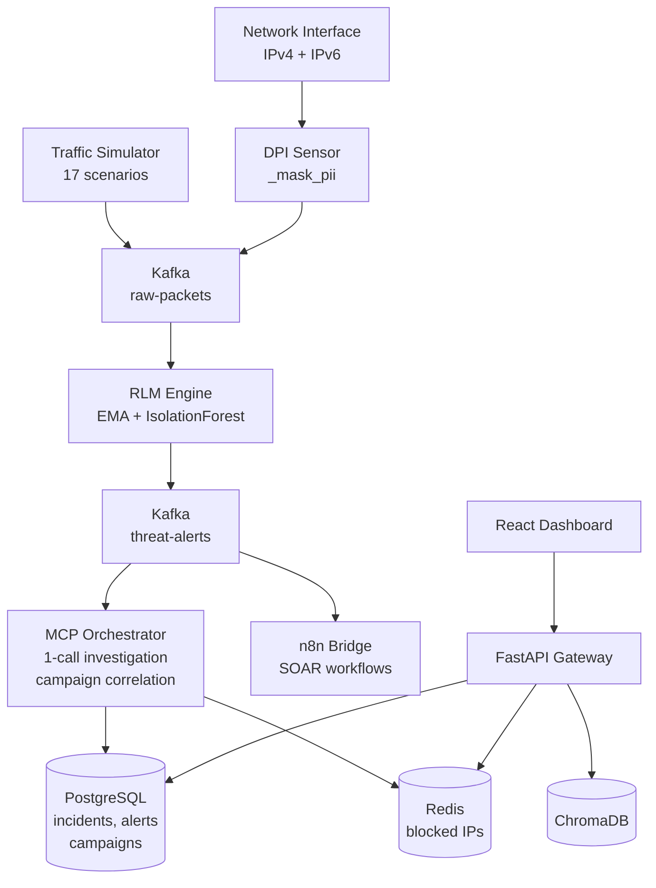

# Technical Requirements Document (TRD)

**Project:** CyberSentinel AI
**Version:** 1.3.0
**Status:** Production Ready
**Date:** 2025/2026

---

## 1. System Overview

CyberSentinel AI is an event-driven microservices platform deployed as 14 Docker containers via Docker Compose. All inter-service communication in the detection pipeline happens asynchronously through Apache Kafka. Services are stateless — state lives in PostgreSQL (persistent), Redis (hot cache), and ChromaDB (vector store). No direct service-to-service HTTP calls exist in the detection pipeline.

The system has two input modes that share the same unified pipeline:
- **Real DPI mode** — Scapy captures actual network packets (IPv4 + IPv6), applies PII masking, feeds the RLM engine, and builds real behavioral profiles
- **Simulator mode** — `traffic_simulator.py` generates synthetic threat events via raw `PacketEvent` bursts to `raw-packets` — the same topic and same pipeline as real DPI

See `docs/PIPELINES.md` for the complete pipeline comparison.

---

## 2. Technology Stack

| Component | Technology | Version | Justification |
|-----------|-----------|---------|---------------|
| Packet Capture | Scapy | 2.5.0 | Industry standard; supports BPF, IPv4 + IPv6, async sniffing |
| Message Bus | Apache Kafka (Confluent) | 7.5.0 | Guaranteed delivery, consumer groups, replay capability |
| Vector Database | ChromaDB | 0.4.22 | Native Python, cosine similarity, no external infra required |
| Time-Series DB | TimescaleDB (PostgreSQL 15) | latest-pg15 | SQL familiarity + hypertable compression + retention policies |
| Cache | Redis | 7-alpine | Sub-millisecond latency for blocking decisions and embedding cache |
| Embedding Model | all-MiniLM-L6-v2 | pinned | 384-dim, 256-token limit, runs on CPU, zero API cost |
| Sequence Anomaly | scikit-learn IsolationForest | 1.4.2 | Detects anomalous score progressions — 50-obs rolling buffer per IP |
| LLM — Primary | gpt-4o-mini / claude-sonnet-4-6 | configurable | Switchable via `LLM_PROVIDER` env var |
| LLM — Fast | gpt-4o-mini / claude-haiku-4-5 | configurable | `LLM_MODEL_FAST` override |
| LLM — Analysis | gpt-4o-mini / claude-sonnet-4-6 | configurable | `LLM_MODEL_ANALYSIS` override |
| CTI Scraping | Playwright | 1.40.0 | Handles JavaScript-rendered pages; Chromium headless |
| REST API | FastAPI | 0.109.0 | Async, auto-Swagger, Pydantic validation, high throughput |
| API Validation | Pydantic | 2.5.0 | Type-safe schemas, automatic JSON serialisation |
| Auth | python-jose + passlib | 3.3.0 / 1.7.4 | JWT (HS256) + bcrypt (work factor 12) |
| SOAR | n8n | latest | Self-hosted, JSON-importable workflows, 11+ integrations |
| Frontend | React | 18.2.0 | Component model, hooks, broad ecosystem |
| Charts | Recharts | 2.12.0 | Declarative, works with React 18 |
| Build Tool | Vite | 5.1.0 | Sub-second HMR, ESM native, proxy support |
| Observability | Grafana + Prometheus | 10.2 / v2.47 | De-facto standard for containerised monitoring |
| Orchestration | Docker Compose | v2.20+ | 14 containers on `cybersentinel-net` bridge network |

**Current recommended LLM provider:** OpenAI (`LLM_PROVIDER=openai`, model: `gpt-4o-mini`)
- Cost: $0.15/1M input, $0.60/1M output
- ~553 tokens/investigation → $0.000165/investigation
- With `INVESTIGATION_INTERVAL_SEC=1800`: ~$0.008/day → 625 days on $5 budget

---

## 3. Service Architecture

### 3.1 Docker Container Inventory

All 14 containers start with `docker compose up -d` on the `cybersentinel-net` bridge network.

| Container | Image | External Port | Role |
|-----------|-------|--------------|------|
| cybersentinel-zookeeper | `confluentinc/cp-zookeeper:7.5.0` | 2181 | Kafka coordinator |
| cybersentinel-kafka | `confluentinc/cp-kafka:7.5.0` | 9092 | Event streaming backbone |
| cybersentinel-postgres | `timescale/timescaledb:latest-pg16` | 5432 | Persistent storage (incidents, alerts, campaigns) |
| cybersentinel-redis | `redis:7-alpine` | 6379 | Hot cache (blocks, sessions, embed cache) |
| cybersentinel-chromadb | `chromadb/chroma` | 8000 | Vector store (threat signatures, CTI, profiles) |
| cybersentinel-api | `Dockerfile.api` | 8080 | REST API + JWT auth |
| cybersentinel-mcp | `Dockerfile.mcp` | 3000 | AI investigation + campaign correlation |
| cybersentinel-rlm | `Dockerfile.rlm` | — | EMA profiling + IsolationForest anomaly detection |
| cybersentinel-frontend | `Dockerfile.frontend` | 5173 | React SOC Dashboard |
| cybersentinel-scraper | `Dockerfile.scraper` | — | CTI harvesting (NVD, CISA, MITRE, OTX, Abuse.ch) |
| cybersentinel-simulator | `Dockerfile.simulator` | — | Synthetic threat event generation |
| cybersentinel-grafana | `grafana/grafana:10.2.0` | 3001 | Metrics dashboards |
| cybersentinel-prometheus | `prom/prometheus:v2.47.0` | 9090 | Metrics collection |
| cybersentinel-dpi | `Dockerfile.dpi` | — | Packet capture (`network_mode: host`, IPv4 + IPv6) |

**N8N (standalone — not in docker-compose.yml):**
- `N8N` — started via `scripts/start_n8n.ps1`, joined to `cybersentinel-net`, port 5678

### 3.2 Kafka Topic Specification

| Topic | Retention | Producer | Consumers |
|-------|-----------|----------|-----------|
| `raw-packets` | 1 hour | dpi-sensor, traffic-simulator | rlm-engine |
| `threat-alerts` | 24 hours | dpi-sensor, rlm-engine | mcp-orchestrator, n8n-bridge |
| `incidents` | 7 days | mcp-orchestrator | n8n-bridge |
| `cti-updates` | 48 hours | threat-intel-scraper | rlm-engine, n8n-bridge |

### 3.3 Inter-Service Data Flow



---

## 4. Module Specifications

### 4.1 DPI Sensor (`src/dpi/`)

**Entry point:** `sensor.py` — `DPISensor.start()`

**Capture method:** `scapy.sniff()` with BPF filter `"ip or ip6"` (IPv4 + IPv6), runs in thread pool executor.

**PII masking:** `_mask_pii()` static method called on every `PacketEvent` before Kafka publish. Redacts emails and credential params from `dns_query`, `http_uri`, `user_agent`.

**PacketEvent fields:**
```
timestamp, src_ip, dst_ip, src_port, dst_port,
protocol,  payload_size, flags, ttl, entropy,
has_tls, has_dns, dns_query,
http_method, http_host, http_uri, user_agent,
is_suspicious, suspicion_reasons, session_id
```

**Detection functions (`detectors.py`):**

| Function | Signal | MITRE | Threshold |
|----------|--------|-------|-----------|
| `detect_high_entropy()` | Shannon entropy > 7.2 on non-TLS port | T1048 | Configurable |
| `detect_suspicious_port()` | Port in {4444, 5555, 6666, 31337, ...} | T1046 | Fixed set |
| `detect_dga()` | Subdomain > 20 chars, vowel ratio < 25% | T1568.002 | Configurable |
| `detect_c2_beacon()` | avg_interval < 60s AND std_dev < 2.0 | T1071.001 | Configurable |
| `detect_cleartext_credentials()` | Payload contains `password=`, `Authorization: Basic` | T1003 | Fixed patterns |
| `detect_ttl_anomaly()` | TTL not in {32, 64, 128, 255} | T1595 | Fixed set |
| `detect_malware_user_agent()` | UA matches known scanner strings | T1595 | Fixed list |
| `detect_external_db_access()` | DB port accessed from non-RFC-1918 IP | T1078 | Port set |

**Severity thresholds:**
- 1 detection reason → `HIGH`
- 2+ detection reasons → `CRITICAL`

---

### 4.2 Traffic Simulator (`src/simulation/`)

**Entry point:** `traffic_simulator.py` — `TrafficSimulator.start()`

**Kafka target:** `raw-packets` — publishes bursts of PacketEvent dicts. Goes through the full RLM + IsolationForest pipeline before reaching `threat-alerts`.

**17 scenarios:** 12 MITRE-mapped (C2 Beacon, Data Exfil, Reverse Shell, Exploit, Lateral SMB, RDP, DNS Tunnel, Brute Force SSH, Port Scan, High Entropy, Protocol Tunnel, Credential Spray) + 5 unknown novel threats (POLYMORPHIC_BEACON, COVERT_STORAGE_CHANNEL, SLOW_DRIP_EXFIL, MESH_C2_RELAY, SYNTHETIC_IDLE_TRAFFIC).

**Configuration:**
```
SIMULATION_RATE env var: events per minute (default: 2)
interval_sec = 60 / EVENTS_PER_MINUTE
```

---

### 4.3 RLM Engine (`src/models/`)

**Entry point:** `rlm_engine.py` — `RLMEngine.start()`

**Kafka consumer:** `raw-packets` topic ONLY

**BehaviorProfile EMA update formula:**
```
new_value = (1 − α) × old_value + α × observation
α = 0.1 (default, configurable via RLM_ALPHA)
```

**IsolationForest layer (`SequenceAnomalyDetector`):**
- 50-observation rolling buffer per IP
- Fits `sklearn.ensemble.IsolationForest` once ≥ 10 samples collected
- Blend: `final_score = 0.75 × base_score + 0.25 × if_score`
- Returns raw `base_score` during cold start (< 10 observations)

**Cache invalidation fix (v1.3):** `threat_intel_updated:*` keys deleted immediately after consuming — prevents thundering-herd re-embedding on every CTI refresh.

**Persistence:** Every 300 seconds, all in-memory BehaviorProfiles UPSERT to PostgreSQL `behavior_profiles`.

---

### 4.4 MCP Orchestrator (`src/agents/`)

**Entry point:** `mcp_orchestrator.py` — `MCPOrchestrator.start()`

**Alert routing:**
```python
if severity in ("HIGH", "CRITICAL"):
    await investigation_queue.put(alert)   # → 1-call AI investigation
else:
    await db_conn.execute("INSERT INTO alerts ...", ...)  # direct to DB
```

**Optimized 1-Call Investigation Pipeline:**

```
Step 1: asyncio.gather() — 4 intel tools in parallel (0 LLM calls)
        ├─ query_threat_database → ChromaDB top-3
        ├─ get_host_profile      → ChromaDB + PostgreSQL
        ├─ lookup_ip_reputation  → AbuseIPDB API (Redis cached)
        └─ get_recent_alerts     → PostgreSQL last 6h

Step 2: _summarize_result() — compress each to 1–3 lines

Step 3: Single LLM call — ~553 tokens total
        tools=None, max_tokens=1024

Step 4: Parse JSON verdict → _create_incident() + asyncio.ensure_future(_correlate_campaign_with_pool())
```

**Campaign correlation (`_correlate_campaign_with_pool()`):**
- Groups incidents from the same `src_ip` within 24 hours into one campaign
- Updates `max_severity` (severity ratchet) and `mitre_stages[]` (union)
- Runs as fire-and-forget to avoid blocking incident creation

**Token breakdown per investigation:**

| Component | Tokens |
|-----------|--------|
| System prompt | ~180–220 |
| alert_slim (raw_event stripped) | ~100–150 |
| threat_summary | ~25 |
| host_summary | ~20 |
| rep_summary | ~25 |
| recent_summary | ~50 |
| **Total input** | **~420–480** |
| JSON verdict output | ~183 |
| **Grand total** | **~553** |

---

### 4.5 REST API (`src/api/`)

**Entry point:** `gateway.py` — FastAPI app

**Authentication:** JWT Bearer tokens only. Default credentials: `admin` / `cybersentinel2025`.
POST `/auth/token` returns a token valid for 480 minutes.

**Startup sequence:**
1. Create asyncpg connection pool (min 5, max 20)
2. Connect Redis client
3. Connect ChromaDB via `get_chroma_client()` from embedder
4. Validate `JWT_SECRET` — raise `RuntimeError` if empty

**All endpoints:**

| Method | Path | Description |
|--------|------|-------------|
| `GET` | `/health` | Platform health check — postgres, redis, chromadb, llm |
| `POST` | `/auth/token` | Returns JWT (480-minute expiry) |
| `GET` | `/api/v1/dashboard` | 12-field SOC stats from TimescaleDB |
| `GET` | `/api/v1/alerts` | Paginated, filterable alerts |
| `POST` | `/api/v1/threat-search` | ChromaDB semantic search |
| `GET` | `/api/v1/incidents` | Incidents with status/severity filter |
| `GET` | `/api/v1/incidents/{id}/detail` | Full single incident detail |
| `PATCH` | `/api/v1/incidents/{id}` | Update status, notes, assignment |
| `GET` | `/api/v1/block-recommendations` | Pending block recommendations |
| `POST` | `/api/v1/incidents/{id}/block` | Approve block: firewall_rules + Redis |
| `POST` | `/api/v1/incidents/{id}/dismiss` | Dismiss recommendation |
| `POST` | `/api/v1/incidents/{id}/remediation` | Generate AI Technical Playbook |
| `GET` | `/api/v1/hosts/{ip}` | RLM profile + alert history + block status |
| `GET` | `/api/v1/firewall-rules` | List blocked IPs |
| `DELETE` | `/api/v1/firewall-rules?ip={ip}` | Unblock an IP |
| `GET` | `/api/v1/control?source=` | Check investigation pause state |
| `POST` | `/api/v1/control?source=` | Pause / resume investigations |
| `GET` | `/api/v1/campaigns` | All attacker campaigns ordered by last activity |
| `GET` | `/metrics` | Prometheus metrics |

---

### 4.6 Database Schema

**Tables:**

| Table | Type | Key Details |
|-------|------|-------------|
| `packets` | TimescaleDB hypertable | 1-day partitions, 30-day retention, compressed after 7 days |
| `alerts` | Regular table | Indexed by timestamp, severity, src_ip, type, mitre_technique |
| `incidents` | Regular table | Status enum: OPEN/INVESTIGATING/RESOLVED/CLOSED; includes block_recommended, block_target_ip |
| `attacker_campaigns` | Regular table | 24h correlation window per src_ip; severity ratchet; MITRE stages union |
| `campaign_incidents` | Junction table | Links incidents to campaigns; PK (campaign_id, incident_id) |
| `behavior_profiles` | Regular table | Indexed by anomaly_score; profile_text column |
| `firewall_rules` | Regular table | Trigger auto-calculates expires_at from duration_hours |
| `threat_intel` | Regular table | Unique (source, indicator_type, indicator); full-text search index |
| `users` | Regular table | JWT auth; bcrypt-hashed passwords |
| `audit_log` | Regular table | All user actions with timestamp |

**Migrations:**
- `scripts/db/init.sql` — base schema (all tables except campaigns)
- `scripts/db/migrate_campaigns.sql` — v1.3.0: attacker_campaigns + campaign_incidents
- `scripts/db/migrate_multitenancy.sql` — optional: multi-tenant extensions

---

### 4.7 n8n SOAR (`n8n/`)

**5 Workflow Playbooks:**

| Workflow | Trigger | Purpose |
|----------|---------|---------|
| WF01 | Critical alert webhook | Immediate Slack notification + response options |
| WF02 | Daily schedule | SOC Intelligence Report (OpenAI generated) |
| WF03 | CVE intel webhook | New CVE analysis and team notification |
| WF04 | Hourly schedule | SLA Watchdog — escalates breached incidents |
| WF05 | Weekly schedule | Executive Board Report |

**Bridge routing (`kafka_bridge.py`):**

| Topic | Condition | Webhook |
|-------|-----------|---------|
| `threat-alerts` | severity == CRITICAL | `/webhook/critical-alert` |
| `threat-alerts` | severity == HIGH | `/webhook/high-alert` |
| `cti-updates` | type == CRITICAL_CVE | `/webhook/critical-cve` |
| `incidents` | any | `/webhook/new-incident` |

---

## 5. RAG Pipeline Technical Specification

### Embedding Model

| Property | Value |
|----------|-------|
| Model name | `all-MiniLM-L6-v2` |
| Dimensionality | 384 |
| Max input tokens | 256 (~900 chars) |
| Compute | CPU (no GPU required) |
| Cost | Free (local inference) |
| Distance metric | Cosine (`hnsw:space: cosine`) |
| Pinning | `SentenceTransformerEmbeddingFunction(model_name=EMBEDDING_MODEL)` |

### ChromaDB Collections

| Collection | Documents | TTL | Populated by |
|-----------|-----------|-----|-------------|
| `threat_signatures` | 8 seed signatures | Never evicted | RLM engine startup |
| `cve_database` | NVD CVEs CVSS ≥ 7.0 | No TTL (upsert by CVE-ID) | CTI scraper every 4h |
| `cti_reports` | CISA, Abuse.ch, MITRE, OTX | 90 days | CTI scraper various schedules |
| `behavior_profiles` | One per IP per hour | 30 days | RLM engine (real DPI + simulator) |

### Cache Invalidation (v1.3 fix)

The embedder sets `threat_intel_updated:{collection}` Redis keys when CTI is refreshed. The RLM engine deletes these keys immediately after consuming them — preventing all profiles from bypassing cache simultaneously.

---

## 6. Environment Variables Reference

| Variable | Default | Used By |
|----------|---------|---------|
| `LLM_PROVIDER` | `openai` | All services — `openai` \| `claude` \| `gemini` |
| `ANTHROPIC_API_KEY` | — | mcp-orchestrator |
| `OPENAI_API_KEY` | — | mcp-orchestrator |
| `GOOGLE_API_KEY` | — | mcp-orchestrator |
| `LLM_MODEL_PRIMARY` | `gpt-4o-mini` | mcp-orchestrator investigation |
| `LLM_MODEL_FAST` | `gpt-4o-mini` | n8n Workflow 03 |
| `LLM_MODEL_ANALYSIS` | `gpt-4o-mini` | n8n Workflows 02 and 05 |
| `LLM_TEMPERATURE` | `0.2` | All LLM calls |
| `INVESTIGATION_INTERVAL_SEC` | `1800` | mcp-orchestrator — min seconds between investigations |
| `SIMULATION_RATE` | `2` | traffic-simulator — events per minute |
| `POSTGRES_PASSWORD` | — (required) | all services |
| `REDIS_PASSWORD` | — (required) | all services |
| `JWT_SECRET` | — (required, min 32 chars) | api-gateway |
| `CHROMA_TOKEN` | — (required) | rlm-engine, api, scraper |
| `EMBEDDING_MODEL` | `all-MiniLM-L6-v2` | rlm-engine, scraper, api |
| `BPF_FILTER` | `ip or ip6` | dpi-sensor (IPv4 + IPv6) |
| `CAPTURE_INTERFACE` | `eth0` | dpi-sensor |
| `RLM_ALPHA` | `0.1` | rlm-engine EMA decay |
| `RLM_ANOMALY_THRESHOLD` | `0.65` | rlm-engine alert gate |
| `RLM_MIN_OBSERVATIONS` | `20` | rlm-engine min packets before scoring |
| `NVD_API_KEY` | optional | scraper |
| `ABUSEIPDB_KEY` | optional | mcp-orchestrator |
| `SHODAN_API_KEY` | optional | mcp-orchestrator |
| `SLACK_BOT_TOKEN` | optional | n8n workflows |
| `GRAFANA_PASSWORD` | `admin2025` | grafana |

---

## 7. Testing

### Unit Tests (no Docker required)

```bash
pip install pytest
pytest tests/unit/ -v
```

- `test_detectors.py` — 27 tests across 9 detector functions
- `test_profile.py` — 5 tests for BehaviorProfile EMA logic

### Integration Tests (requires running stack)

```bash
pytest tests/integration/ -v --tb=short
```

- `test_api.py` — health check, JWT auth, dashboard endpoint

### Manual Validation Checklist

```bash
# All containers healthy
docker compose ps

# API health check
curl http://localhost:8080/health

# Auth
curl -X POST http://localhost:8080/auth/token \
  -d "username=admin&password=cybersentinel2025"

# Dashboard
curl -H "Authorization: Bearer {token}" http://localhost:8080/api/v1/dashboard

# Block recommendations
curl -H "Authorization: Bearer {token}" http://localhost:8080/api/v1/block-recommendations

# Campaigns
curl -H "Authorization: Bearer {token}" http://localhost:8080/api/v1/campaigns

# RLM engine logs
docker compose logs rlm-engine --tail=20

# MCP orchestrator logs (verify "1 LLM call" pattern)
docker compose logs mcp-orchestrator --tail=50
```

---

*Technical Requirements Document — CyberSentinel AI v1.3.0 — 2025/2026*
