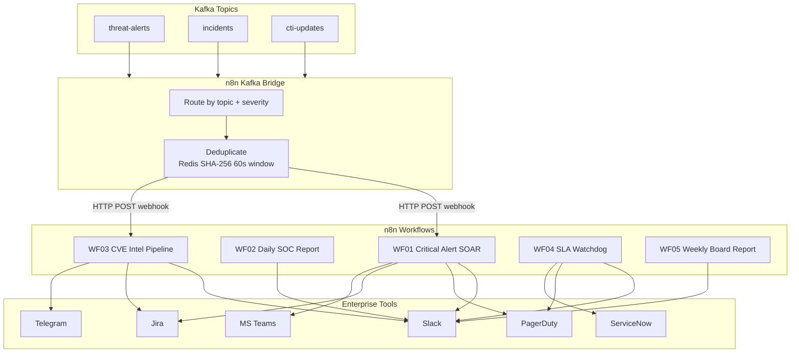
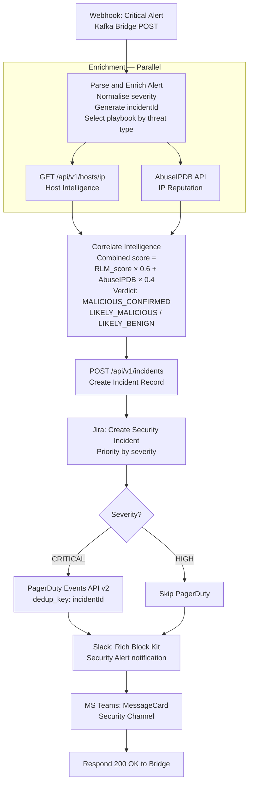
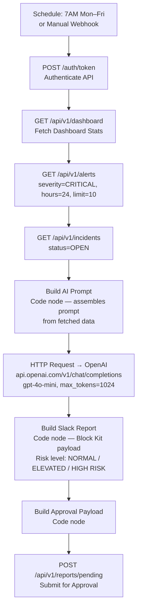
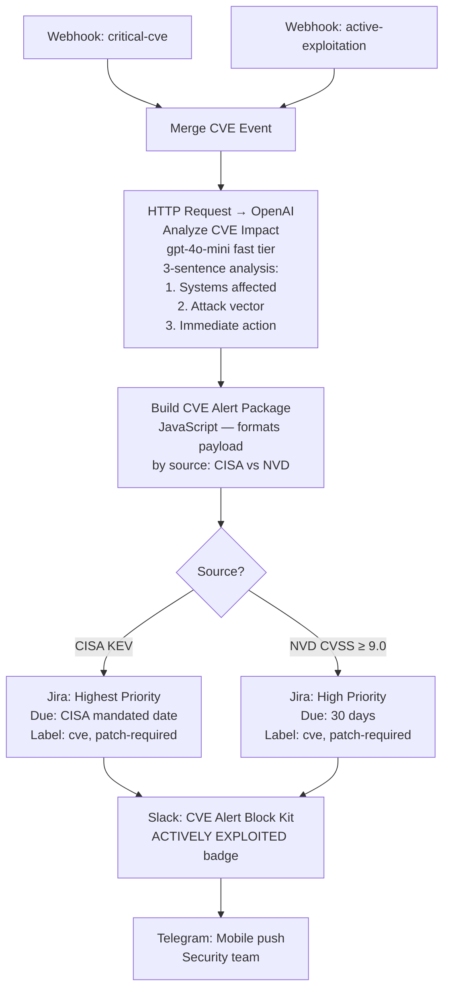
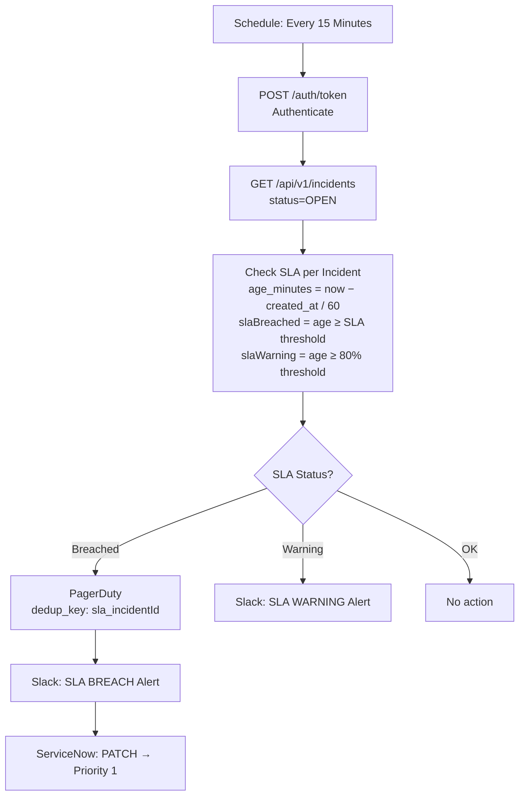
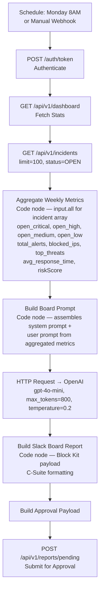
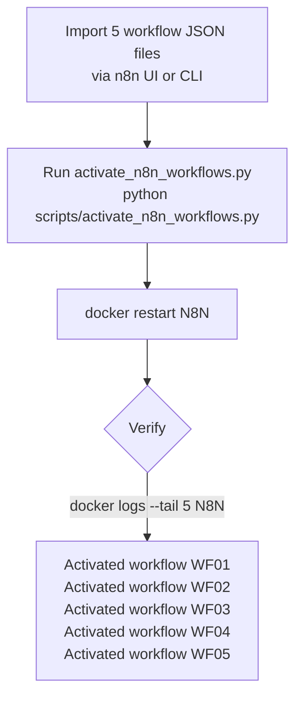

# SOAR Workflows

**CyberSentinel AI v1.3.0 — n8n Workflow Specifications**

Five production workflows covering the complete SOC automation cycle.
All workflow JSON files are in `n8n/workflows/` — import directly into n8n.

---

## Critical: N8N Environment Setup

Before workflows will run, the n8n container must be started with these environment variables:

| Variable | Required Value | Why |
|----------|---------------|-----|
| `N8N_BLOCK_ENV_ACCESS_IN_NODE` | `false` | n8n 2.15+ blocks `$env.OPENAI_API_KEY` etc. by default. Without this, all LLM calls silently fail. |
| `OPENAI_API_KEY` | Your key | Referenced as `$env.OPENAI_API_KEY` in WF02, WF03, WF05 |
| `SLACK_BOT_TOKEN` | Your token | Referenced as `$env.SLACK_BOT_TOKEN` in WF02, WF03, WF04, WF05 |
| `SLACK_CHANNEL_ID` | Your channel | Referenced as `$env.SLACK_CHANNEL_ID` |

Use `scripts/start_n8n.ps1` to start n8n with all required vars set from `.env`. See `docs/N8N_OPERATIONS.md` for full details.

**After any import or restart where workflows are not activating:**
```powershell
python scripts/activate_n8n_workflows.py
docker restart N8N
```

---

## How n8n Fits the Architecture

n8n sits at Layer 3 (Orchestration) alongside the MCP Orchestrator. It receives events via the Kafka Bridge — a Python service that translates Kafka topic messages into HTTP webhook calls.



**Note on IP blocking:** Workflow 01 does NOT auto-block IPs. IP blocking is a human-in-the-loop decision made via the RESPONSE tab in the SOC Dashboard (`POST /api/v1/incidents/{id}/block`). WF01 handles enrichment, Jira ticketing, and multi-channel notification only.

---

## Importing Workflows

**Method A — n8n UI (recommended):**
1. Open `http://localhost:5678`
2. Workflows → + Add Workflow → ⋮ → Import from File
3. Select the JSON file → Save → toggle Active ON
4. Repeat for all 5 workflows

**Method B — n8n CLI (inside Docker container):**
```bash
docker exec -it cybersentinel-n8n \
  n8n import:workflow --separate \
  --input=/home/node/.n8n/workflows/
```

**After importing — required credential setup:**
Open each HTTP Request node and set credentials (Slack webhook URL, PagerDuty routing key, Jira token, etc.) from your `.env` file. See the Credential Configuration Reference table at the end of this document.

---

## Workflow 01 — Critical Alert SOAR Playbook

**File:** `n8n/workflows/01_critical_alert_soar.json`
**Trigger:** Kafka Bridge webhook — CRITICAL and HIGH severity alerts
**Purpose:** Full automated enrichment, Jira ticketing, and multi-channel notification



### Key Business Logic

| Rule | Detail |
|------|--------|
| Combined scoring | RLM behavioral anomaly (60%) + AbuseIPDB reputation (40%) |
| PagerDuty gate | CRITICAL only — HIGH gets Slack + Teams only |
| Jira priority mapping | CRITICAL → Highest, HIGH → High, MEDIUM → Medium |
| Dedup key | `incidentId` prevents duplicate PagerDuty incidents |
| IP blocking | NOT performed by this workflow — analyst decides via RESPONSE tab |

---

## Workflow 02 — Daily SOC Intelligence Report

**File:** `n8n/workflows/02_daily_soc_report.json`
**Trigger:** Cron schedule — 7:00 AM Monday through Friday
**Purpose:** AI-generated daily security briefing for the SOC team



### Report Sections

| # | Section |
|---|---------|
| 1 | Executive Summary |
| 2 | Key Metrics (alerts, incidents, blocked IPs) |
| 3 | Top 3 Threats |
| 4 | MITRE Techniques Observed |
| 5 | Recommended Actions |

> **n8n 2.15+ sandbox constraint:** The LLM call is an HTTP Request node, not a Code node. n8n's JS Task Runner sandbox blocks all outbound HTTP from Code nodes. The Code node only builds the prompt — the HTTP Request node makes the API call.

---

## Workflow 03 — CVE Intel Pipeline

**File:** `n8n/workflows/03_cve_intel_pipeline.json`
**Trigger:** Kafka Bridge webhook — `critical-cve` and `active-exploitation` events from the CTI scraper
**Purpose:** Instant CVE awareness with AI impact analysis and patch ticket creation



### CISA vs NVD Handling

| Source | Urgency | Jira Priority | Due Date |
|--------|---------|---------------|----------|
| CISA KEV | ACTIVELY EXPLOITED | Highest | CISA mandated remediation date |
| NVD (CVSS ≥ 9.0) | CVSS critical | High | 30 days from publish date |

---

## Workflow 04 — SLA Watchdog and Incident Escalation

**File:** `n8n/workflows/04_sla_watchdog.json`
**Trigger:** Cron schedule — every 15 minutes, 24/7
**Purpose:** Enforce SLA guarantees on all open incidents and auto-escalate breaches

### SLA Thresholds

| Severity | SLA Limit | Warning at | Breach Action |
|----------|-----------|------------|---------------|
| CRITICAL | 30 min | 24 min (80%) | PagerDuty page + Slack + ServiceNow P1 |
| HIGH | 2 hours | 96 min (80%) | Slack alert + ServiceNow escalate |
| MEDIUM | 8 hours | 384 min (80%) | Slack warning only |
| LOW | 24 hours | 1152 min (80%) | Log only |



---

## Workflow 05 — Weekly Executive Board Report

**File:** `n8n/workflows/05_weekly_board_report.json`
**Trigger:** Cron schedule — Monday 8:00 AM
**Purpose:** C-Suite and Board-level security posture briefing

### Risk Score Formula

```
riskScore = min(100, CRITICAL×10 + HIGH×3 + MEDIUM×0.5 + open_incidents×5)
```



### Board Report Sections

| # | Section |
|---|---------|
| 1 | Executive Summary |
| 2 | Key Threats |
| 3 | Response Effectiveness |
| 4 | Recommendations |
| 5 | Next Week Outlook |

> **n8n 2.15+ sandbox constraint:** Same as WF02 — the LLM call is an HTTP Request node.
> **Incidents array note:** `Aggregate Weekly Metrics` uses `$('Fetch Open Incidents').all()` to collect all items after n8n splits the JSON array response.

---

## Credential Configuration Reference

After importing workflows, configure these in n8n Settings → Credentials:

| n8n Credential | Type | Required For |
|----------------|------|-------------|
| CyberSentinel API | HTTP Header Auth (Bearer) | All workflows |
| Slack Webhook | HTTP Request | WF01, WF02, WF03, WF04, WF05 |
| PagerDuty | HTTP Request (routing key) | WF01, WF04 |
| Jira | HTTP Basic Auth | WF01, WF03 |
| MS Teams | HTTP Request (webhook) | WF01, WF02 |
| ServiceNow | HTTP Basic Auth | WF04 |
| Telegram | HTTP Request (bot token) | WF03 |

---

## LLM Configuration for n8n

Workflows 02, 03, and 05 call OpenAI GPT-4o mini directly via HTTP Request nodes.

**Current implementation:** The `Call OpenAI` node calls `https://api.openai.com/v1/chat/completions` with a Bearer token in the Authorization header (`$env.OPENAI_API_KEY`).

**To switch model or provider:** Open the `Call OpenAI` node in n8n, update the URL and Authorization header.

> **Why not `$env.LLM_PROVIDER` routing?** n8n 2.15 JS Task Runner sandbox blocks all HTTP from Code nodes. HTTP Request nodes don't share env var routing logic. The simplest working approach is a direct HTTP Request to OpenAI with the API key from `$env.OPENAI_API_KEY`.

---

## Testing Workflows Manually

```bash
# Trigger WF01 with a test CRITICAL alert
curl -X POST http://localhost:5678/webhook/critical-alert \
  -H "Content-Type: application/json" \
  -d '{
    "type": "C2_BEACON_DETECTED",
    "severity": "CRITICAL",
    "src_ip": "10.0.0.99",
    "dst_ip": "185.220.101.47",
    "anomaly_score": 0.91,
    "mitre_technique": "T1071.001",
    "timestamp": "2026-04-16T09:00:00Z"
  }'

# Trigger WF03 with a test CVE
curl -X POST http://localhost:5678/webhook/critical-cve \
  -H "Content-Type: application/json" \
  -d '{
    "type": "CRITICAL_CVE",
    "cve_id": "CVE-2026-1234",
    "cvss": 9.8,
    "description": "Remote code execution in Apache XYZ",
    "source": "NVD"
  }'

# Trigger WF02 and WF05 manually
# n8n UI → Workflows → select workflow → Execute Workflow button
```

---

## N8N Activation Reference

After importing workflows or after a fresh n8n setup, workflows start as **inactive drafts**. n8n requires all of the following in its SQLite database for a workflow to run:

1. `workflow_entity.active = 1`
2. `workflow_entity.activeVersionId` pointing to a version UUID
3. A row in `workflow_published_version` for each workflow
4. Correct nodes stored in `workflow_history` at that version UUID

The script `scripts/activate_n8n_workflows.py` handles all of this automatically.



### Symptoms of Inactive Workflows

| Symptom | Cause |
|---------|-------|
| `{"code":404,"message":"The requested webhook is not registered"}` | Workflow not active in SQLite |
| n8n logs: `Processed 5 draft workflows, 0 published workflows` | activeVersionId not set |
| Dashboard Automation tab shows FAILED on all triggers | Same — workflow never published |

**Fix:**
```powershell
python scripts/activate_n8n_workflows.py
docker restart N8N
# Verify:
docker logs --tail 5 N8N
# Expect: "Activated workflow ..." for all 5
```

See `docs/N8N_OPERATIONS.md` for a complete troubleshooting guide.

---

*SOAR Workflows — CyberSentinel AI v1.3.0 — 2026*
